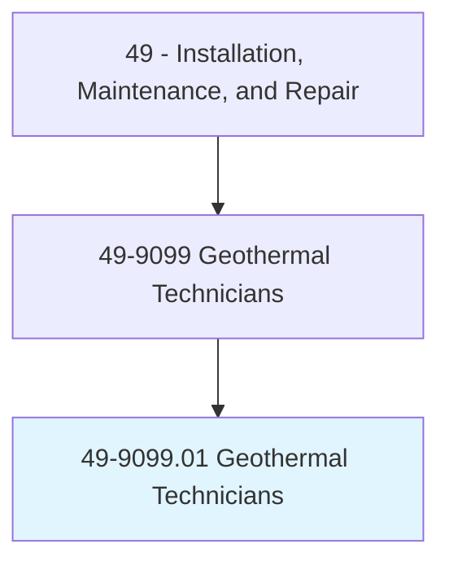
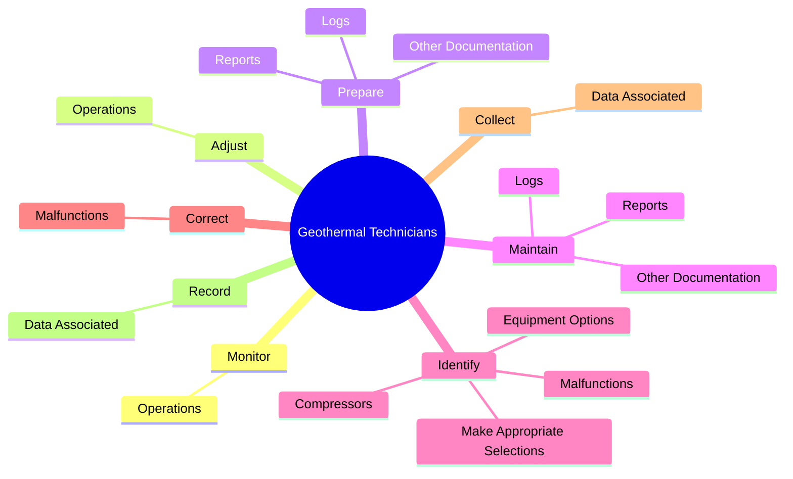
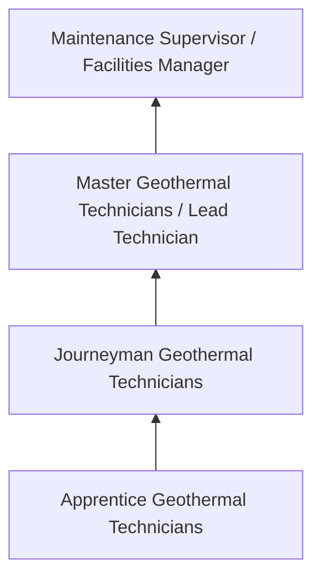
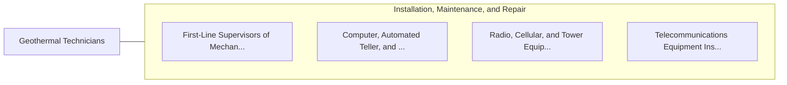

# Geothermal Technicians

> Perform technical activities at power plants or individual installations necessary for the generation of power from geothermal energy sources. Monitor and control operating activities at geothermal power generation facilities and perform maintenance and repairs as necessary. Install, test, and maintain residential and commercial geothermal heat pumps.

## Overview

Geothermal Technicians professionals perform technical activities at power plants or individual installations necessary for the generation of power from geothermal energy sources. This occupation falls within the Installation, Maintenance, and Repair category and requires a combination of specialized knowledge, technical skills, and practical experience.

These professionals work across diverse settings and organizational contexts, applying their expertise to meet the demands of their field. They must stay current with industry standards, emerging practices, and regulatory requirements that affect their work. The role demands both independent judgment and collaborative skills, as practitioners regularly interact with colleagues, stakeholders, and the public.

As the field continues to evolve, Geothermal Technicians professionals increasingly leverage technology and data-driven approaches to enhance their effectiveness. Career opportunities span the public and private sectors, with demand influenced by economic conditions, demographic shifts, and technological advancement.

## Classification Hierarchy



## Key Statistics

| Metric | Value |
|--------|-------|
| SOC Code | 49-9099.01 |
| Job Zone | N/A |
| Category | [Installation, Maintenance, and Repair](/occupations/Maintenance/index) |
| Core Tasks | 98+ |
| Salary Range | $35,000 - $80,000 |
| Median Salary | $50,000 |
| Growth Outlook | 5% (As fast as average) |
| Source | O*NET |

## Core Tasks



### maintain.Logs

Geothermal Technicians maintain logs as part of their core responsibilities.

**Actions:**
- `maintain.Logs.of.WorkPerformed` - Prepare and maintain logs, reports, or other documentation of work performed.
- `maintain.Reports.of.WorkPerformed` - Prepare and maintain logs, reports, or other documentation of work performed.
- `maintain.OtherDocumentation.of.WorkPerformed` - Prepare and maintain logs, reports, or other documentation of work performed.
- `maintain.ElectricalSwitchgear.in.Accordance.with.GeothermalPlantProcedures` - Maintain electrical switchgear, process controls, transmitters, gauges, and c...
- `maintain.ProcessControls.in.Accordance.with.GeothermalPlantProcedures` - Maintain electrical switchgear, process controls, transmitters, gauges, and c...

### perform.PrePressure

Geothermal Technicians perform pre pressure as part of their core responsibilities.

**Actions:**
- `perform.PrePressure.of.VerticalGeothermalLoopPiping` - Perform pre- and post-installation pressure, flow, and related tests of verti...
- `perform.PrePressure.of.HorizontalGeothermalLoopPiping` - Perform pre- and post-installation pressure, flow, and related tests of verti...
- `perform.PostInstallationPressure.of.VerticalGeothermalLoopPiping` - Perform pre- and post-installation pressure, flow, and related tests of verti...
- `perform.PostInstallationPressure.of.HorizontalGeothermalLoopPiping` - Perform pre- and post-installation pressure, flow, and related tests of verti...
- `perform.Flow.of.VerticalGeothermalLoopPiping` - Perform pre- and post-installation pressure, flow, and related tests of verti...

### operate.Excavators

Geothermal Technicians operate excavators as part of their core responsibilities.

**Actions:**
- `operate.Excavators` - Operate equipment, such as excavators, backhoes, rock hammers, trench compact...
- `operate.RockHammers` - Operate equipment, such as excavators, backhoes, rock hammers, trench compact...
- `operate.TrenchCompactors` - Operate equipment, such as excavators, backhoes, rock hammers, trench compact...
- `operate.PavementSaws` - Operate equipment, such as excavators, backhoes, rock hammers, trench compact...
- `operate.GroutMixers` - Operate equipment, such as excavators, backhoes, rock hammers, trench compact...

### identify.Malfunctions

Geothermal Technicians identify malfunctions as part of their core responsibilities.

**Actions:**
- `identify.Malfunctions.of.GeothermalPlantEquipment` - Identify and correct malfunctions of geothermal plant equipment, electrical s...
- `identify.Malfunctions.of.ElectricalSystems` - Identify and correct malfunctions of geothermal plant equipment, electrical s...
- `identify.Malfunctions.of.Instrumentation` - Identify and correct malfunctions of geothermal plant equipment, electrical s...
- `identify.Malfunctions.of.Controls` - Identify and correct malfunctions of geothermal plant equipment, electrical s...
- `identify.EquipmentOptions` - Identify equipment options, such as compressors, and make appropriate selecti...


## Skills & Competencies

### Technical Skills
- **Diagnostics and Troubleshooting** - Expert
- **Repair Techniques** - Advanced
- **Preventive Maintenance** - Advanced
- **Electrical Systems** - Advanced
- **Mechanical Systems** - Advanced
- **Safety Compliance** - Advanced

### Soft Skills
- **Problem Solving** - Critical
- **Attention to Detail** - Critical
- **Physical Stamina** - Essential
- **Communication** - Essential
- **Time Management** - Essential

## Education & Certifications

| Requirement | Details |
|-------------|---------|
| Typical Education | Post-secondary technical training or apprenticeship |
| Work Experience | 1-4 years hands-on experience |
| On-the-Job Training | Extensive - apprenticeship or technical certification programs |
| Certifications | Trade-specific licenses, EPA certifications, manufacturer certifications |

## Career Progression



## Industry Variations

### Industrial Maintenance
Equipment repair in manufacturing and production facilities. Geothermal Technicians professionals keep production lines running efficiently.

### Commercial Building Services
HVAC, electrical, and plumbing maintenance for commercial properties. Focus on preventive maintenance and tenant satisfaction.

### Automotive and Vehicle
Diagnosis and repair of vehicles and mobile equipment. Emphasis on diagnostic technology and manufacturer specifications.

### Specialized Technical
Maintenance of specialized systems such as telecommunications, medical equipment, or industrial controls.

## Technology & Tools

- **Diagnostic equipment and multimeters**
- **Computerized maintenance management systems (CMMS)**
- **Specialty hand and power tools**
- **Thermal imaging cameras**
- **Technical documentation systems**

## Related Occupations



## Industries

- [Automotive Repair](/industries/AutomotiveRepair) - High Employment
- [Manufacturing](/industries/Manufacturing) - High Employment
- [Commercial Building Services](/industries/BuildingServices) - Moderate Employment
- [Telecommunications](/industries/Telecom) - Moderate Employment

## Departments

This occupation typically works in:
- [Maintenance and Repair](/departments/Maintenance)
- [Facilities Management](/departments/Facilities)
- [Technical Services](/departments/TechnicalServices)

## GraphDL Semantic Structure

```
Geothermal Technicians perform:
- monitor.Operations.of.GeothermalPowerPlantEquipment
- monitor.Operations.of.Systems
- adjust.Operations.of.GeothermalPowerPlantEquipment
- adjust.Operations.of.Systems
- prepare.Logs.of.WorkPerformed
- prepare.Reports.of.WorkPerformed
```

---

*Source: O*NET 49-9099.01 - ONETOccupation*
