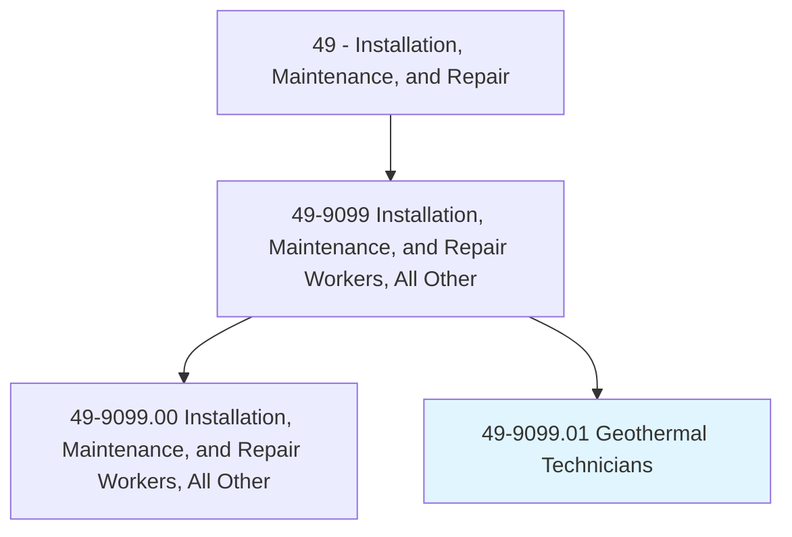
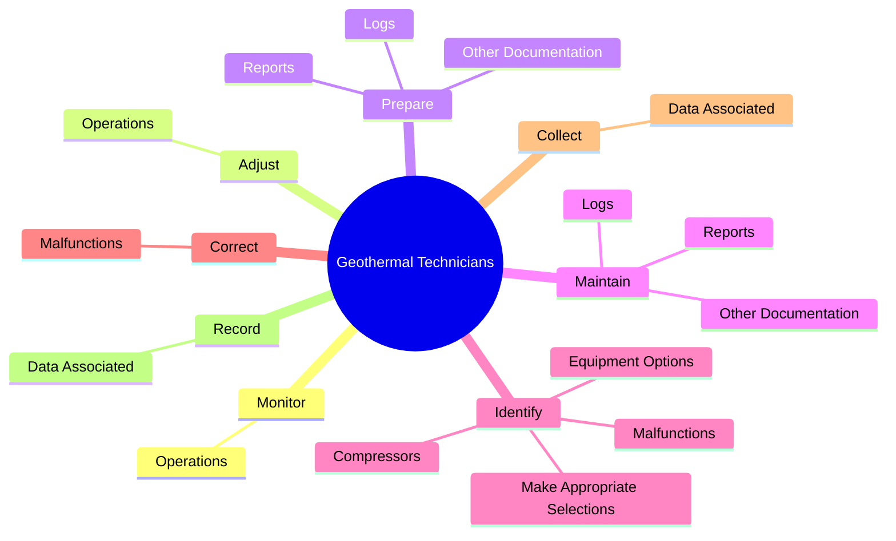
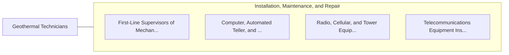

# Geothermal Technicians

> Perform technical activities at power plants or individual installations necessary for the generation of power from geothermal energy sources. Monitor and control operating activities at geothermal power generation facilities and perform maintenance and repairs as necessary. Install, test, and maintain residential and commercial geothermal heat pumps.

## Overview

Geothermal Technicians is a specialized variant within the Installation, Maintenance, and Repair category. Perform technical activities at power plants or individual installations necessary for the generation of power from geothermal energy sources. Monitor and control operating activities at geothermal power generation facilities and perform maintenance and repairs as necessary.

## Classification Hierarchy

## Key Statistics

| Metric | Value |
|--------|-------|
| SOC Code | 49-9099.01 |
| Category | [Installation, Maintenance, and Repair](/occupations/Maintenance/index) |
| Task Count | 98 |
| Source | O*NET |

## Core Tasks

### monitor.Operations

Geothermal Technicians monitor operations as part of their core responsibilities.

**Actions:**
- `monitor.Operations.of.GeothermalPowerPlantEquipment`
- `monitor.Operations.of.Systems`

### adjust.Operations

Geothermal Technicians adjust operations as part of their core responsibilities.

**Actions:**
- `adjust.Operations.of.GeothermalPowerPlantEquipment`
- `adjust.Operations.of.Systems`

### prepare.Logs

Geothermal Technicians prepare logs as part of their core responsibilities.

**Actions:**
- `prepare.Logs.of.WorkPerformed`
- `prepare.Reports.of.WorkPerformed`
- `prepare.OtherDocumentation.of.WorkPerformed`

## Skills & Competencies

### Technical Skills
- **Equipment Repair** - Advanced
- **Diagnostic Testing** - Advanced
- **Preventive Maintenance** - Advanced

### Soft Skills
- **Communication** - Essential
- **Problem Solving** - Essential
- **Critical Thinking** - Important
- **Teamwork** - Important
- **Adaptability** - Important

## Related Occupations

## Industries

This occupation is found across multiple industries. See [Industries](/industries) for sector-specific employment data.

## Career Progression

---

*Source: O*NET 49-9099.01 - ONETOccupation*
