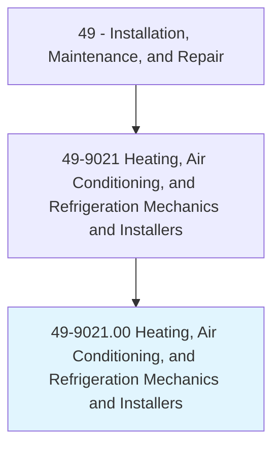
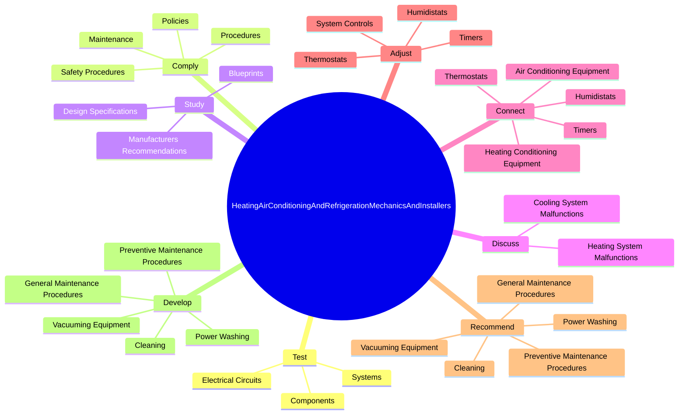
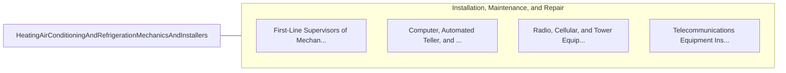

# Heating, Air Conditioning, and Refrigeration Mechanics and Installers

> Install or repair heating, central air conditioning, HVAC, or refrigeration systems, including oil burners, hot-air furnaces, and heating stoves.

## Overview

Heating, Air Conditioning, and Refrigeration Mechanics and Installers is classified under Installation, Maintenance, and Repair (SOC 49). Install or repair heating, central air conditioning, HVAC, or refrigeration systems, including oil burners, hot-air furnaces, and heating stoves.

## Classification Hierarchy

## Key Statistics

| Metric | Value |
|--------|-------|
| SOC Code | 49-9021.00 |
| Category | [Installation, Maintenance, and Repair](/occupations/Maintenance) |
| Task Count | 189 |
| Source | O*NET |

## Core Tasks

### test.ElectricalCircuits

Heating, Air Conditioning, and Refrigeration Mechanics and Installers test electrical circuits as part of their core responsibilities.

**Actions:**
- `test.ElectricalCircuits.for.Continuity`
- `test.ElectricalCircuits.for.UsingElectricalTestEquipment`
- `test.Components.for.Continuity`
- `test.Components.for.UsingElectricalTestEquipment`

### comply.Policies

Heating, Air Conditioning, and Refrigeration Mechanics and Installers comply policies as part of their core responsibilities.

**Actions:**
- `comply.Policies.of.CleanWorkArea`
- `comply.Procedures.of.CleanWorkArea`
- `comply.SafetyProcedures.of.CleanWorkArea`
- `comply.Maintenance.of.CleanWorkArea`

### study.Blueprints

Heating, Air Conditioning, and Refrigeration Mechanics and Installers study blueprints as part of their core responsibilities.

**Actions:**
- `study.Blueprints.to.ascertain.ConfigurationOfHeating`
- `study.Blueprints.to.CoolingEquipmentComponentsEnsureProperInstallationOfComponents`
- `study.Blueprints.to.ToEnsureProperInstallationOfComponents`
- `study.DesignSpecifications.to.ascertain.ConfigurationOfHeating`

## Skills & Competencies

### Technical Skills
- **Equipment Repair** - Advanced
- **Diagnostic Testing** - Advanced
- **Preventive Maintenance** - Advanced

### Soft Skills
- **Communication** - Essential
- **Problem Solving** - Essential
- **Critical Thinking** - Important
- **Teamwork** - Important
- **Adaptability** - Important

## Related Occupations

## Industries

This occupation is found across multiple industries. See [Industries](/industries) for sector-specific employment data.

## Career Progression

---

*Source: O*NET 49-9021.00 - ONETOccupation*
