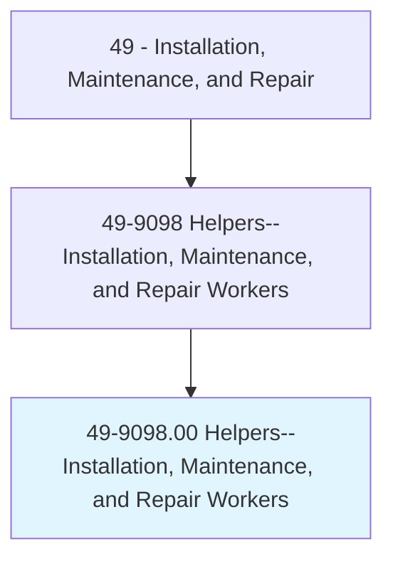
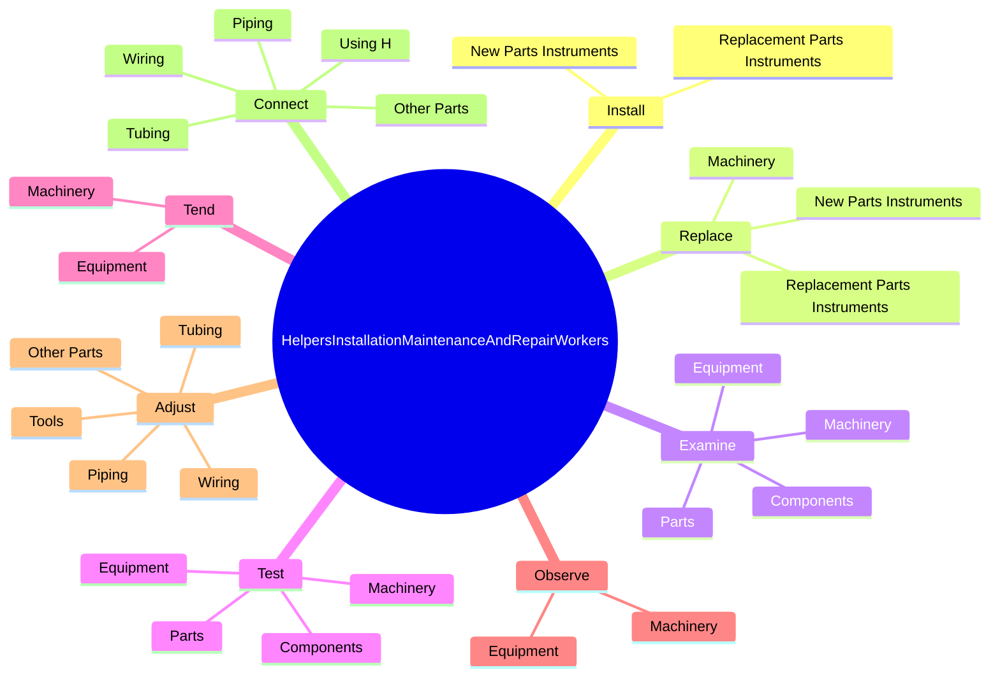
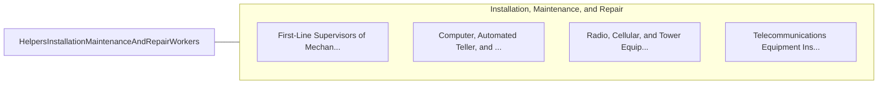

# Helpers--Installation, Maintenance, and Repair Workers

> Help installation, maintenance, and repair workers in maintenance, parts replacement, and repair of vehicles, industrial machinery, and electrical and electronic equipment. Perform duties such as furnishing tools, materials, and supplies to other workers; cleaning work area, machines, and tools; and holding materials or tools for other workers.

## Overview

Helpers--Installation, Maintenance, and Repair Workers is an occupation within the Installation, Maintenance, and Repair category. Help installation, maintenance, and repair workers in maintenance, parts replacement, and repair of vehicles, industrial machinery, and electrical and electronic equipment. 

## Classification Hierarchy

## Key Statistics

| Metric | Value |
|--------|-------|
| SOC Code | 49-9098.00 |
| Category | [Installation, Maintenance, and Repair](/occupations/Maintenance/index) |
| Task Count | 125 |
| Source | O*NET |

## Core Tasks

### install.NewPartsInstruments

Helpers--Installation, Maintenance, and Repair Workers install new parts instruments as part of their core responsibilities.

**Actions:**
- `install.NewPartsInstruments`
- `install.ReplacementPartsInstruments`

### replace.Machinery

Helpers--Installation, Maintenance, and Repair Workers replace machinery as part of their core responsibilities.

**Actions:**
- `replace.Machinery`
- `replace.NewPartsInstruments`
- `replace.ReplacementPartsInstruments`

### examine.Machinery

Helpers--Installation, Maintenance, and Repair Workers examine machinery as part of their core responsibilities.

**Actions:**
- `examine.Machinery.for.Defects.to.ensure.ProperFunctioning`
- `examine.Equipment.for.Defects.to.ensure.ProperFunctioning`
- `examine.Components.for.Defects.to.ensure.ProperFunctioning`
- `examine.Parts.for.Defects.to.ensure.ProperFunctioning`

## Skills & Competencies

### Technical Skills
- **Equipment Repair** - Advanced
- **Diagnostic Testing** - Advanced
- **Preventive Maintenance** - Advanced

### Soft Skills
- **Communication** - Essential
- **Problem Solving** - Essential
- **Critical Thinking** - Important
- **Teamwork** - Important
- **Adaptability** - Important

## Related Occupations

## Industries

This occupation is found across multiple industries. See [Industries](/industries) for sector-specific employment data.

## Career Progression

---

*Source: O*NET 49-9098.00 - ONETOccupation*
