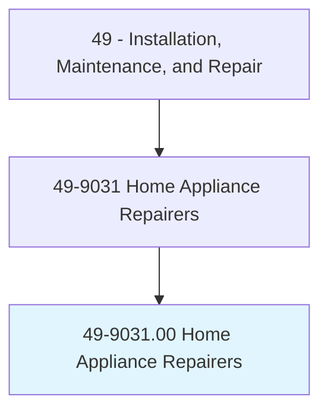
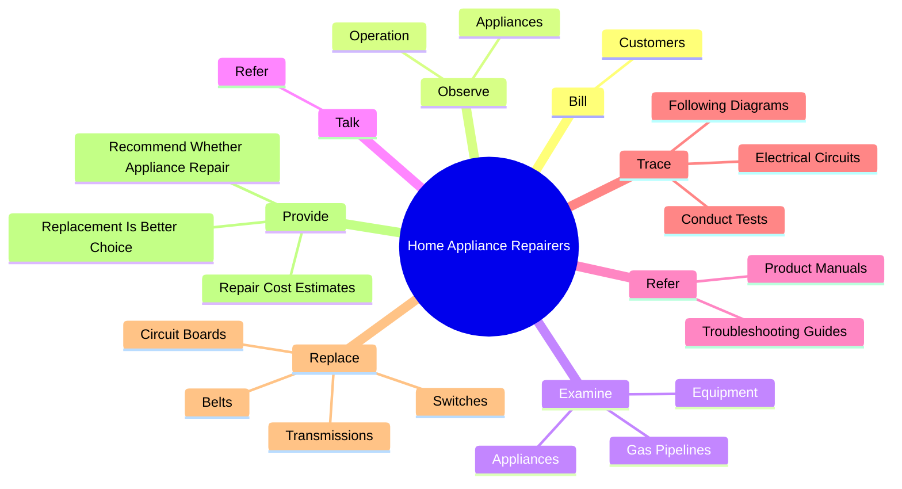
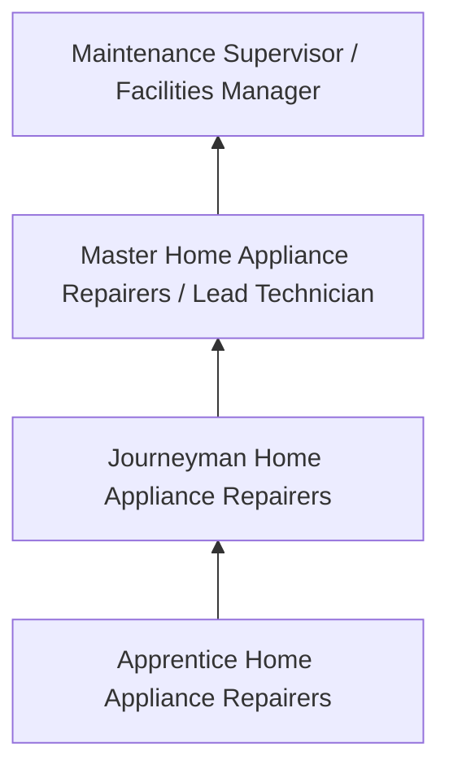
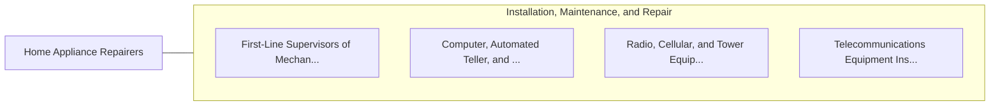

# Home Appliance Repairers

> Repair, adjust, or install all types of electric or gas household appliances, such as refrigerators, washers, dryers, and ovens.

## Overview

Home Appliance Repairers professionals repair, adjust, or install all types of electric or gas household appliances, such as refrigerators, washers, dryers, and ovens.. This occupation falls within the Installation, Maintenance, and Repair category and requires a combination of specialized knowledge, technical skills, and practical experience.

These professionals work across diverse settings and organizational contexts, applying their expertise to meet the demands of their field. They must stay current with industry standards, emerging practices, and regulatory requirements that affect their work. The role demands both independent judgment and collaborative skills, as practitioners regularly interact with colleagues, stakeholders, and the public.

As the field continues to evolve, Home Appliance Repairers professionals increasingly leverage technology and data-driven approaches to enhance their effectiveness. Career opportunities span the public and private sectors, with demand influenced by economic conditions, demographic shifts, and technological advancement.

## Classification Hierarchy



## Key Statistics

| Metric | Value |
|--------|-------|
| SOC Code | 49-9031.00 |
| Job Zone | N/A |
| Category | [Installation, Maintenance, and Repair](/occupations/Maintenance/index) |
| Core Tasks | 145+ |
| Salary Range | $35,000 - $80,000 |
| Median Salary | $50,000 |
| Growth Outlook | 5% (As fast as average) |
| Source | O*NET |

## Core Tasks



### level.Refrigerators

Home Appliance Repairers level refrigerators as part of their core responsibilities.

**Actions:**
- `level.Refrigerators.to.water.PipesForIceMakers` - Level refrigerators, adjust doors, and connect water lines to water pipes for...
- `level.Refrigerators.to.water.Dispensers` - Level refrigerators, adjust doors, and connect water lines to water pipes for...
- `level.Refrigerators.to.UsingH` - Level refrigerators, adjust doors, and connect water lines to water pipes for...
- `level.Refrigerators.to.Tools` - Level refrigerators, adjust doors, and connect water lines to water pipes for...
- `level.AdjustDoors.to.water.PipesForIceMakers` - Level refrigerators, adjust doors, and connect water lines to water pipes for...

### examine.Appliances

Home Appliance Repairers examine appliances as part of their core responsibilities.

**Actions:**
- `examine.Appliances.during.Operation.to.detect.SpecificMalfunctions` - Observe and examine appliances during operation to detect specific malfunctio...
- `examine.Appliances.during.OperationToLooseParts` - Observe and examine appliances during operation to detect specific malfunctio...
- `examine.Appliances.during.OperationToLeakingFluid` - Observe and examine appliances during operation to detect specific malfunctio...
- `examine.GasPipelines.to.locate.LeaksConnections` - Test and examine gas pipelines and equipment to locate leaks and faulty conne...
- `examine.GasPipelines.to.FaultyConnections` - Test and examine gas pipelines and equipment to locate leaks and faulty conne...

### test.GasPipelines

Home Appliance Repairers test gas pipelines as part of their core responsibilities.

**Actions:**
- `test.GasPipelines.to.locate.LeaksConnections` - Test and examine gas pipelines and equipment to locate leaks and faulty conne...
- `test.GasPipelines.to.FaultyConnections` - Test and examine gas pipelines and equipment to locate leaks and faulty conne...
- `test.GasPipelines.to.ToDeterminePressure` - Test and examine gas pipelines and equipment to locate leaks and faulty conne...
- `test.GasPipelines.to.FlowOfGas` - Test and examine gas pipelines and equipment to locate leaks and faulty conne...
- `test.Equipment.to.locate.LeaksConnections` - Test and examine gas pipelines and equipment to locate leaks and faulty conne...

### measure.Pipe

Home Appliance Repairers measure pipe as part of their core responsibilities.

**Actions:**
- `measure.Pipe.to.FeederLinesAppliances` - Measure, cut, and thread pipe, and connect it to feeder lines and equipment o...
- `measure.Pipe.to.EquipmentAppliances` - Measure, cut, and thread pipe, and connect it to feeder lines and equipment o...
- `measure.Pipe.to.UsingRules` - Measure, cut, and thread pipe, and connect it to feeder lines and equipment o...
- `measure.Pipe.to.hand.Tools` - Measure, cut, and thread pipe, and connect it to feeder lines and equipment o...
- `measure.ConnectIt.to.FeederLinesAppliances` - Measure, cut, and thread pipe, and connect it to feeder lines and equipment o...


## Skills & Competencies

### Technical Skills
- **Diagnostics and Troubleshooting** - Expert
- **Repair Techniques** - Advanced
- **Preventive Maintenance** - Advanced
- **Electrical Systems** - Advanced
- **Mechanical Systems** - Advanced
- **Safety Compliance** - Advanced

### Soft Skills
- **Problem Solving** - Critical
- **Attention to Detail** - Critical
- **Physical Stamina** - Essential
- **Communication** - Essential
- **Time Management** - Essential

## Education & Certifications

| Requirement | Details |
|-------------|---------|
| Typical Education | Post-secondary technical training or apprenticeship |
| Work Experience | 1-4 years hands-on experience |
| On-the-Job Training | Extensive - apprenticeship or technical certification programs |
| Certifications | Trade-specific licenses, EPA certifications, manufacturer certifications |

## Career Progression



## Industry Variations

### Industrial Maintenance
Equipment repair in manufacturing and production facilities. Home Appliance Repairers professionals keep production lines running efficiently.

### Commercial Building Services
HVAC, electrical, and plumbing maintenance for commercial properties. Focus on preventive maintenance and tenant satisfaction.

### Automotive and Vehicle
Diagnosis and repair of vehicles and mobile equipment. Emphasis on diagnostic technology and manufacturer specifications.

### Specialized Technical
Maintenance of specialized systems such as telecommunications, medical equipment, or industrial controls.

## Technology & Tools

- **Diagnostic equipment and multimeters**
- **Computerized maintenance management systems (CMMS)**
- **Specialty hand and power tools**
- **Thermal imaging cameras**
- **Technical documentation systems**

## Related Occupations



## Industries

- [Automotive Repair](/industries/AutomotiveRepair) - High Employment
- [Manufacturing](/industries/Manufacturing) - High Employment
- [Commercial Building Services](/industries/BuildingServices) - Moderate Employment
- [Telecommunications](/industries/Telecom) - Moderate Employment

## Departments

This occupation typically works in:
- [Maintenance and Repair](/departments/Maintenance)
- [Facilities Management](/departments/Facilities)
- [Technical Services](/departments/TechnicalServices)

## GraphDL Semantic Structure

```
Home Appliance Repairers perform:
- bill.Customers.for.RepairWork
- bill.Customers.for.CollectPayment
- observe.Appliances.during.Operation.to.detect.SpecificMalfunctions
- observe.Appliances.during.OperationToLooseParts
- observe.Appliances.during.OperationToLeakingFluid
- examine.Appliances.during.Operation.to.detect.SpecificMalfunctions
```

---

*Source: O*NET 49-9031.00 - ONETOccupation*
