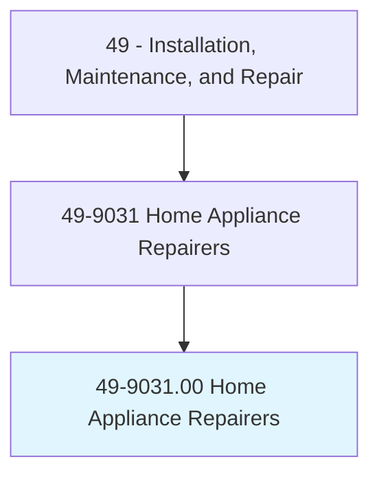
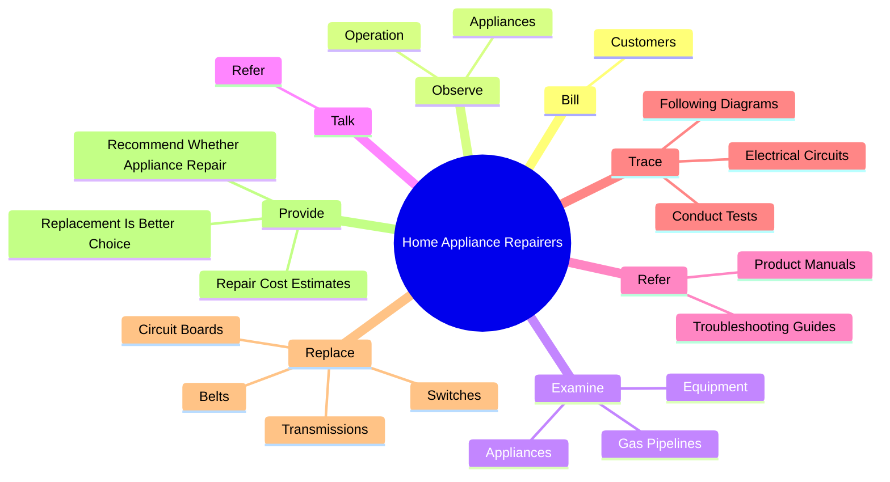
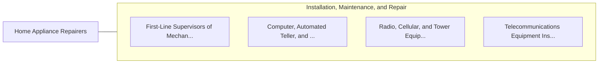

# Home Appliance Repairers

> Repair, adjust, or install all types of electric or gas household appliances, such as refrigerators, washers, dryers, and ovens.

## Overview

Home Appliance Repairers is classified under Installation, Maintenance, and Repair (SOC 49). Repair, adjust, or install all types of electric or gas household appliances, such as refrigerators, washers, dryers, and ovens.

## Classification Hierarchy

## Key Statistics

| Metric | Value |
|--------|-------|
| SOC Code | 49-9031.00 |
| Category | [Installation, Maintenance, and Repair](/occupations/Maintenance/index) |
| Task Count | 145 |
| Source | O*NET |

## Core Tasks

### bill.Customers

Home Appliance Repairers bill customers as part of their core responsibilities.

**Actions:**
- `bill.Customers.for.RepairWork`
- `bill.Customers.for.CollectPayment`

### observe.Appliances

Home Appliance Repairers observe appliances as part of their core responsibilities.

**Actions:**
- `observe.Appliances.during.Operation.to.detect.SpecificMalfunctions`
- `observe.Appliances.during.OperationToLooseParts`
- `observe.Appliances.during.OperationToLeakingFluid`
- `observe.Operation.of.AppliancesFollowingInstallation`

### examine.Appliances

Home Appliance Repairers examine appliances as part of their core responsibilities.

**Actions:**
- `examine.Appliances.during.Operation.to.detect.SpecificMalfunctions`
- `examine.Appliances.during.OperationToLooseParts`
- `examine.Appliances.during.OperationToLeakingFluid`
- `examine.GasPipelines.to.locate.LeaksConnections`

## Skills & Competencies

### Technical Skills
- **Equipment Repair** - Advanced
- **Diagnostic Testing** - Advanced
- **Preventive Maintenance** - Advanced

### Soft Skills
- **Communication** - Essential
- **Problem Solving** - Essential
- **Critical Thinking** - Important
- **Teamwork** - Important
- **Adaptability** - Important

## Related Occupations

## Industries

This occupation is found across multiple industries. See [Industries](/industries) for sector-specific employment data.

## Career Progression

---

*Source: O*NET 49-9031.00 - ONETOccupation*
