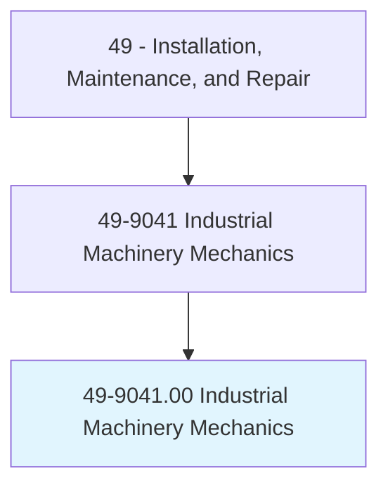
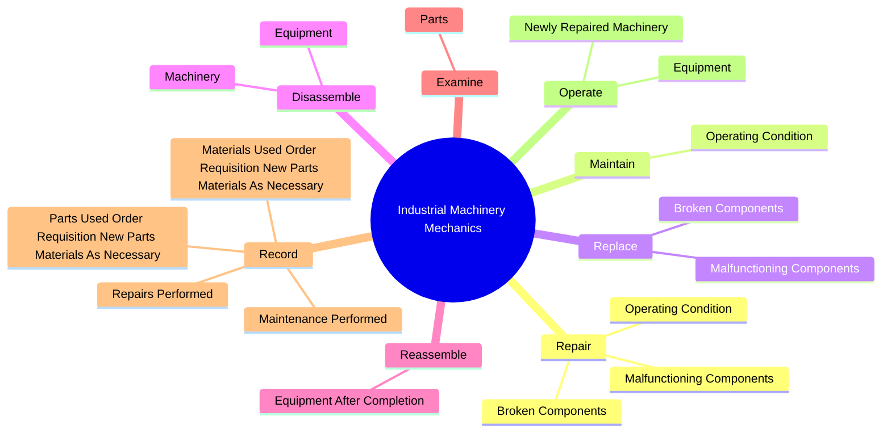
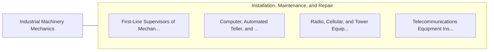

# Industrial Machinery Mechanics

> Repair, install, adjust, or maintain industrial production and processing machinery or refinery and pipeline distribution systems. May also install, dismantle, or move machinery and heavy equipment according to plans.

## Overview

Industrial Machinery Mechanics is an occupation within the Installation, Maintenance, and Repair category. Repair, install, adjust, or maintain industrial production and processing machinery or refinery and pipeline distribution systems. 

## Classification Hierarchy

## Key Statistics

| Metric | Value |
|--------|-------|
| SOC Code | 49-9041.00 |
| Category | [Installation, Maintenance, and Repair](/occupations/Maintenance) |
| Task Count | 55 |
| Source | O*NET |

## Core Tasks

### repair.OperatingCondition

Industrial Machinery Mechanics repair operating condition as part of their core responsibilities.

**Actions:**
- `repair.OperatingCondition.of.IndustrialProduction`
- `repair.OperatingCondition.of.ProcessingMachinery`
- `repair.OperatingCondition.of.Equipment`
- `repair.BrokenComponents.of.Machinery`

### maintain.OperatingCondition

Industrial Machinery Mechanics maintain operating condition as part of their core responsibilities.

**Actions:**
- `maintain.OperatingCondition.of.IndustrialProduction`
- `maintain.OperatingCondition.of.ProcessingMachinery`
- `maintain.OperatingCondition.of.Equipment`

### replace.BrokenComponents

Industrial Machinery Mechanics replace broken components as part of their core responsibilities.

**Actions:**
- `replace.BrokenComponents.of.Machinery`
- `replace.BrokenComponents.of.Equipment`
- `replace.MalfunctioningComponents.of.Machinery`
- `replace.MalfunctioningComponents.of.Equipment`

## Skills & Competencies

### Technical Skills
- **Equipment Repair** - Advanced
- **Diagnostic Testing** - Advanced
- **Preventive Maintenance** - Advanced

### Soft Skills
- **Communication** - Essential
- **Problem Solving** - Essential
- **Critical Thinking** - Important
- **Teamwork** - Important
- **Adaptability** - Important

## Related Occupations

## Industries

This occupation is found across multiple industries. See [Industries](/industries) for sector-specific employment data.

## Career Progression

---

*Source: O*NET 49-9041.00 - ONETOccupation*
