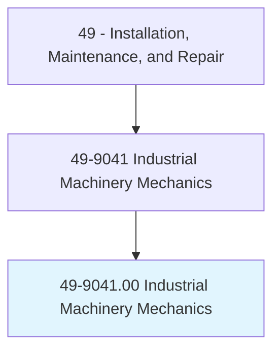
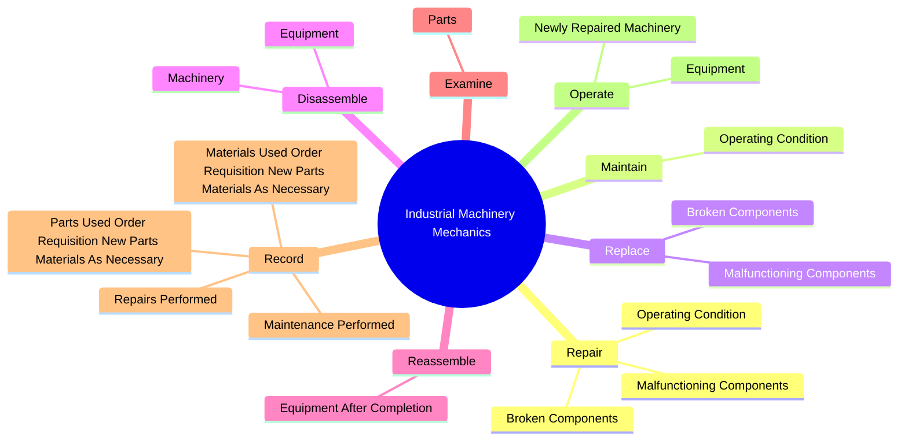
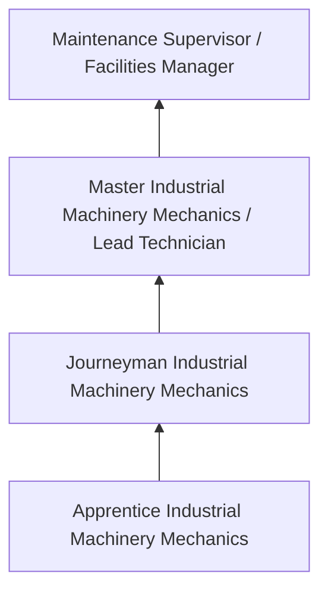
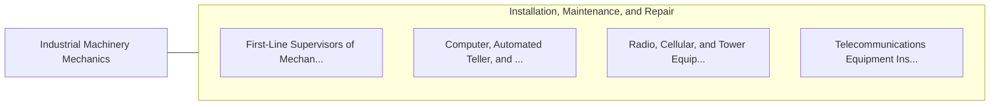

# Industrial Machinery Mechanics

> Repair, install, adjust, or maintain industrial production and processing machinery or refinery and pipeline distribution systems. May also install, dismantle, or move machinery and heavy equipment according to plans.

## Overview

Industrial Machinery Mechanics professionals repair, install, adjust, or maintain industrial production and processing machinery or refinery and pipeline distribution systems. This occupation falls within the Installation, Maintenance, and Repair category and requires a combination of specialized knowledge, technical skills, and practical experience.

These professionals work across diverse settings and organizational contexts, applying their expertise to meet the demands of their field. They must stay current with industry standards, emerging practices, and regulatory requirements that affect their work. The role demands both independent judgment and collaborative skills, as practitioners regularly interact with colleagues, stakeholders, and the public.

As the field continues to evolve, Industrial Machinery Mechanics professionals increasingly leverage technology and data-driven approaches to enhance their effectiveness. Career opportunities span the public and private sectors, with demand influenced by economic conditions, demographic shifts, and technological advancement.

## Classification Hierarchy



## Key Statistics

| Metric | Value |
|--------|-------|
| SOC Code | 49-9041.00 |
| Job Zone | N/A |
| Category | [Installation, Maintenance, and Repair](/occupations/Maintenance/index) |
| Core Tasks | 55+ |
| Salary Range | $35,000 - $80,000 |
| Median Salary | $50,000 |
| Growth Outlook | 5% (As fast as average) |
| Source | O*NET |

## Core Tasks



### repair.OperatingCondition

Industrial Machinery Mechanics repair operating condition as part of their core responsibilities.

**Actions:**
- `repair.OperatingCondition.of.IndustrialProduction` - Repair or maintain the operating condition of industrial production or proces...
- `repair.OperatingCondition.of.ProcessingMachinery` - Repair or maintain the operating condition of industrial production or proces...
- `repair.OperatingCondition.of.Equipment` - Repair or maintain the operating condition of industrial production or proces...
- `repair.BrokenComponents.of.Machinery` - Repair or replace broken or malfunctioning components of machinery or equipment.
- `repair.BrokenComponents.of.Equipment` - Repair or replace broken or malfunctioning components of machinery or equipment.

### replace.BrokenComponents

Industrial Machinery Mechanics replace broken components as part of their core responsibilities.

**Actions:**
- `replace.BrokenComponents.of.Machinery` - Repair or replace broken or malfunctioning components of machinery or equipment.
- `replace.BrokenComponents.of.Equipment` - Repair or replace broken or malfunctioning components of machinery or equipment.
- `replace.MalfunctioningComponents.of.Machinery` - Repair or replace broken or malfunctioning components of machinery or equipment.
- `replace.MalfunctioningComponents.of.Equipment` - Repair or replace broken or malfunctioning components of machinery or equipment.

### disassemble.Machinery

Industrial Machinery Mechanics disassemble machinery as part of their core responsibilities.

**Actions:**
- `disassemble.Machinery.to.remove.Parts` - Disassemble machinery or equipment to remove parts and make repairs.
- `disassemble.Machinery.to.make.Repairs` - Disassemble machinery or equipment to remove parts and make repairs.
- `disassemble.Equipment.to.remove.Parts` - Disassemble machinery or equipment to remove parts and make repairs.
- `disassemble.Equipment.to.make.Repairs` - Disassemble machinery or equipment to remove parts and make repairs.

### record.RepairsPerformed

Industrial Machinery Mechanics record repairs performed as part of their core responsibilities.

**Actions:**
- `record.RepairsPerformed` - Record repairs and maintenance performed.
- `record.MaintenancePerformed` - Record repairs and maintenance performed.
- `record.PartsUsedOrderRequisitionNewPartsMaterialsAsNecessary` - Record parts or materials used and order or requisition new parts or material...
- `record.MaterialsUsedOrderRequisitionNewPartsMaterialsAsNecessary` - Record parts or materials used and order or requisition new parts or material...


## Skills & Competencies

### Technical Skills
- **Diagnostics and Troubleshooting** - Expert
- **Repair Techniques** - Advanced
- **Preventive Maintenance** - Advanced
- **Electrical Systems** - Advanced
- **Mechanical Systems** - Advanced
- **Safety Compliance** - Advanced

### Soft Skills
- **Problem Solving** - Critical
- **Attention to Detail** - Critical
- **Physical Stamina** - Essential
- **Communication** - Essential
- **Time Management** - Essential

## Education & Certifications

| Requirement | Details |
|-------------|---------|
| Typical Education | Post-secondary technical training or apprenticeship |
| Work Experience | 1-4 years hands-on experience |
| On-the-Job Training | Extensive - apprenticeship or technical certification programs |
| Certifications | Trade-specific licenses, EPA certifications, manufacturer certifications |

## Career Progression



## Industry Variations

### Industrial Maintenance
Equipment repair in manufacturing and production facilities. Industrial Machinery Mechanics professionals keep production lines running efficiently.

### Commercial Building Services
HVAC, electrical, and plumbing maintenance for commercial properties. Focus on preventive maintenance and tenant satisfaction.

### Automotive and Vehicle
Diagnosis and repair of vehicles and mobile equipment. Emphasis on diagnostic technology and manufacturer specifications.

### Specialized Technical
Maintenance of specialized systems such as telecommunications, medical equipment, or industrial controls.

## Technology & Tools

- **Diagnostic equipment and multimeters**
- **Computerized maintenance management systems (CMMS)**
- **Specialty hand and power tools**
- **Thermal imaging cameras**
- **Technical documentation systems**

## Related Occupations



## Industries

- [Automotive Repair](/industries/AutomotiveRepair) - High Employment
- [Manufacturing](/industries/Manufacturing) - High Employment
- Commercial Building Services - Moderate Employment
- Telecommunications - Moderate Employment

## Departments

This occupation typically works in:
- [Maintenance and Repair](/departments/Operations)
- [Facilities Management](/departments/Operations)
- Technical Services

## GraphDL Semantic Structure

```graphdl
Industrial Machinery Mechanics perform:
- repair.OperatingCondition.of.IndustrialProduction
- repair.OperatingCondition.of.ProcessingMachinery
- repair.OperatingCondition.of.Equipment
- maintain.OperatingCondition.of.IndustrialProduction
- maintain.OperatingCondition.of.ProcessingMachinery
- maintain.OperatingCondition.of.Equipment
```

---

*Source: O*NET 49-9041.00 - ONETOccupation*
