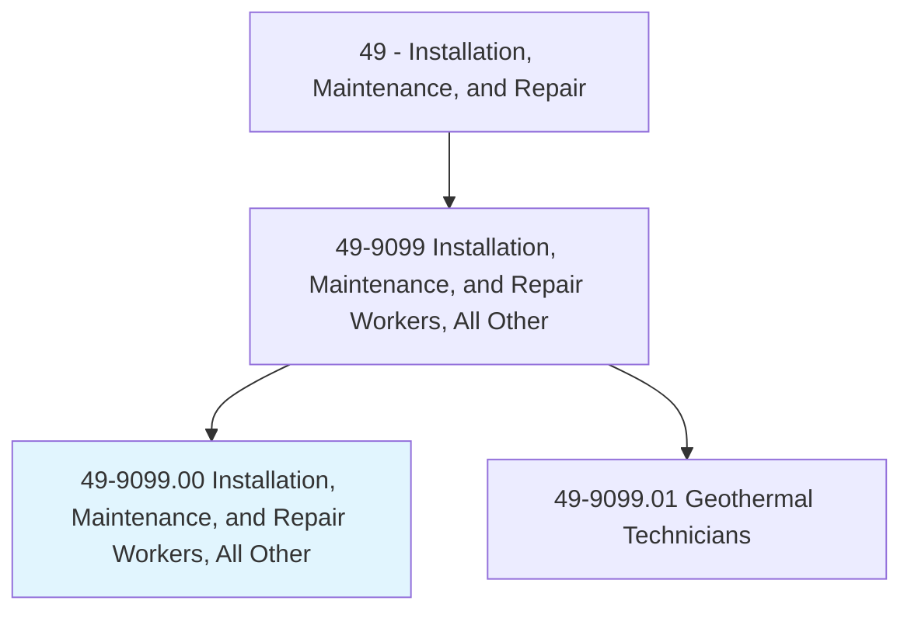
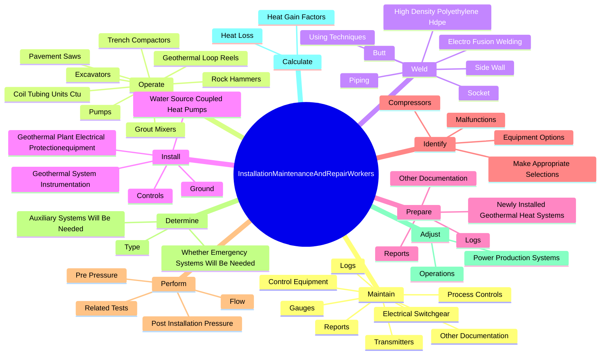
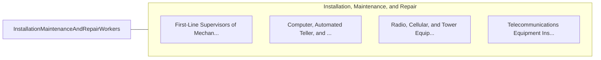

# Installation, Maintenance, and Repair Workers, All Other

> All installation, maintenance, and repair workers not listed separately.

## Overview

Installation, Maintenance, and Repair Workers, All Other is classified under Installation, Maintenance, and Repair (SOC 49). All installation, maintenance, and repair workers not listed separately.

## Classification Hierarchy

## Key Statistics

| Metric | Value |
|--------|-------|
| SOC Code | 49-9099.00 |
| Category | [Installation, Maintenance, and Repair](/occupations/Maintenance) |
| Task Count | 98 |
| Source | O*NET |

## Core Tasks

### maintain.Logs

Installation, Maintenance, and Repair Workers, All Other maintain logs as part of their core responsibilities.

**Actions:**
- `maintain.Logs.of.WorkPerformed`
- `maintain.Reports.of.WorkPerformed`
- `maintain.OtherDocumentation.of.WorkPerformed`
- `maintain.ElectricalSwitchgear.in.Accordance`

### operate.Excavators

Installation, Maintenance, and Repair Workers, All Other operate excavators as part of their core responsibilities.

**Actions:**
- `operate.Excavators`
- `operate.RockHammers`
- `operate.TrenchCompactors`
- `operate.PavementSaws`

### weld.Piping

Installation, Maintenance, and Repair Workers, All Other weld piping as part of their core responsibilities.

**Actions:**
- `weld.Piping`
- `weld.HighDensityPolyethyleneHdpe`
- `weld.UsingTechniques`
- `weld.Butt`

## Skills & Competencies

### Technical Skills
- **Equipment Repair** - Advanced
- **Diagnostic Testing** - Advanced
- **Preventive Maintenance** - Advanced

### Soft Skills
- **Communication** - Essential
- **Problem Solving** - Essential
- **Critical Thinking** - Important
- **Teamwork** - Important
- **Adaptability** - Important

## Related Occupations

## Industries

This occupation is found across multiple industries. See [Industries](/industries) for sector-specific employment data.

## Career Progression

---

*Source: O*NET 49-9099.00 - ONETOccupation*
