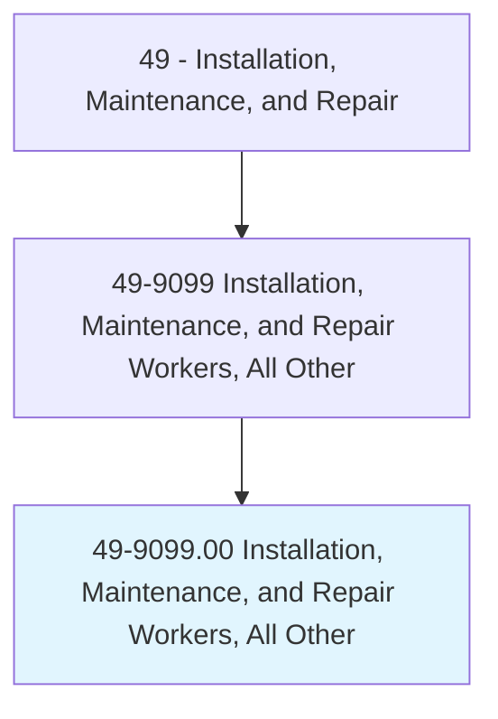
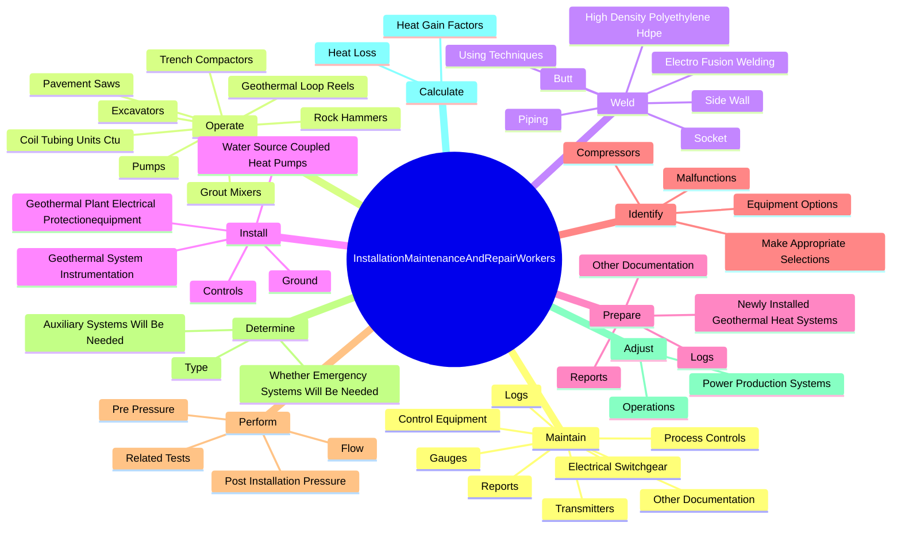
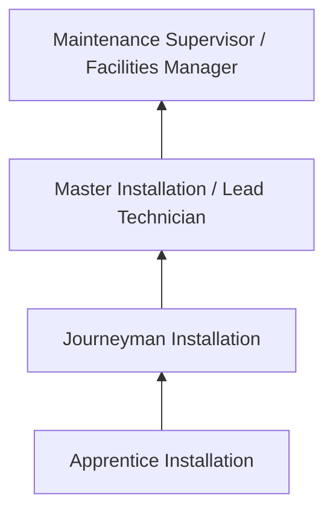
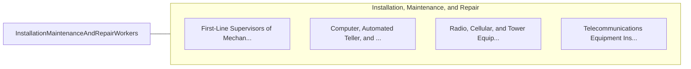

# Installation, Maintenance, and Repair Workers, All Other

> All installation, maintenance, and repair workers not listed separately.

## Overview

Installation, Maintenance, and Repair Workers professionals serve a vital function within the Installation, Maintenance, and Repair field. They bring specialized skills and knowledge to their roles, contributing to organizational objectives and societal needs.

These practitioners work in varied environments, adapting their expertise to meet specific requirements of their industry and employer. The role requires ongoing professional development to maintain competency and respond to changing demands.

Career paths in this field offer opportunities for advancement through experience, additional education, and specialized certifications. Employment prospects are influenced by industry trends, technological change, and workforce demographics.

## Classification Hierarchy



## Key Statistics

| Metric | Value |
|--------|-------|
| SOC Code | 49-9099.00 |
| Job Zone | N/A |
| Category | [Installation, Maintenance, and Repair](/occupations/Maintenance/index) |
| Core Tasks | N/A+ |
| Salary Range | $35,000 - $80,000 |
| Median Salary | $50,000 |
| Growth Outlook | 5% (As fast as average) |
| Source | O*NET |

## Core Tasks



### maintain.Logs

Installation, Maintenance, and Repair Workers, All Other maintain logs as part of their core responsibilities.

**Actions:**
- `maintain.Logs.of.WorkPerformed`
- `maintain.Reports.of.WorkPerformed`
- `maintain.OtherDocumentation.of.WorkPerformed`
- `maintain.ElectricalSwitchgear.in.Accordance`

### operate.Excavators

Installation, Maintenance, and Repair Workers, All Other operate excavators as part of their core responsibilities.

**Actions:**
- `operate.Excavators`
- `operate.RockHammers`
- `operate.TrenchCompactors`
- `operate.PavementSaws`

### weld.Piping

Installation, Maintenance, and Repair Workers, All Other weld piping as part of their core responsibilities.

**Actions:**
- `weld.Piping`
- `weld.HighDensityPolyethyleneHdpe`
- `weld.UsingTechniques`
- `weld.Butt`


### Technical Skills
- **Equipment Repair** - Advanced
- **Diagnostic Testing** - Advanced
- **Preventive Maintenance** - Advanced

### Soft Skills
- **Communication** - Essential
- **Problem Solving** - Essential
- **Critical Thinking** - Important
- **Teamwork** - Important
- **Adaptability** - Important


## Skills & Competencies

### Technical Skills
- **Diagnostics and Troubleshooting** - Expert
- **Repair Techniques** - Advanced
- **Preventive Maintenance** - Advanced
- **Electrical Systems** - Advanced
- **Mechanical Systems** - Advanced
- **Safety Compliance** - Advanced

### Soft Skills
- **Problem Solving** - Critical
- **Attention to Detail** - Critical
- **Physical Stamina** - Essential
- **Communication** - Essential
- **Time Management** - Essential

## Education & Certifications

| Requirement | Details |
|-------------|---------|
| Typical Education | Post-secondary technical training or apprenticeship |
| Work Experience | 1-4 years hands-on experience |
| On-the-Job Training | Extensive - apprenticeship or technical certification programs |
| Certifications | Trade-specific licenses, EPA certifications, manufacturer certifications |

## Career Progression



## Industry Variations

### Industrial Maintenance
Equipment repair in manufacturing and production facilities. Installation professionals keep production lines running efficiently.

### Commercial Building Services
HVAC, electrical, and plumbing maintenance for commercial properties. Focus on preventive maintenance and tenant satisfaction.

### Automotive and Vehicle
Diagnosis and repair of vehicles and mobile equipment. Emphasis on diagnostic technology and manufacturer specifications.

### Specialized Technical
Maintenance of specialized systems such as telecommunications, medical equipment, or industrial controls.

## Technology & Tools

- **Diagnostic equipment and multimeters**
- **Computerized maintenance management systems (CMMS)**
- **Specialty hand and power tools**
- **Thermal imaging cameras**
- **Technical documentation systems**

## Related Occupations



## Industries

- [Automotive Repair](/industries/AutomotiveRepair) - High Employment
- [Manufacturing](/industries/Manufacturing) - High Employment
- Commercial Building Services - Moderate Employment
- Telecommunications - Moderate Employment

## Departments

This occupation typically works in:
- [Maintenance and Repair](/departments/Operations)
- [Facilities Management](/departments/Operations)
- Technical Services

## GraphDL Semantic Structure

```graphdl
Installation, Maintenance, and Repair Workers, All Other perform:
- diagnose.Problems.in.EquipmentSystems
- repair.Equipment.using.SpecializedTools
- maintain.Systems.for.OptimalPerformance
- inspect.Components.for.WearAndDamage
- document.Repairs.in.MaintenanceRecords
```

---

*Source: O*NET 49-9099.00 - ONETOccupation*
