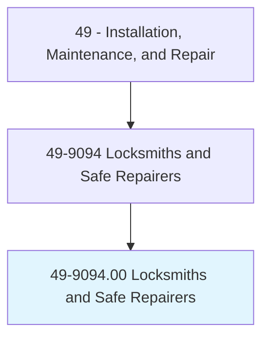
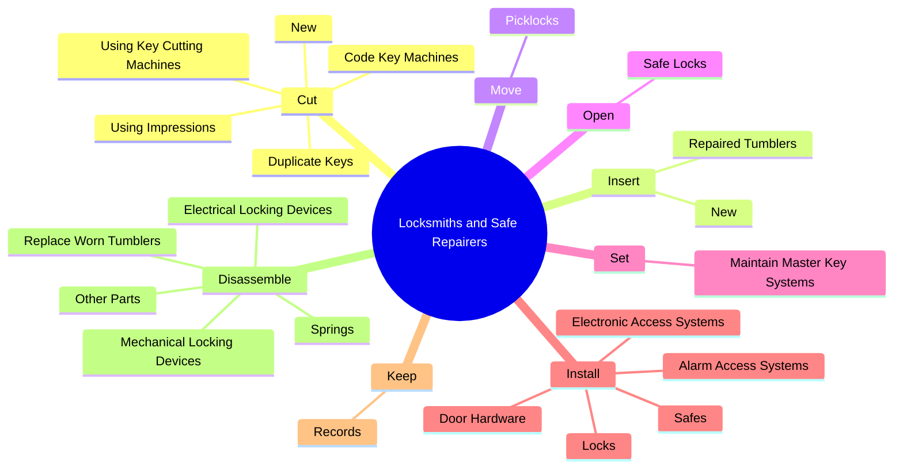
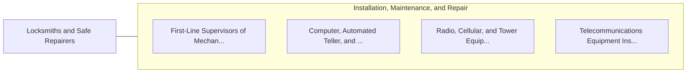

# Locksmiths and Safe Repairers

> Repair and open locks, make keys, change locks and safe combinations, and install and repair safes.

## Overview

Locksmiths and Safe Repairers is classified under Installation, Maintenance, and Repair (SOC 49). Repair and open locks, make keys, change locks and safe combinations, and install and repair safes.

## Classification Hierarchy

## Key Statistics

| Metric | Value |
|--------|-------|
| SOC Code | 49-9094.00 |
| Category | [Installation, Maintenance, and Repair](/occupations/Maintenance) |
| Task Count | 63 |
| Source | O*NET |

## Core Tasks

### cut.New

Locksmiths and Safe Repairers cut new as part of their core responsibilities.

**Actions:**
- `cut.New`
- `cut.DuplicateKeys`
- `cut.UsingImpressions`
- `cut.CodeKeyMachines`

### insert.New

Locksmiths and Safe Repairers insert new as part of their core responsibilities.

**Actions:**
- `insert.New.to.change.Combinations`
- `insert.RepairedTumblers.into.Locks.to.change.Combinations`

### move.Picklocks

Locksmiths and Safe Repairers move picklocks as part of their core responsibilities.

**Actions:**
- `move.Picklocks.in.Cylinders.to.open.DoorLocksWithoutKeys`

## Skills & Competencies

### Technical Skills
- **Equipment Repair** - Advanced
- **Diagnostic Testing** - Advanced
- **Preventive Maintenance** - Advanced

### Soft Skills
- **Communication** - Essential
- **Problem Solving** - Essential
- **Critical Thinking** - Important
- **Teamwork** - Important
- **Adaptability** - Important

## Related Occupations

## Industries

This occupation is found across multiple industries. See [Industries](/industries) for sector-specific employment data.

## Career Progression

---

*Source: O*NET 49-9094.00 - ONETOccupation*
