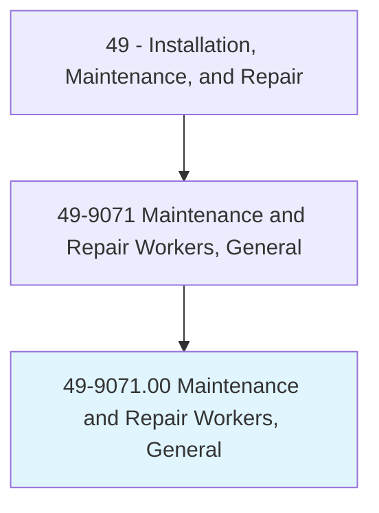
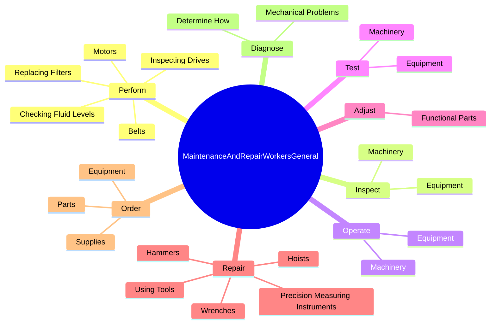
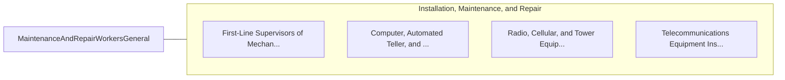

# Maintenance and Repair Workers, General

> Perform work involving the skills of two or more maintenance or craft occupations to keep machines, mechanical equipment, or the structure of a building in repair. Duties may involve pipe fitting; HVAC maintenance; insulating; welding; machining; carpentry; repairing electrical or mechanical equipment; installing, aligning, and balancing new equipment; and repairing buildings, floors, or stairs.

## Overview

Maintenance and Repair Workers, General is an occupation within the Installation, Maintenance, and Repair category. Perform work involving the skills of two or more maintenance or craft occupations to keep machines, mechanical equipment, or the structure of a building in repair. 

## Classification Hierarchy

## Key Statistics

| Metric | Value |
|--------|-------|
| SOC Code | 49-9071.00 |
| Category | [Installation, Maintenance, and Repair](/occupations/Maintenance) |
| Task Count | 197 |
| Source | O*NET |

## Core Tasks

### perform.InspectingDrives

Maintenance and Repair Workers, General perform inspecting drives as part of their core responsibilities.

**Actions:**
- `perform.InspectingDrives`
- `perform.Motors`
- `perform.Belts`
- `perform.CheckingFluidLevels`

### inspect.Machinery

Maintenance and Repair Workers, General inspect machinery as part of their core responsibilities.

**Actions:**
- `inspect.Machinery.to.diagnose.MachineMalfunctions`
- `inspect.Equipment.to.diagnose.MachineMalfunctions`

### operate.Machinery

Maintenance and Repair Workers, General operate machinery as part of their core responsibilities.

**Actions:**
- `operate.Machinery.to.diagnose.MachineMalfunctions`
- `operate.Equipment.to.diagnose.MachineMalfunctions`

## Skills & Competencies

### Technical Skills
- **Equipment Repair** - Advanced
- **Diagnostic Testing** - Advanced
- **Preventive Maintenance** - Advanced

### Soft Skills
- **Communication** - Essential
- **Problem Solving** - Essential
- **Critical Thinking** - Important
- **Teamwork** - Important
- **Adaptability** - Important

## Related Occupations

## Industries

This occupation is found across multiple industries. See [Industries](/industries) for sector-specific employment data.

## Career Progression

---

*Source: O*NET 49-9071.00 - ONETOccupation*
