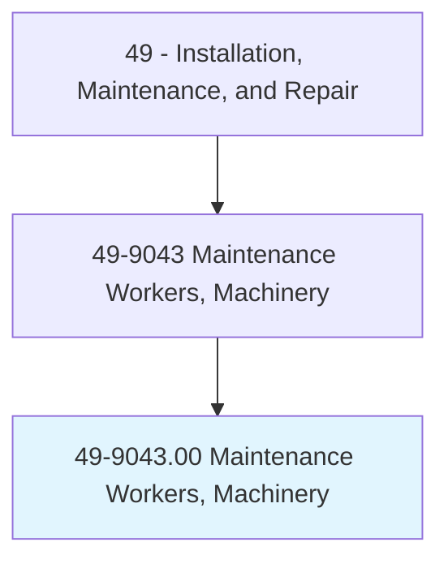
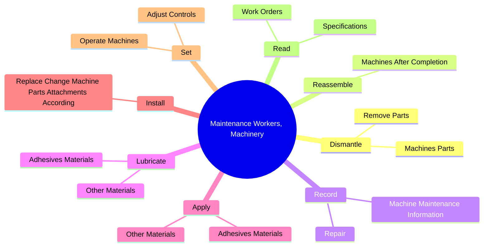
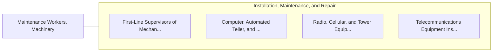

# Maintenance Workers, Machinery

> Lubricate machinery, change parts, or perform other routine machinery maintenance.

## Overview

Maintenance Workers, Machinery is classified under Installation, Maintenance, and Repair (SOC 49). Lubricate machinery, change parts, or perform other routine machinery maintenance.

## Classification Hierarchy

## Key Statistics

| Metric | Value |
|--------|-------|
| SOC Code | 49-9043.00 |
| Category | [Installation, Maintenance, and Repair](/occupations/Maintenance/index) |
| Task Count | 122 |
| Source | O*NET |

## Core Tasks

### dismantle.MachinesParts

Maintenance Workers, Machinery dismantle machines parts as part of their core responsibilities.

**Actions:**
- `dismantle.MachinesParts.for.Repair`
- `dismantle.MachinesParts.for.UsingH`
- `dismantle.MachinesParts.for.Tools`
- `dismantle.MachinesParts.for.ChainFalls`

### reassemble.MachinesAfterCompletion

Maintenance Workers, Machinery reassemble machines after completion as part of their core responsibilities.

**Actions:**
- `reassemble.MachinesAfterCompletion.of.RepairWork`
- `reassemble.MachinesAfterCompletion.of.MaintenanceWork`

### record.Repair

Maintenance Workers, Machinery record repair as part of their core responsibilities.

**Actions:**
- `record.Repair`
- `record.MachineMaintenanceInformation`

## Skills & Competencies

### Technical Skills
- **Equipment Repair** - Advanced
- **Diagnostic Testing** - Advanced
- **Preventive Maintenance** - Advanced

### Soft Skills
- **Communication** - Essential
- **Problem Solving** - Essential
- **Critical Thinking** - Important
- **Teamwork** - Important
- **Adaptability** - Important

## Related Occupations

## Industries

This occupation is found across multiple industries. See [Industries](/industries) for sector-specific employment data.

## Career Progression

---

*Source: O*NET 49-9043.00 - ONETOccupation*
