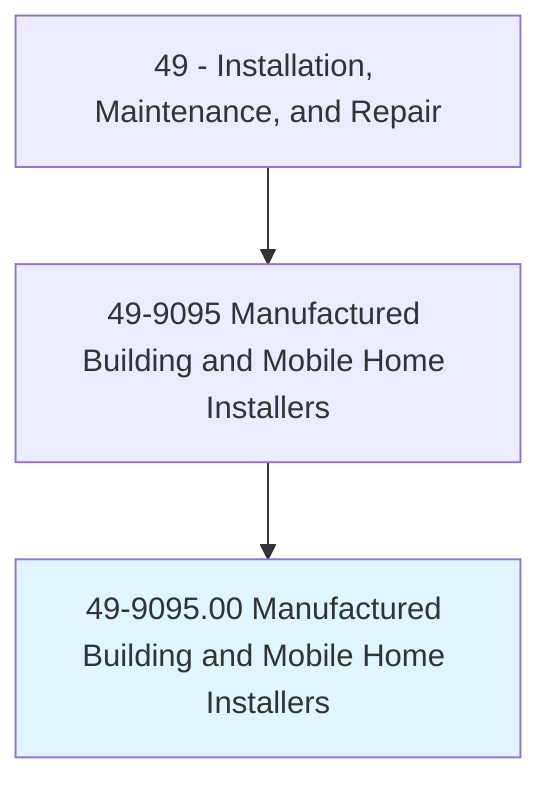
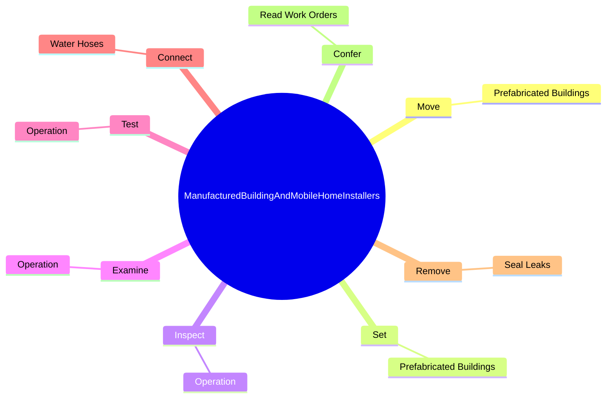
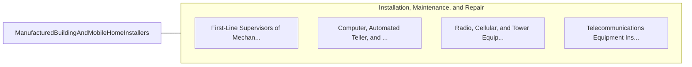

# Manufactured Building and Mobile Home Installers

> Move or install mobile homes or prefabricated buildings.

## Overview

Manufactured Building and Mobile Home Installers is classified under Installation, Maintenance, and Repair (SOC 49). Move or install mobile homes or prefabricated buildings.

## Classification Hierarchy

## Key Statistics

| Metric | Value |
|--------|-------|
| SOC Code | 49-9095.00 |
| Category | [Installation, Maintenance, and Repair](/occupations/Maintenance) |
| Task Count | 134 |
| Source | O*NET |

## Core Tasks

### move.PrefabricatedBuildings

Manufactured Building and Mobile Home Installers move prefabricated buildings as part of their core responsibilities.

**Actions:**
- `move.PrefabricatedBuildings.on.OwnersLotsMobileHomeParks`
- `move.PrefabricatedBuildings.on.AtMobileHomeParks`

### set.PrefabricatedBuildings

Manufactured Building and Mobile Home Installers set prefabricated buildings as part of their core responsibilities.

**Actions:**
- `set.PrefabricatedBuildings.on.OwnersLotsMobileHomeParks`
- `set.PrefabricatedBuildings.on.AtMobileHomeParks`

### inspect.Operation

Manufactured Building and Mobile Home Installers inspect operation as part of their core responsibilities.

**Actions:**
- `inspect.Operation.of.Parts.to.evaluate.OperatingConditionToDetermineIfRepairsAreNeeded`
- `inspect.Operation.of.Systems.to.evaluate.OperatingConditionToDetermineIfRepairsAreNeeded`

## Skills & Competencies

### Technical Skills
- **Equipment Repair** - Advanced
- **Diagnostic Testing** - Advanced
- **Preventive Maintenance** - Advanced

### Soft Skills
- **Communication** - Essential
- **Problem Solving** - Essential
- **Critical Thinking** - Important
- **Teamwork** - Important
- **Adaptability** - Important

## Related Occupations

## Industries

This occupation is found across multiple industries. See [Industries](/industries) for sector-specific employment data.

## Career Progression

---

*Source: O*NET 49-9095.00 - ONETOccupation*
