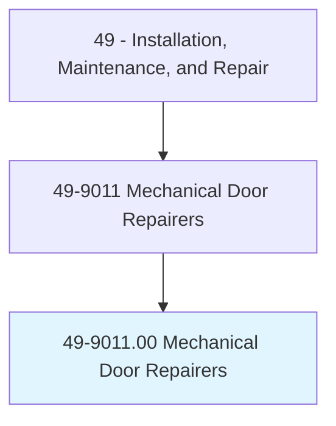
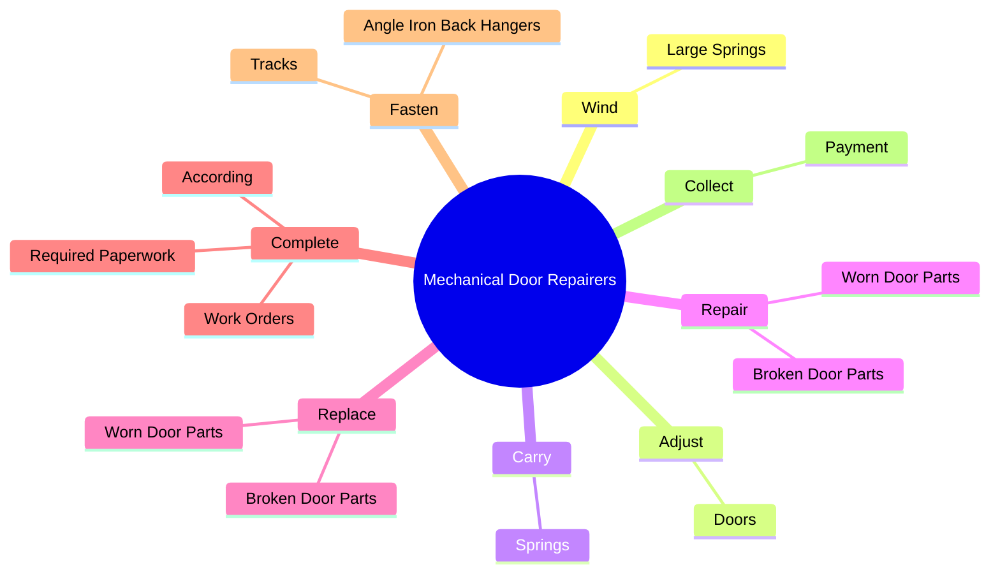
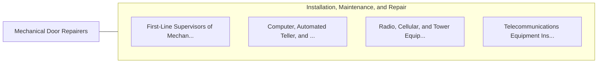

# Mechanical Door Repairers

> Install, service, or repair automatic door mechanisms and hydraulic doors. Includes garage door mechanics.

## Overview

Mechanical Door Repairers is an occupation within the Installation, Maintenance, and Repair category. Install, service, or repair automatic door mechanisms and hydraulic doors. 

## Classification Hierarchy

## Key Statistics

| Metric | Value |
|--------|-------|
| SOC Code | 49-9011.00 |
| Category | [Installation, Maintenance, and Repair](/occupations/Maintenance) |
| Task Count | 94 |
| Source | O*NET |

## Core Tasks

### wind.LargeSprings

Mechanical Door Repairers wind large springs as part of their core responsibilities.

**Actions:**
- `wind.LargeSprings.with.UpwardMotion.of.Arm`

### adjust.Doors

Mechanical Door Repairers adjust doors as part of their core responsibilities.

**Actions:**
- `adjust.Doors.to.open.WithCorrectAmountOfEffort`
- `adjust.Doors.to.close.WithCorrectAmountOfEffort`
- `adjust.Doors.to.make.SimpleAdjustmentsToElectricOpeners`

### carry.Springs

Mechanical Door Repairers carry springs as part of their core responsibilities.

**Actions:**
- `carry.Springs.to.TopsOfDoors`
- `carry.Springs.to.UsingLadders`
- `carry.Springs.to.Scaffolding`
- `carry.Springs.to.attach.SpringsToTracksToInstallSpringSystems`

## Skills & Competencies

### Technical Skills
- **Equipment Repair** - Advanced
- **Diagnostic Testing** - Advanced
- **Preventive Maintenance** - Advanced

### Soft Skills
- **Communication** - Essential
- **Problem Solving** - Essential
- **Critical Thinking** - Important
- **Teamwork** - Important
- **Adaptability** - Important

## Related Occupations

## Industries

This occupation is found across multiple industries. See [Industries](/industries) for sector-specific employment data.

## Career Progression

---

*Source: O*NET 49-9011.00 - ONETOccupation*
