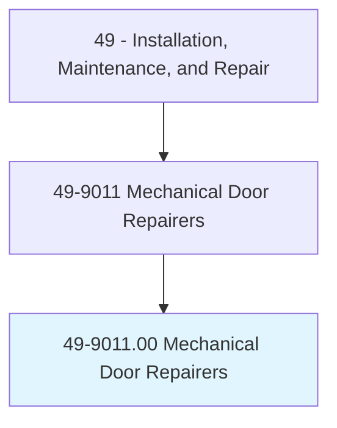
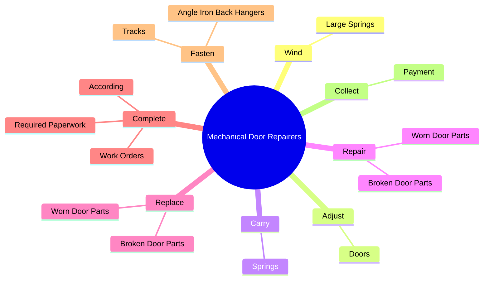
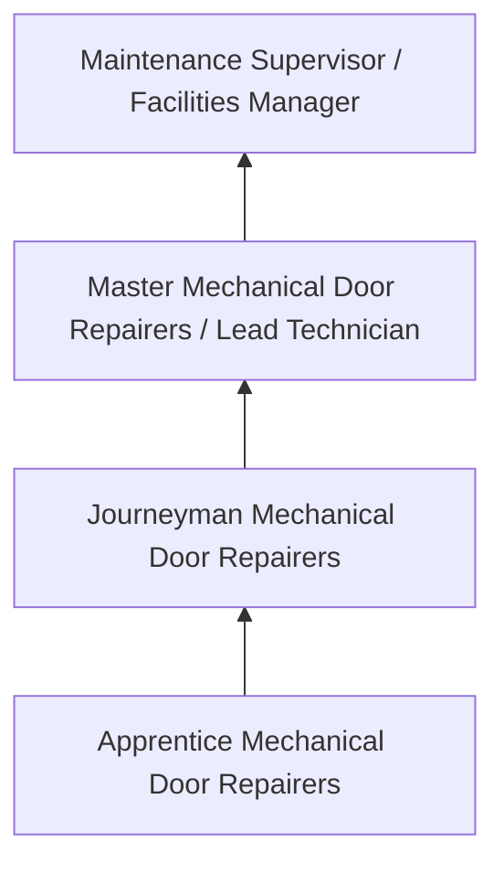
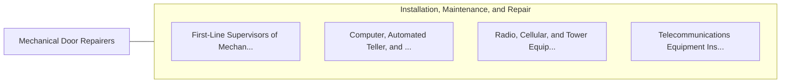

# Mechanical Door Repairers

> Install, service, or repair automatic door mechanisms and hydraulic doors. Includes garage door mechanics.

## Overview

Mechanical Door Repairers professionals install, service, or repair automatic door mechanisms and hydraulic doors. This occupation falls within the Installation, Maintenance, and Repair category and requires a combination of specialized knowledge, technical skills, and practical experience.

These professionals work across diverse settings and organizational contexts, applying their expertise to meet the demands of their field. They must stay current with industry standards, emerging practices, and regulatory requirements that affect their work. The role demands both independent judgment and collaborative skills, as practitioners regularly interact with colleagues, stakeholders, and the public.

As the field continues to evolve, Mechanical Door Repairers professionals increasingly leverage technology and data-driven approaches to enhance their effectiveness. Career opportunities span the public and private sectors, with demand influenced by economic conditions, demographic shifts, and technological advancement.

## Classification Hierarchy



## Key Statistics

| Metric | Value |
|--------|-------|
| SOC Code | 49-9011.00 |
| Job Zone | N/A |
| Category | [Installation, Maintenance, and Repair](/occupations/Maintenance/index) |
| Core Tasks | 94+ |
| Salary Range | $35,000 - $80,000 |
| Median Salary | $50,000 |
| Growth Outlook | 5% (As fast as average) |
| Source | O*NET |

## Core Tasks



### install.DoorFrames

Mechanical Door Repairers install door frames as part of their core responsibilities.

**Actions:**
- `install.DoorFrames` - Install door frames, rails, steel rolling curtains, electronic-eye mechanisms...
- `install.Rails` - Install door frames, rails, steel rolling curtains, electronic-eye mechanisms...
- `install.SteelRollingCurtains` - Install door frames, rails, steel rolling curtains, electronic-eye mechanisms...
- `install.ElectronicEyeMechanisms` - Install door frames, rails, steel rolling curtains, electronic-eye mechanisms...
- `install.ElectricDoorOpeners` - Install door frames, rails, steel rolling curtains, electronic-eye mechanisms...

### fasten.AngleIronBackHangers

Mechanical Door Repairers fasten angle iron back hangers as part of their core responsibilities.

**Actions:**
- `fasten.AngleIronBackHangers.to.Ceilings` - Fasten angle iron back-hangers to ceilings and tracks, using fasteners or wel...
- `fasten.AngleIronBackHangers.to.tracks` - Fasten angle iron back-hangers to ceilings and tracks, using fasteners or wel...
- `fasten.AngleIronBackHangers.to.UsingFasteners` - Fasten angle iron back-hangers to ceilings and tracks, using fasteners or wel...
- `fasten.AngleIronBackHangers.to.WeldingEquipment` - Fasten angle iron back-hangers to ceilings and tracks, using fasteners or wel...
- `fasten.Tracks.to.structures` - Assemble and fasten tracks to structures or bucks, using impact wrenches or w...

### fabricate.Replacements

Mechanical Door Repairers fabricate replacements as part of their core responsibilities.

**Actions:**
- `fabricate.Replacements.for.WornParts` - Fabricate replacements for worn or broken parts, using welders, lathes, drill...
- `fabricate.Replacements.for.BrokenParts` - Fabricate replacements for worn or broken parts, using welders, lathes, drill...
- `fabricate.Replacements.for.UsingWelders` - Fabricate replacements for worn or broken parts, using welders, lathes, drill...
- `fabricate.Replacements.for.Lathes` - Fabricate replacements for worn or broken parts, using welders, lathes, drill...
- `fabricate.Replacements.for.DrillPresses` - Fabricate replacements for worn or broken parts, using welders, lathes, drill...

### complete.RequiredPaperwork

Mechanical Door Repairers complete required paperwork as part of their core responsibilities.

**Actions:**
- `complete.RequiredPaperwork.to.services.Performed` - Complete required paperwork, such as work orders, according to services perfo...
- `complete.RequiredPaperwork.to.Required` - Complete required paperwork, such as work orders, according to services perfo...
- `complete.WorkOrders.to.services.Performed` - Complete required paperwork, such as work orders, according to services perfo...
- `complete.WorkOrders.to.Required` - Complete required paperwork, such as work orders, according to services perfo...
- `complete.According.to.services.Performed` - Complete required paperwork, such as work orders, according to services perfo...


## Skills & Competencies

### Technical Skills
- **Diagnostics and Troubleshooting** - Expert
- **Repair Techniques** - Advanced
- **Preventive Maintenance** - Advanced
- **Electrical Systems** - Advanced
- **Mechanical Systems** - Advanced
- **Safety Compliance** - Advanced

### Soft Skills
- **Problem Solving** - Critical
- **Attention to Detail** - Critical
- **Physical Stamina** - Essential
- **Communication** - Essential
- **Time Management** - Essential

## Education & Certifications

| Requirement | Details |
|-------------|---------|
| Typical Education | Post-secondary technical training or apprenticeship |
| Work Experience | 1-4 years hands-on experience |
| On-the-Job Training | Extensive - apprenticeship or technical certification programs |
| Certifications | Trade-specific licenses, EPA certifications, manufacturer certifications |

## Career Progression



## Industry Variations

### Industrial Maintenance
Equipment repair in manufacturing and production facilities. Mechanical Door Repairers professionals keep production lines running efficiently.

### Commercial Building Services
HVAC, electrical, and plumbing maintenance for commercial properties. Focus on preventive maintenance and tenant satisfaction.

### Automotive and Vehicle
Diagnosis and repair of vehicles and mobile equipment. Emphasis on diagnostic technology and manufacturer specifications.

### Specialized Technical
Maintenance of specialized systems such as telecommunications, medical equipment, or industrial controls.

## Technology & Tools

- **Diagnostic equipment and multimeters**
- **Computerized maintenance management systems (CMMS)**
- **Specialty hand and power tools**
- **Thermal imaging cameras**
- **Technical documentation systems**

## Related Occupations



## Industries

- [Automotive Repair](/industries/AutomotiveRepair) - High Employment
- [Manufacturing](/industries/Manufacturing) - High Employment
- [Commercial Building Services](/industries/BuildingServices) - Moderate Employment
- [Telecommunications](/industries/Telecom) - Moderate Employment

## Departments

This occupation typically works in:
- [Maintenance and Repair](/departments/Maintenance)
- [Facilities Management](/departments/Facilities)
- [Technical Services](/departments/TechnicalServices)

## GraphDL Semantic Structure

```
Mechanical Door Repairers perform:
- wind.LargeSprings.with.UpwardMotion.of.Arm
- adjust.Doors.to.open.WithCorrectAmountOfEffort
- adjust.Doors.to.close.WithCorrectAmountOfEffort
- adjust.Doors.to.make.SimpleAdjustmentsToElectricOpeners
- carry.Springs.to.TopsOfDoors
- carry.Springs.to.UsingLadders
```

---

*Source: O*NET 49-9011.00 - ONETOccupation*
