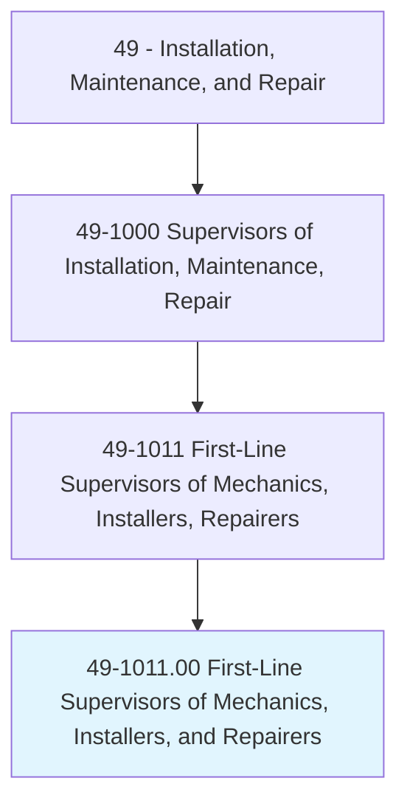
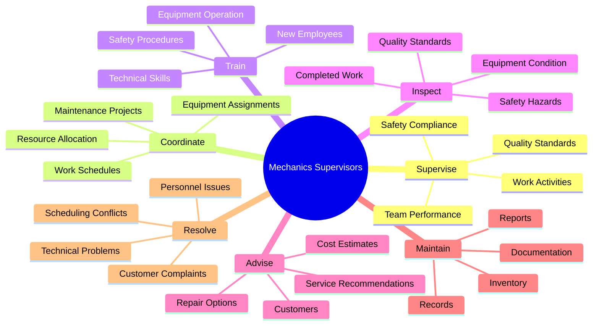
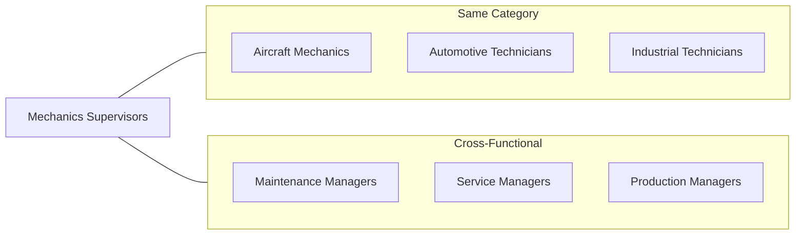
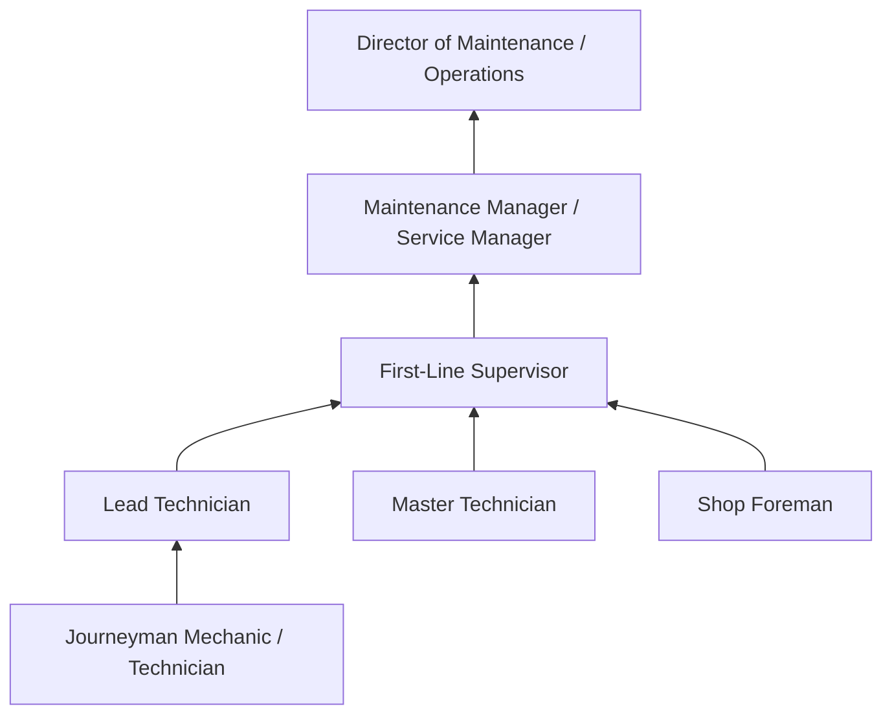

# First-Line Supervisors of Mechanics, Installers, and Repairers

> Directly supervise and coordinate the activities of mechanics, installers, and repairers. May also advise customers on recommended services. Excludes team or work leaders.

## Overview

First-Line Supervisors of Mechanics, Installers, and Repairers are essential leaders in maintenance operations, responsible for overseeing teams of skilled technicians who install, maintain, and repair equipment and machinery. They coordinate work schedules, assign tasks, ensure quality standards, and train workers while also managing customer relationships and handling administrative duties. These supervisors bridge the gap between management and hands-on technical work, often troubleshooting complex issues themselves while ensuring their teams meet safety standards, productivity goals, and customer expectations. The role requires both strong technical expertise and leadership skills to effectively manage diverse maintenance operations.

## Classification Hierarchy

## Key Statistics

| Metric | Value |
|--------|-------|
| SOC Code | 49-1011.00 |
| Job Zone | 3 (Medium Preparation) |
| Category | [Installation, Maintenance, and Repair](/occupations/Maintenance) |
| Core Tasks | 20+ |
| Source | O*NET |

## Core Tasks

### supervise.WorkActivities

First-Line Supervisors oversee the daily work activities of their maintenance teams to ensure efficient operations.

**Actions:**
- `supervise.WorkActivities.of.Mechanics.to.ensure.QualityStandards` - Monitor mechanic work quality
- `supervise.WorkActivities.of.Installers.to.ensure.SafetyCompliance` - Oversee installer safety practices
- `supervise.WorkActivities.of.Repairers.to.ensure.Efficiency` - Manage repairer productivity
- `coordinate.WorkActivities.of.Team.to.meet.Deadlines` - Organize team efforts for timely completion

### train.NewEmployees

First-Line Supervisors develop worker skills through training and mentorship.

**Actions:**
- `train.NewEmployees.in.TechnicalSkills.to.ensure.Competency` - Provide technical training
- `train.NewEmployees.in.SafetyProcedures.to.ensure.Compliance` - Conduct safety training
- `train.Workers.in.EquipmentOperation.to.improve.Efficiency` - Teach equipment usage
- `mentor.JuniorTechnicians.to.develop.Skills` - Provide ongoing guidance

### inspect.CompletedWork

First-Line Supervisors verify the quality and safety of completed maintenance work.

**Actions:**
- `inspect.CompletedWork.for.QualityStandards.to.ensure.CustomerSatisfaction` - Review work quality
- `inspect.CompletedWork.for.SafetyCompliance.to.meet.Regulations` - Verify safety standards
- `inspect.Equipment.for.Condition.to.identify.Issues` - Assess equipment status
- `approve.CompletedWork.for.CustomerDelivery.to.authorize.Release` - Sign off on completed jobs

### advise.Customers

First-Line Supervisors communicate with customers regarding services and recommendations.

**Actions:**
- `advise.Customers.on.RecommendedServices.to.address.Needs` - Suggest appropriate services
- `advise.Customers.on.CostEstimates.to.provide.Pricing` - Deliver repair estimates
- `explain.TechnicalIssues.to.Customers.to.improve.Understanding` - Clarify technical matters
- `resolve.CustomerComplaints.to.ensure.Satisfaction` - Address customer concerns

### coordinate.WorkSchedules

First-Line Supervisors organize and optimize work assignments and schedules.

**Actions:**
- `coordinate.WorkSchedules.for.Team.to.optimize.Resources` - Create efficient schedules
- `assign.Tasks.to.Technicians.based.on.Skills` - Match workers to appropriate jobs
- `allocate.Equipment.to.Jobs.to.ensure.Availability` - Manage equipment resources
- `prioritize.WorkOrders.to.meet.Deadlines` - Order jobs by urgency and importance

### maintain.Records

First-Line Supervisors manage documentation and administrative records.

**Actions:**
- `maintain.Records.of.WorkActivities.for.Documentation` - Keep work logs
- `maintain.Inventory.of.Parts.to.ensure.Availability` - Track parts and supplies
- `prepare.Reports.for.Management.to.communicate.Performance` - Create status reports
- `document.SafetyIncidents.for.Compliance.to.meet.Regulations` - Record safety events

## Skills & Competencies

### Technical Skills
- **Equipment Repair** - Expert
- **Diagnostic Troubleshooting** - Expert
- **Safety Regulations** - Advanced
- **Quality Control** - Advanced
- **Inventory Management** - Advanced
- **Documentation Systems** - Advanced

### Soft Skills
- **Leadership** - Critical
- **Communication** - Critical
- **Problem Solving** - Critical
- **Customer Service** - Essential
- **Time Management** - Essential
- **Conflict Resolution** - Essential

## Related Occupations

## Industries

- [Automotive Dealers and Repair](/industries/AutomotiveRepair) - High Employment
- [Manufacturing](/industries/Manufacturing) - High Employment
- [Transportation and Warehousing](/industries/Transportation) - High Employment
- [Construction](/industries/Construction) - Moderate Employment
- [Utilities](/industries/Utilities) - Moderate Employment
- [Government](/industries/Government) - Moderate Employment

## Industry Variations

### Automotive Services
- Focus on customer relations and service writing
- Manage diagnostic and repair workflows
- Oversee warranty and recall work

### Manufacturing
- Emphasize preventive maintenance scheduling
- Coordinate with production schedules
- Manage equipment uptime metrics

### Fleet Operations
- Prioritize vehicle availability and routing
- Track regulatory compliance (DOT)
- Manage mobile service operations

## Career Progression

## Education & Training

| Requirement | Details |
|-------------|---------|
| Typical Education | High school diploma or equivalent; many have vocational training or associate's degree |
| Work Experience | 3-5+ years as a mechanic, installer, or repairer |
| On-the-Job Training | Supervisory training, management development programs |
| Common Certifications | ASE (Automotive), EPA certifications, OSHA training, manufacturer-specific certifications |

## Departments

This occupation typically works in:
- [Maintenance](/departments/Maintenance)
- [Service](/departments/Service)
- [Facilities](/departments/Facilities)
- [Fleet Operations](/departments/FleetOps)

## Work Environment

- Typically works in shops, garages, or industrial facilities
- May travel to job sites for field service supervision
- Requires combination of office and floor time
- Often involves shift work including evenings and weekends
- Physical demands include standing, walking, and occasional hands-on work

---

*Source: O*NET 49-1011.00 - ONETOccupation*
