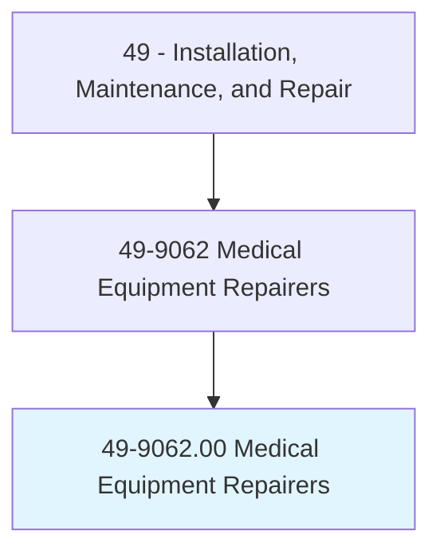
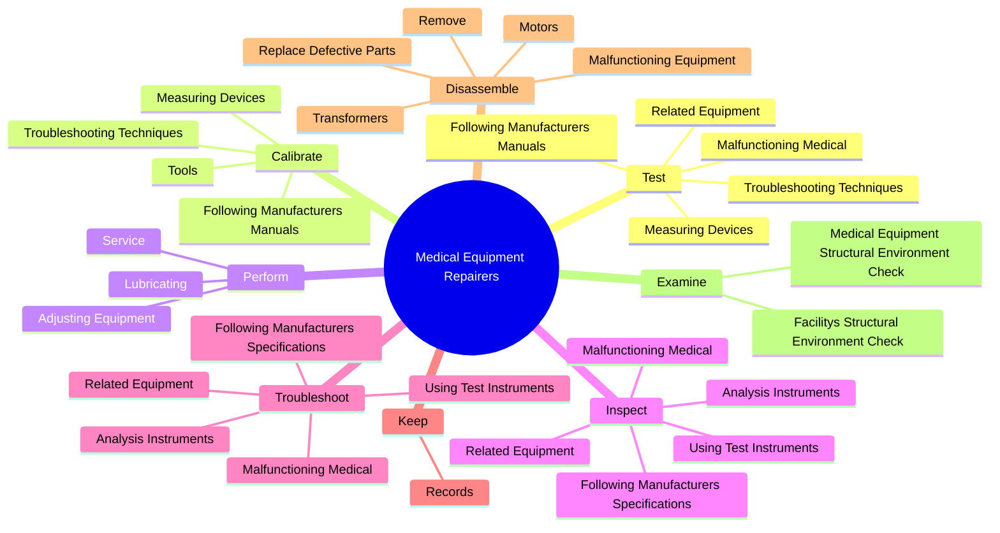
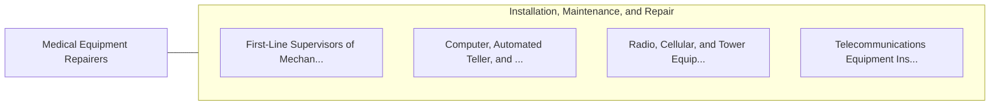

# Medical Equipment Repairers

> Test, adjust, or repair biomedical or electromedical equipment.

## Overview

Medical Equipment Repairers is classified under Installation, Maintenance, and Repair (SOC 49). Test, adjust, or repair biomedical or electromedical equipment.

## Classification Hierarchy

## Key Statistics

| Metric | Value |
|--------|-------|
| SOC Code | 49-9062.00 |
| Category | [Installation, Maintenance, and Repair](/occupations/Maintenance) |
| Task Count | 103 |
| Source | O*NET |

## Core Tasks

### test.FollowingManufacturersManuals

Medical Equipment Repairers test following manufacturers manuals as part of their core responsibilities.

**Actions:**
- `test.FollowingManufacturersManuals`
- `test.TroubleshootingTechniques`
- `test.MeasuringDevices`
- `test.MalfunctioningMedical`

### calibrate.FollowingManufacturersManuals

Medical Equipment Repairers calibrate following manufacturers manuals as part of their core responsibilities.

**Actions:**
- `calibrate.FollowingManufacturersManuals`
- `calibrate.TroubleshootingTechniques`
- `calibrate.Tools`
- `calibrate.MeasuringDevices`

### perform.Service

Medical Equipment Repairers perform service as part of their core responsibilities.

**Actions:**
- `perform.Service`
- `perform.Lubricating`
- `perform.AdjustingEquipment`

## Skills & Competencies

### Technical Skills
- **Equipment Repair** - Advanced
- **Diagnostic Testing** - Advanced
- **Preventive Maintenance** - Advanced

### Soft Skills
- **Communication** - Essential
- **Problem Solving** - Essential
- **Critical Thinking** - Important
- **Teamwork** - Important
- **Adaptability** - Important

## Related Occupations

## Industries

This occupation is found across multiple industries. See [Industries](/industries) for sector-specific employment data.

## Career Progression

---

*Source: O*NET 49-9062.00 - ONETOccupation*
