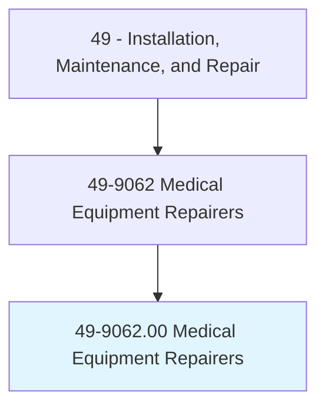
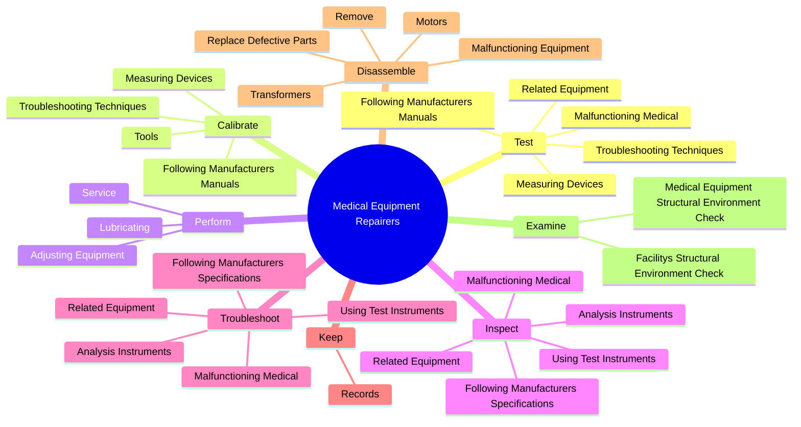
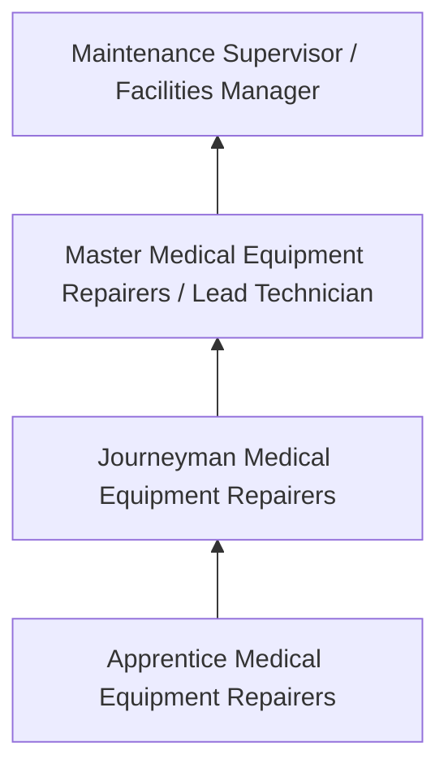
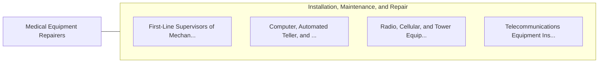

# Medical Equipment Repairers

> Test, adjust, or repair biomedical or electromedical equipment.

## Overview

Medical Equipment Repairers professionals test, adjust, or repair biomedical or electromedical equipment.. This occupation falls within the Installation, Maintenance, and Repair category and requires a combination of specialized knowledge, technical skills, and practical experience.

These professionals work across diverse settings and organizational contexts, applying their expertise to meet the demands of their field. They must stay current with industry standards, emerging practices, and regulatory requirements that affect their work. The role demands both independent judgment and collaborative skills, as practitioners regularly interact with colleagues, stakeholders, and the public.

As the field continues to evolve, Medical Equipment Repairers professionals increasingly leverage technology and data-driven approaches to enhance their effectiveness. Career opportunities span the public and private sectors, with demand influenced by economic conditions, demographic shifts, and technological advancement.

## Classification Hierarchy



## Key Statistics

| Metric | Value |
|--------|-------|
| SOC Code | 49-9062.00 |
| Job Zone | N/A |
| Category | [Installation, Maintenance, and Repair](/occupations/Maintenance/index) |
| Core Tasks | 103+ |
| Salary Range | $35,000 - $80,000 |
| Median Salary | $50,000 |
| Growth Outlook | 5% (As fast as average) |
| Source | O*NET |

## Core Tasks



### test.FollowingManufacturersManuals

Medical Equipment Repairers test following manufacturers manuals as part of their core responsibilities.

**Actions:**
- `test.FollowingManufacturersManuals` - Test or calibrate components or equipment, following manufacturers' manuals a...
- `test.TroubleshootingTechniques` - Test or calibrate components or equipment, following manufacturers' manuals a...
- `test.MeasuringDevices` - Test or calibrate components or equipment, following manufacturers' manuals a...
- `test.MalfunctioningMedical` - Inspect, test, or troubleshoot malfunctioning medical or related equipment, f...
- `test.RelatedEquipment` - Inspect, test, or troubleshoot malfunctioning medical or related equipment, f...

### carry.UsingBlueprints

Medical Equipment Repairers carry using blueprints as part of their core responsibilities.

**Actions:**
- `carry.UsingBlueprints` - Plan and carry out work assignments, using blueprints, schematic drawings, te...
- `carry.SchematicDrawings` - Plan and carry out work assignments, using blueprints, schematic drawings, te...
- `carry.TechnicalManuals` - Plan and carry out work assignments, using blueprints, schematic drawings, te...
- `carry.WiringDiagrams` - Plan and carry out work assignments, using blueprints, schematic drawings, te...
- `carry.LiquidFlowSheets` - Plan and carry out work assignments, using blueprints, schematic drawings, te...

### evaluate.ExcessMedicalEquipmentDetermineServiceability

Medical Equipment Repairers evaluate excess medical equipment determine serviceability as part of their core responsibilities.

**Actions:**
- `evaluate.ExcessMedicalEquipmentDetermineServiceability.in.Accordance.with.Regulations` - Test, evaluate, and classify excess or in-use medical equipment and determine...
- `evaluate.Condition.in.Accordance.with.Regulations` - Test, evaluate, and classify excess or in-use medical equipment and determine...
- `evaluate.Disposition.in.Accordance.with.Regulations` - Test, evaluate, and classify excess or in-use medical equipment and determine...
- `evaluate.TechnicalSpecifications.to.identify.EquipmentBestSuitedForIntendedUsePossiblePurchase` - Evaluate technical specifications to identify equipment or systems best suite...
- `evaluate.TechnicalSpecifications.to.SystemsBestSuitedForIntendedUsePossiblePurchase` - Evaluate technical specifications to identify equipment or systems best suite...

### plan.UsingBlueprints

Medical Equipment Repairers plan using blueprints as part of their core responsibilities.

**Actions:**
- `plan.UsingBlueprints` - Plan and carry out work assignments, using blueprints, schematic drawings, te...
- `plan.SchematicDrawings` - Plan and carry out work assignments, using blueprints, schematic drawings, te...
- `plan.WiringDiagrams` - Plan and carry out work assignments, using blueprints, schematic drawings, te...
- `plan.LiquidFlowSheets` - Plan and carry out work assignments, using blueprints, schematic drawings, te...
- `plan.AirFlowSheets` - Plan and carry out work assignments, using blueprints, schematic drawings, te...


## Skills & Competencies

### Technical Skills
- **Diagnostics and Troubleshooting** - Expert
- **Repair Techniques** - Advanced
- **Preventive Maintenance** - Advanced
- **Electrical Systems** - Advanced
- **Mechanical Systems** - Advanced
- **Safety Compliance** - Advanced

### Soft Skills
- **Problem Solving** - Critical
- **Attention to Detail** - Critical
- **Physical Stamina** - Essential
- **Communication** - Essential
- **Time Management** - Essential

## Education & Certifications

| Requirement | Details |
|-------------|---------|
| Typical Education | Post-secondary technical training or apprenticeship |
| Work Experience | 1-4 years hands-on experience |
| On-the-Job Training | Extensive - apprenticeship or technical certification programs |
| Certifications | Trade-specific licenses, EPA certifications, manufacturer certifications |

## Career Progression



## Industry Variations

### Industrial Maintenance
Equipment repair in manufacturing and production facilities. Medical Equipment Repairers professionals keep production lines running efficiently.

### Commercial Building Services
HVAC, electrical, and plumbing maintenance for commercial properties. Focus on preventive maintenance and tenant satisfaction.

### Automotive and Vehicle
Diagnosis and repair of vehicles and mobile equipment. Emphasis on diagnostic technology and manufacturer specifications.

### Specialized Technical
Maintenance of specialized systems such as telecommunications, medical equipment, or industrial controls.

## Technology & Tools

- **Diagnostic equipment and multimeters**
- **Computerized maintenance management systems (CMMS)**
- **Specialty hand and power tools**
- **Thermal imaging cameras**
- **Technical documentation systems**

## Related Occupations



## Industries

- [Automotive Repair](/industries/AutomotiveRepair) - High Employment
- [Manufacturing](/industries/Manufacturing) - High Employment
- Commercial Building Services - Moderate Employment
- Telecommunications - Moderate Employment

## Departments

This occupation typically works in:
- [Maintenance and Repair](/departments/Operations)
- [Facilities Management](/departments/Operations)
- Technical Services

## GraphDL Semantic Structure

```graphdl
Medical Equipment Repairers perform:
- test.FollowingManufacturersManuals
- test.TroubleshootingTechniques
- test.MeasuringDevices
- calibrate.FollowingManufacturersManuals
- calibrate.TroubleshootingTechniques
- calibrate.Tools
```

---

*Source: O*NET 49-9062.00 - ONETOccupation*
