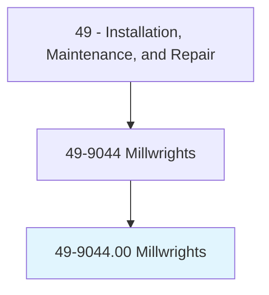
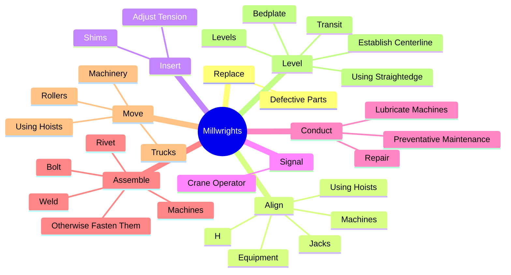
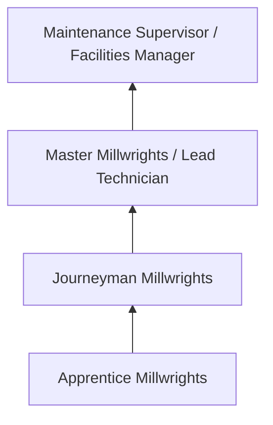

# Millwrights

> Install, dismantle, or move machinery and heavy equipment according to layout plans, blueprints, or other drawings.

## Overview

Millwrights professionals install, dismantle, or move machinery and heavy equipment according to layout plans, blueprints, or other drawings.. This occupation falls within the Installation, Maintenance, and Repair category and requires a combination of specialized knowledge, technical skills, and practical experience.

These professionals work across diverse settings and organizational contexts, applying their expertise to meet the demands of their field. They must stay current with industry standards, emerging practices, and regulatory requirements that affect their work. The role demands both independent judgment and collaborative skills, as practitioners regularly interact with colleagues, stakeholders, and the public.

As the field continues to evolve, Millwrights professionals increasingly leverage technology and data-driven approaches to enhance their effectiveness. Career opportunities span the public and private sectors, with demand influenced by economic conditions, demographic shifts, and technological advancement.

## Classification Hierarchy



## Key Statistics

| Metric | Value |
|--------|-------|
| SOC Code | 49-9044.00 |
| Job Zone | N/A |
| Category | [Installation, Maintenance, and Repair](/occupations/Maintenance/index) |
| Core Tasks | 126+ |
| Salary Range | $35,000 - $80,000 |
| Median Salary | $50,000 |
| Growth Outlook | 5% (As fast as average) |
| Source | O*NET |

## Core Tasks



### assemble.Machines

Millwrights assemble machines as part of their core responsibilities.

**Actions:**
- `assemble.Machines.to.FoundationStructures` - Assemble machines, and bolt, weld, rivet, or otherwise fasten them to foundat...
- `assemble.Machines.to.OtherStructures` - Assemble machines, and bolt, weld, rivet, or otherwise fasten them to foundat...
- `assemble.Machines.to.UsingH` - Assemble machines, and bolt, weld, rivet, or otherwise fasten them to foundat...
- `assemble.Machines.to.ToolsTools` - Assemble machines, and bolt, weld, rivet, or otherwise fasten them to foundat...
- `assemble.Machines.to.PowerTools` - Assemble machines, and bolt, weld, rivet, or otherwise fasten them to foundat...

### insert.Shims

Millwrights insert shims as part of their core responsibilities.

**Actions:**
- `insert.Shims.on.Nuts` - Insert shims, adjust tension on nuts and bolts, or position parts, using hand...
- `insert.Shims.on.Bolts` - Insert shims, adjust tension on nuts and bolts, or position parts, using hand...
- `insert.Shims.on.PositionParts` - Insert shims, adjust tension on nuts and bolts, or position parts, using hand...
- `insert.Shims.on.UsingH` - Insert shims, adjust tension on nuts and bolts, or position parts, using hand...
- `insert.Shims.on.Tools` - Insert shims, adjust tension on nuts and bolts, or position parts, using hand...

### dismantle.Machines

Millwrights dismantle machines as part of their core responsibilities.

**Actions:**
- `dismantle.Machines` - Dismantle machines, using hammers, wrenches, crowbars, and other hand tools.
- `dismantle.UsingHammers` - Dismantle machines, using hammers, wrenches, crowbars, and other hand tools.
- `dismantle.Wrenches` - Dismantle machines, using hammers, wrenches, crowbars, and other hand tools.
- `dismantle.Crowbars` - Dismantle machines, using hammers, wrenches, crowbars, and other hand tools.
- `dismantle.OtherHandTools` - Dismantle machines, using hammers, wrenches, crowbars, and other hand tools.

### align.Machines

Millwrights align machines as part of their core responsibilities.

**Actions:**
- `align.Machines` - Align machines or equipment, using hoists, jacks, hand tools, squares, rules,...
- `align.Equipment` - Align machines or equipment, using hoists, jacks, hand tools, squares, rules,...
- `align.UsingHoists` - Align machines or equipment, using hoists, jacks, hand tools, squares, rules,...
- `align.Jacks` - Align machines or equipment, using hoists, jacks, hand tools, squares, rules,...
- `align.H` - Align machines or equipment, using hoists, jacks, hand tools, squares, rules,...


## Skills & Competencies

### Technical Skills
- **Diagnostics and Troubleshooting** - Expert
- **Repair Techniques** - Advanced
- **Preventive Maintenance** - Advanced
- **Electrical Systems** - Advanced
- **Mechanical Systems** - Advanced
- **Safety Compliance** - Advanced

### Soft Skills
- **Problem Solving** - Critical
- **Attention to Detail** - Critical
- **Physical Stamina** - Essential
- **Communication** - Essential
- **Time Management** - Essential

## Education & Certifications

| Requirement | Details |
|-------------|---------|
| Typical Education | Post-secondary technical training or apprenticeship |
| Work Experience | 1-4 years hands-on experience |
| On-the-Job Training | Extensive - apprenticeship or technical certification programs |
| Certifications | Trade-specific licenses, EPA certifications, manufacturer certifications |

## Career Progression



## Industry Variations

### Industrial Maintenance
Equipment repair in manufacturing and production facilities. Millwrights professionals keep production lines running efficiently.

### Commercial Building Services
HVAC, electrical, and plumbing maintenance for commercial properties. Focus on preventive maintenance and tenant satisfaction.

### Automotive and Vehicle
Diagnosis and repair of vehicles and mobile equipment. Emphasis on diagnostic technology and manufacturer specifications.

### Specialized Technical
Maintenance of specialized systems such as telecommunications, medical equipment, or industrial controls.

## Technology & Tools

- **Diagnostic equipment and multimeters**
- **Computerized maintenance management systems (CMMS)**
- **Specialty hand and power tools**
- **Thermal imaging cameras**
- **Technical documentation systems**

## Related Occupations


## Industries

- [Automotive Repair](/industries/AutomotiveRepair) - High Employment
- [Manufacturing](/industries/Manufacturing) - High Employment
- Commercial Building Services - Moderate Employment
- Telecommunications - Moderate Employment

## Departments

This occupation typically works in:
- [Maintenance and Repair](/departments/Operations)
- [Facilities Management](/departments/Operations)
- Technical Services

## GraphDL Semantic Structure

```graphdl
Millwrights perform:
- replace.DefectiveParts.of.Machine
- replace.DefectiveParts.of.AdjustClearances
- replace.DefectiveParts.of.Alignment.of.MovingParts
- align.Machines
- align.Equipment
- align.UsingHoists
```

---

*Source: O*NET 49-9044.00 - ONETOccupation*
