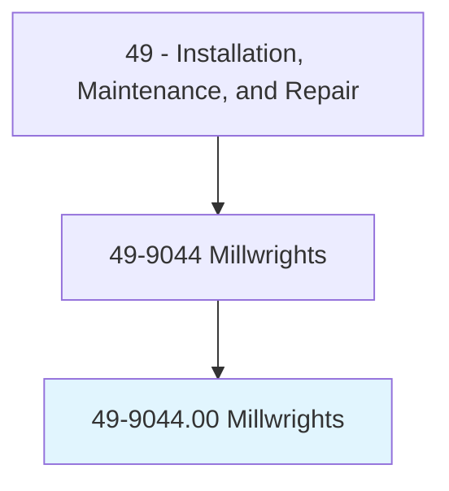
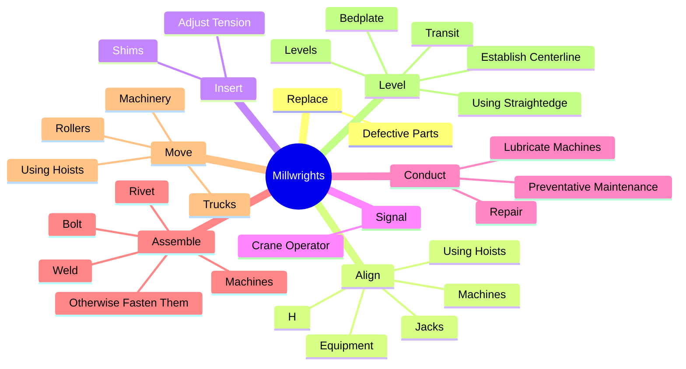

# Millwrights

> Install, dismantle, or move machinery and heavy equipment according to layout plans, blueprints, or other drawings.

## Overview

Millwrights is classified under Installation, Maintenance, and Repair (SOC 49). Install, dismantle, or move machinery and heavy equipment according to layout plans, blueprints, or other drawings.

## Classification Hierarchy

## Key Statistics

| Metric | Value |
|--------|-------|
| SOC Code | 49-9044.00 |
| Category | [Installation, Maintenance, and Repair](/occupations/Maintenance/index) |
| Task Count | 126 |
| Source | O*NET |

## Core Tasks

### replace.DefectiveParts

Millwrights replace defective parts as part of their core responsibilities.

**Actions:**
- `replace.DefectiveParts.of.Machine`
- `replace.DefectiveParts.of.AdjustClearances`
- `replace.DefectiveParts.of.Alignment.of.MovingParts`

### align.Machines

Millwrights align machines as part of their core responsibilities.

**Actions:**
- `align.Machines`
- `align.Equipment`
- `align.UsingHoists`
- `align.Jacks`

### insert.Shims

Millwrights insert shims as part of their core responsibilities.

**Actions:**
- `insert.Shims.on.Nuts`
- `insert.Shims.on.Bolts`
- `insert.Shims.on.PositionParts`
- `insert.Shims.on.UsingH`

## Skills & Competencies

### Technical Skills
- **Equipment Repair** - Advanced
- **Diagnostic Testing** - Advanced
- **Preventive Maintenance** - Advanced

### Soft Skills
- **Communication** - Essential
- **Problem Solving** - Essential
- **Critical Thinking** - Important
- **Teamwork** - Important
- **Adaptability** - Important

## Related Occupations

## Industries

This occupation is found across multiple industries. See [Industries](/industries) for sector-specific employment data.

## Career Progression

---

*Source: O*NET 49-9044.00 - ONETOccupation*
