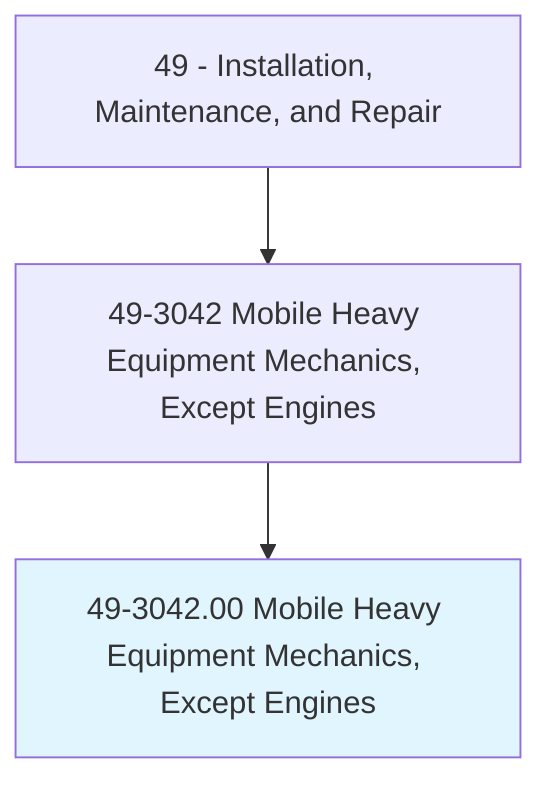
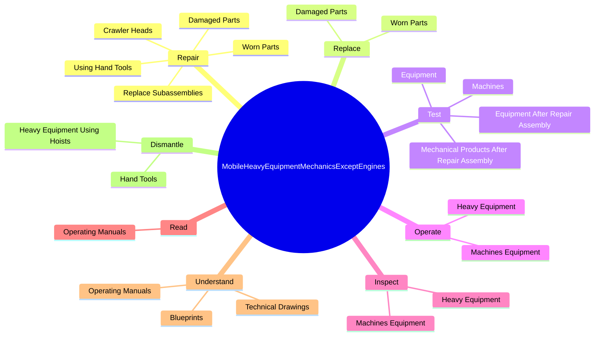
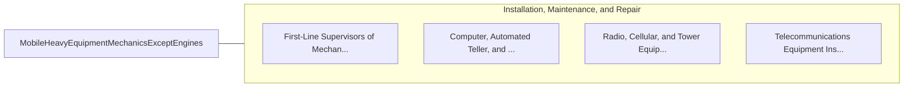

# Mobile Heavy Equipment Mechanics, Except Engines

> Diagnose, adjust, repair, or overhaul mobile mechanical, hydraulic, and pneumatic equipment, such as cranes, bulldozers, graders, and conveyors, used in construction, logging, and mining.

## Overview

Mobile Heavy Equipment Mechanics, Except Engines is classified under Installation, Maintenance, and Repair (SOC 49). Diagnose, adjust, repair, or overhaul mobile mechanical, hydraulic, and pneumatic equipment, such as cranes, bulldozers, graders, and conveyors, used in construction, logging, and mining.

## Classification Hierarchy

## Key Statistics

| Metric | Value |
|--------|-------|
| SOC Code | 49-3042.00 |
| Category | [Installation, Maintenance, and Repair](/occupations/Maintenance/index) |
| Task Count | 97 |
| Source | O*NET |

## Core Tasks

### repair.DamagedParts

Mobile Heavy Equipment Mechanics, Except Engines repair damaged parts as part of their core responsibilities.

**Actions:**
- `repair.DamagedParts`
- `repair.WornParts`
- `repair.ReplaceSubassemblies`
- `repair.CrawlerHeads`

### replace.DamagedParts

Mobile Heavy Equipment Mechanics, Except Engines replace damaged parts as part of their core responsibilities.

**Actions:**
- `replace.DamagedParts`
- `replace.WornParts`

### test.MechanicalProductsAfterRepairAssembly

Mobile Heavy Equipment Mechanics, Except Engines test mechanical products after repair assembly as part of their core responsibilities.

**Actions:**
- `test.MechanicalProductsAfterRepairAssembly.to.ensure.ProperPerformanceWithManufacturersSpecifications`
- `test.MechanicalProductsAfterRepairAssembly.to.ComplianceWithManufacturersSpecifications`
- `test.EquipmentAfterRepairAssembly.to.ensure.ProperPerformanceWithManufacturersSpecifications`
- `test.EquipmentAfterRepairAssembly.to.ComplianceWithManufacturersSpecifications`

## Skills & Competencies

### Technical Skills
- **Equipment Repair** - Advanced
- **Diagnostic Testing** - Advanced
- **Preventive Maintenance** - Advanced

### Soft Skills
- **Communication** - Essential
- **Problem Solving** - Essential
- **Critical Thinking** - Important
- **Teamwork** - Important
- **Adaptability** - Important

## Related Occupations

## Industries

This occupation is found across multiple industries. See [Industries](/industries) for sector-specific employment data.

## Career Progression

---

*Source: O*NET 49-3042.00 - ONETOccupation*
