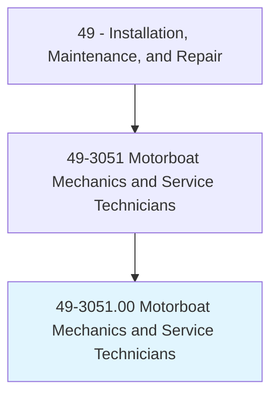
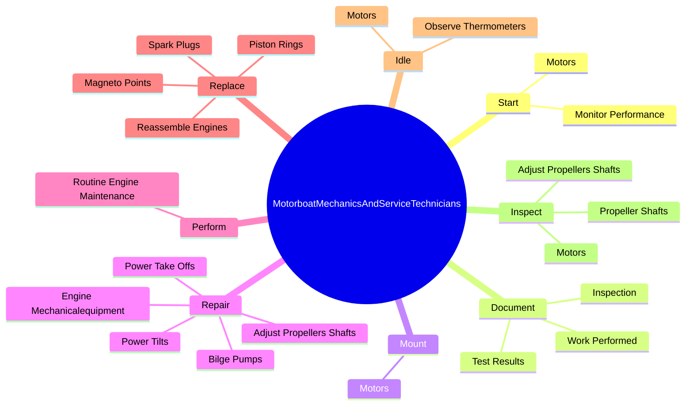
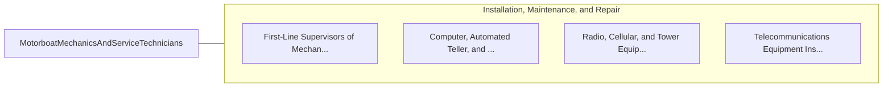

# Motorboat Mechanics and Service Technicians

> Repair and adjust electrical and mechanical equipment of inboard or inboard-outboard boat engines.

## Overview

Motorboat Mechanics and Service Technicians is classified under Installation, Maintenance, and Repair (SOC 49). Repair and adjust electrical and mechanical equipment of inboard or inboard-outboard boat engines.

## Classification Hierarchy

## Key Statistics

| Metric | Value |
|--------|-------|
| SOC Code | 49-3051.00 |
| Category | [Installation, Maintenance, and Repair](/occupations/Maintenance) |
| Task Count | 58 |
| Source | O*NET |

## Core Tasks

### start.Motors

Motorboat Mechanics and Service Technicians start motors as part of their core responsibilities.

**Actions:**
- `start.Motors.for.Signs.of.Malfunctioning`
- `start.Motors.for.Smoke`
- `start.Motors.for.ExcessiveVibration`
- `start.Motors.for.Misfiring`

### document.Inspection

Motorboat Mechanics and Service Technicians document inspection as part of their core responsibilities.

**Actions:**
- `document.Inspection.to.BePerformed`
- `document.TestResults.to.BePerformed`
- `document.WorkPerformed.to.BePerformed`

### mount.Motors

Motorboat Mechanics and Service Technicians mount motors as part of their core responsibilities.

**Actions:**
- `mount.Motors.to.Boats`
- `mount.Motors.to.operate.BoatsAtVariousSpeedsOnWaterwaysToConductOperationalTests`

## Skills & Competencies

### Technical Skills
- **Equipment Repair** - Advanced
- **Diagnostic Testing** - Advanced
- **Preventive Maintenance** - Advanced

### Soft Skills
- **Communication** - Essential
- **Problem Solving** - Essential
- **Critical Thinking** - Important
- **Teamwork** - Important
- **Adaptability** - Important

## Related Occupations

## Industries

This occupation is found across multiple industries. See [Industries](/industries) for sector-specific employment data.

## Career Progression

---

*Source: O*NET 49-3051.00 - ONETOccupation*
