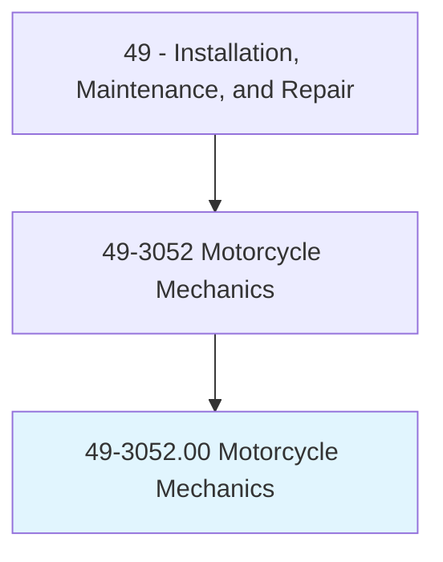
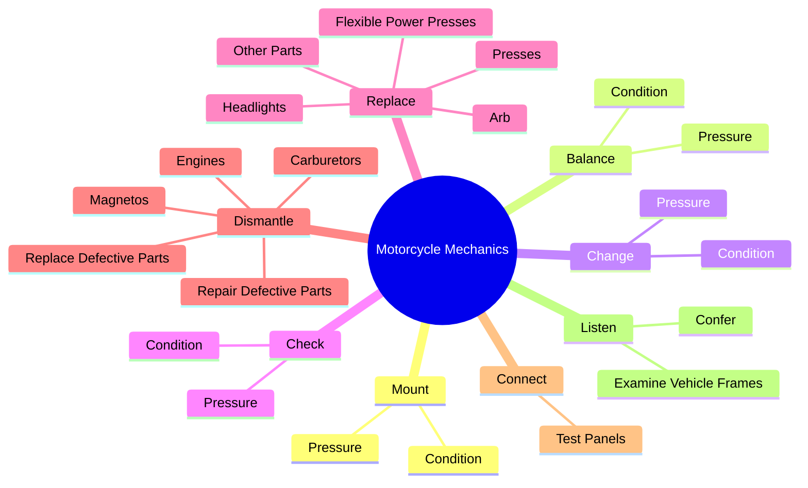
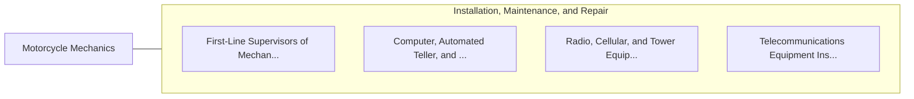

# Motorcycle Mechanics

> Diagnose, adjust, repair, or overhaul motorcycles, scooters, mopeds, dirt bikes, or similar motorized vehicles.

## Overview

Motorcycle Mechanics is classified under Installation, Maintenance, and Repair (SOC 49). Diagnose, adjust, repair, or overhaul motorcycles, scooters, mopeds, dirt bikes, or similar motorized vehicles.

## Classification Hierarchy

## Key Statistics

| Metric | Value |
|--------|-------|
| SOC Code | 49-3052.00 |
| Category | [Installation, Maintenance, and Repair](/occupations/Maintenance) |
| Task Count | 84 |
| Source | O*NET |

## Core Tasks

### mount.Condition

Motorcycle Mechanics mount condition as part of their core responsibilities.

**Actions:**
- `mount.Condition.of.Tires`
- `mount.Pressure.of.Tires`

### balance.Condition

Motorcycle Mechanics balance condition as part of their core responsibilities.

**Actions:**
- `balance.Condition.of.Tires`
- `balance.Pressure.of.Tires`

### change.Condition

Motorcycle Mechanics change condition as part of their core responsibilities.

**Actions:**
- `change.Condition.of.Tires`
- `change.Pressure.of.Tires`

## Skills & Competencies

### Technical Skills
- **Equipment Repair** - Advanced
- **Diagnostic Testing** - Advanced
- **Preventive Maintenance** - Advanced

### Soft Skills
- **Communication** - Essential
- **Problem Solving** - Essential
- **Critical Thinking** - Important
- **Teamwork** - Important
- **Adaptability** - Important

## Related Occupations

## Industries

This occupation is found across multiple industries. See [Industries](/industries) for sector-specific employment data.

## Career Progression

---

*Source: O*NET 49-3052.00 - ONETOccupation*
