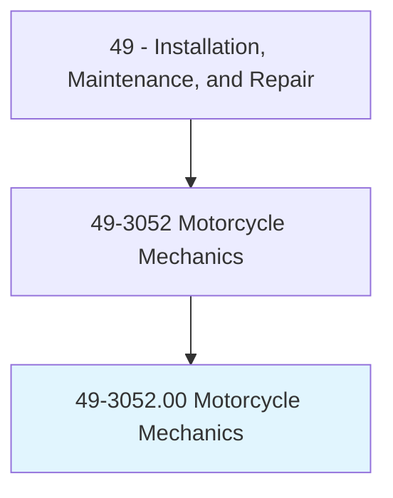
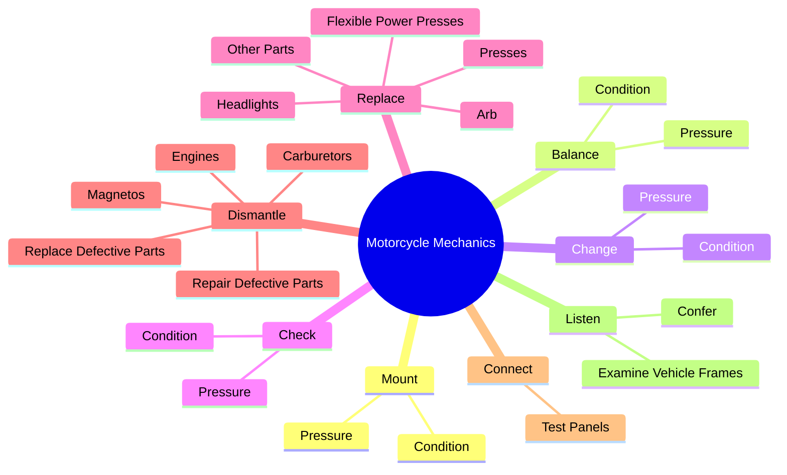
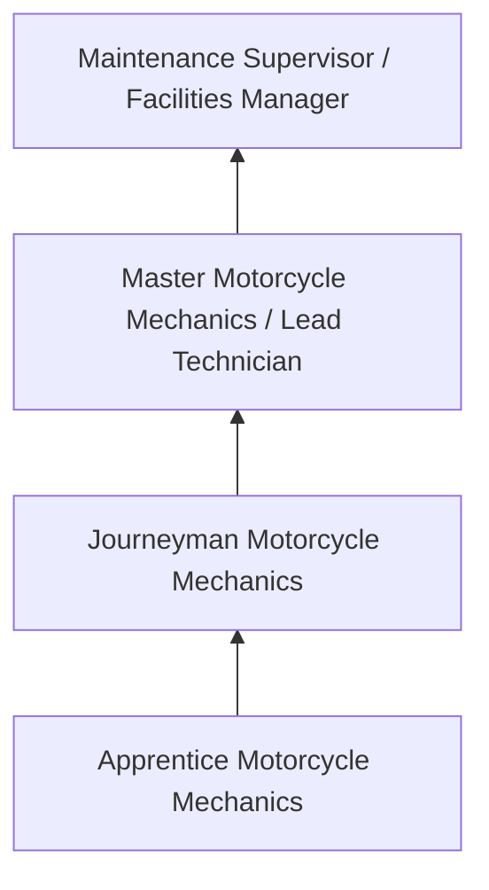
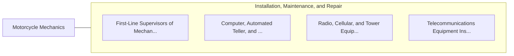

# Motorcycle Mechanics

> Diagnose, adjust, repair, or overhaul motorcycles, scooters, mopeds, dirt bikes, or similar motorized vehicles.

## Overview

Motorcycle Mechanics professionals diagnose, adjust, repair, or overhaul motorcycles, scooters, mopeds, dirt bikes, or similar motorized vehicles.. This occupation falls within the Installation, Maintenance, and Repair category and requires a combination of specialized knowledge, technical skills, and practical experience.

These professionals work across diverse settings and organizational contexts, applying their expertise to meet the demands of their field. They must stay current with industry standards, emerging practices, and regulatory requirements that affect their work. The role demands both independent judgment and collaborative skills, as practitioners regularly interact with colleagues, stakeholders, and the public.

As the field continues to evolve, Motorcycle Mechanics professionals increasingly leverage technology and data-driven approaches to enhance their effectiveness. Career opportunities span the public and private sectors, with demand influenced by economic conditions, demographic shifts, and technological advancement.

## Classification Hierarchy



## Key Statistics

| Metric | Value |
|--------|-------|
| SOC Code | 49-3052.00 |
| Job Zone | N/A |
| Category | [Installation, Maintenance, and Repair](/occupations/Maintenance/index) |
| Core Tasks | 84+ |
| Salary Range | $35,000 - $80,000 |
| Median Salary | $50,000 |
| Growth Outlook | 5% (As fast as average) |
| Source | O*NET |

## Core Tasks



### remove.CylinderHeads

Motorcycle Mechanics remove cylinder heads as part of their core responsibilities.

**Actions:**
- `remove.CylinderHeads.to.scrape.OffCarbon` - Remove cylinder heads and grind valves to scrape off carbon and replace defec...
- `remove.CylinderHeads.to.replace.DefectiveValves` - Remove cylinder heads and grind valves to scrape off carbon and replace defec...
- `remove.CylinderHeads.to.Pistons` - Remove cylinder heads and grind valves to scrape off carbon and replace defec...
- `remove.CylinderHeads.to.Cylinders` - Remove cylinder heads and grind valves to scrape off carbon and replace defec...
- `remove.CylinderHeads.to.Rings` - Remove cylinder heads and grind valves to scrape off carbon and replace defec...

### repair.OtherParts

Motorcycle Mechanics repair other parts as part of their core responsibilities.

**Actions:**
- `repair.OtherParts` - Repair or replace other parts, such as headlights, horns, handlebar controls,...
- `repair.Headlights` - Repair or replace other parts, such as headlights, horns, handlebar controls,...
- `repair.Horns` - Repair or replace other parts, such as headlights, horns, handlebar controls,...
- `repair.HandlebarControls` - Repair or replace other parts, such as headlights, horns, handlebar controls,...
- `repair.Gasoline` - Repair or replace other parts, such as headlights, horns, handlebar controls,...

### disassemble.SubassemblyUnits

Motorcycle Mechanics disassemble subassembly units as part of their core responsibilities.

**Actions:**
- `disassemble.SubassemblyUnits.of.Parts` - Disassemble subassembly units and examine condition, movement, or alignment o...
- `disassemble.SubassemblyUnits.of.Visually` - Disassemble subassembly units and examine condition, movement, or alignment o...
- `disassemble.SubassemblyUnits.of.UsingGauges` - Disassemble subassembly units and examine condition, movement, or alignment o...
- `disassemble.ExamineCondition.of.Parts` - Disassemble subassembly units and examine condition, movement, or alignment o...
- `disassemble.ExamineCondition.of.Visually` - Disassemble subassembly units and examine condition, movement, or alignment o...

### replace.Arb

Motorcycle Mechanics replace arb as part of their core responsibilities.

**Actions:**
- `replace.Arb` - Replace defective parts, using hand tools, arbor presses, flexible power pres...
- `replace.Presses` - Replace defective parts, using hand tools, arbor presses, flexible power pres...
- `replace.FlexiblePowerPresses` - Replace defective parts, using hand tools, arbor presses, flexible power pres...
- `replace.OtherParts` - Repair or replace other parts, such as headlights, horns, handlebar controls,...
- `replace.Headlights` - Repair or replace other parts, such as headlights, horns, handlebar controls,...


## Skills & Competencies

### Technical Skills
- **Diagnostics and Troubleshooting** - Expert
- **Repair Techniques** - Advanced
- **Preventive Maintenance** - Advanced
- **Electrical Systems** - Advanced
- **Mechanical Systems** - Advanced
- **Safety Compliance** - Advanced

### Soft Skills
- **Problem Solving** - Critical
- **Attention to Detail** - Critical
- **Physical Stamina** - Essential
- **Communication** - Essential
- **Time Management** - Essential

## Education & Certifications

| Requirement | Details |
|-------------|---------|
| Typical Education | Post-secondary technical training or apprenticeship |
| Work Experience | 1-4 years hands-on experience |
| On-the-Job Training | Extensive - apprenticeship or technical certification programs |
| Certifications | Trade-specific licenses, EPA certifications, manufacturer certifications |

## Career Progression



## Industry Variations

### Industrial Maintenance
Equipment repair in manufacturing and production facilities. Motorcycle Mechanics professionals keep production lines running efficiently.

### Commercial Building Services
HVAC, electrical, and plumbing maintenance for commercial properties. Focus on preventive maintenance and tenant satisfaction.

### Automotive and Vehicle
Diagnosis and repair of vehicles and mobile equipment. Emphasis on diagnostic technology and manufacturer specifications.

### Specialized Technical
Maintenance of specialized systems such as telecommunications, medical equipment, or industrial controls.

## Technology & Tools

- **Diagnostic equipment and multimeters**
- **Computerized maintenance management systems (CMMS)**
- **Specialty hand and power tools**
- **Thermal imaging cameras**
- **Technical documentation systems**

## Related Occupations



## Industries

- [Automotive Repair](/industries/AutomotiveRepair) - High Employment
- [Manufacturing](/industries/Manufacturing) - High Employment
- Commercial Building Services - Moderate Employment
- Telecommunications - Moderate Employment

## Departments

This occupation typically works in:
- [Maintenance and Repair](/departments/Operations)
- [Facilities Management](/departments/Operations)
- Technical Services

## GraphDL Semantic Structure

```graphdl
Motorcycle Mechanics perform:
- mount.Condition.of.Tires
- mount.Pressure.of.Tires
- balance.Condition.of.Tires
- balance.Pressure.of.Tires
- change.Condition.of.Tires
- change.Pressure.of.Tires
```

---

*Source: O*NET 49-3052.00 - ONETOccupation*
