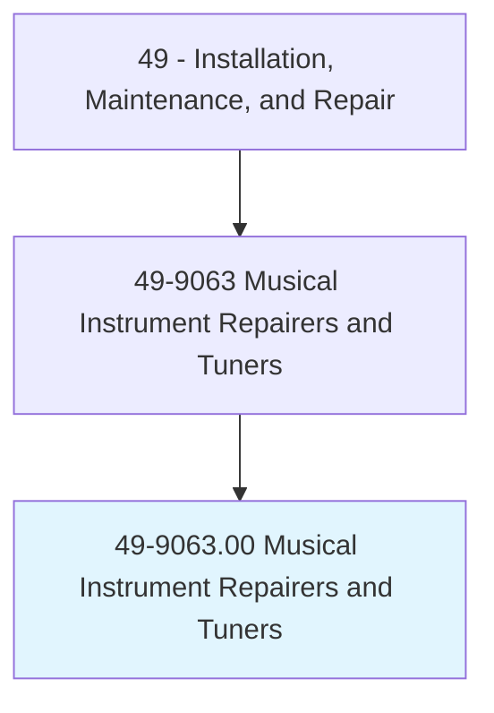
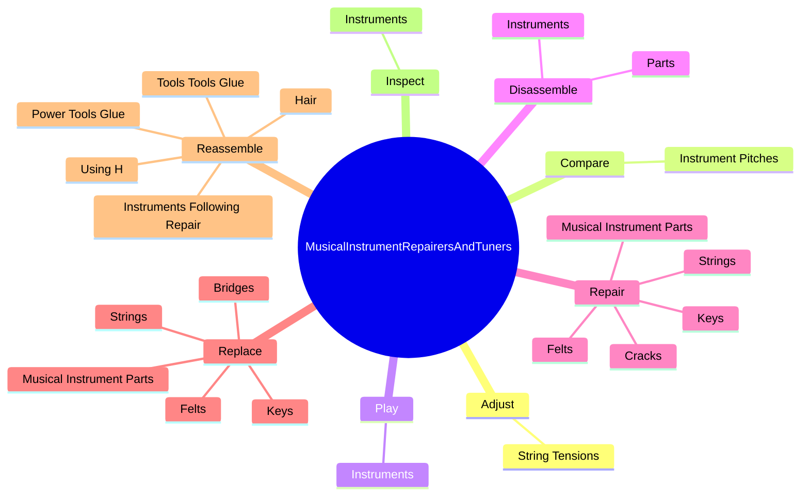
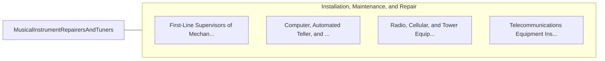

# Musical Instrument Repairers and Tuners

> Repair percussion, stringed, reed, or wind instruments. May specialize in one area, such as piano tuning.

## Overview

Musical Instrument Repairers and Tuners is an occupation within the Installation, Maintenance, and Repair category. Repair percussion, stringed, reed, or wind instruments. 

## Classification Hierarchy

## Key Statistics

| Metric | Value |
|--------|-------|
| SOC Code | 49-9063.00 |
| Category | [Installation, Maintenance, and Repair](/occupations/Maintenance) |
| Task Count | 118 |
| Source | O*NET |

## Core Tasks

### adjust.StringTensions

Musical Instrument Repairers and Tuners adjust string tensions as part of their core responsibilities.

**Actions:**
- `adjust.StringTensions.to.tune.Instruments`
- `adjust.StringTensions.to.UsingH`
- `adjust.StringTensions.to.ToolsTuningDevices`
- `adjust.StringTensions.to.ElectronicTuningDevices`

### compare.InstrumentPitches

Musical Instrument Repairers and Tuners compare instrument pitches as part of their core responsibilities.

**Actions:**
- `compare.InstrumentPitches.with.TuningToolPitches.to.tune.Instruments`

### play.Instruments

Musical Instrument Repairers and Tuners play instruments as part of their core responsibilities.

**Actions:**
- `play.Instruments.to.evaluate.SoundQualityLocateDefects`
- `play.Instruments.to.ToLocateDefects`

## Skills & Competencies

### Technical Skills
- **Equipment Repair** - Advanced
- **Diagnostic Testing** - Advanced
- **Preventive Maintenance** - Advanced

### Soft Skills
- **Communication** - Essential
- **Problem Solving** - Essential
- **Critical Thinking** - Important
- **Teamwork** - Important
- **Adaptability** - Important

## Related Occupations

## Industries

This occupation is found across multiple industries. See [Industries](/industries) for sector-specific employment data.

## Career Progression

---

*Source: O*NET 49-9063.00 - ONETOccupation*
