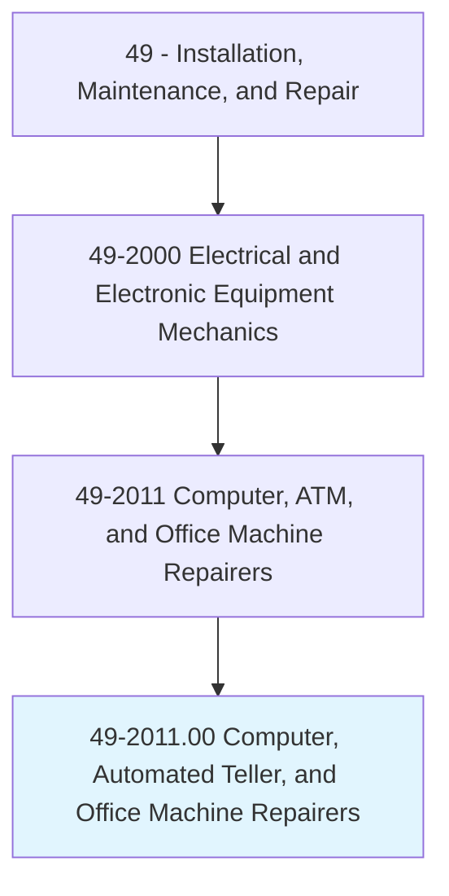
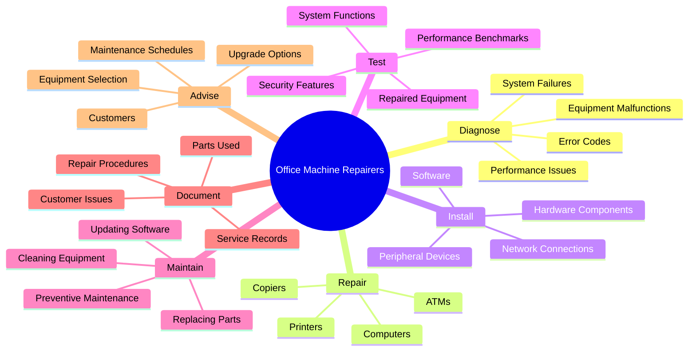
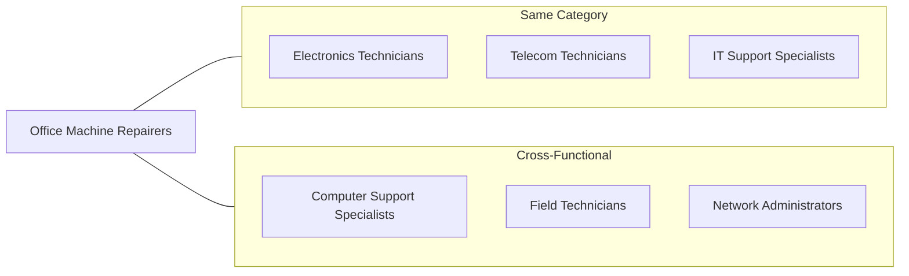
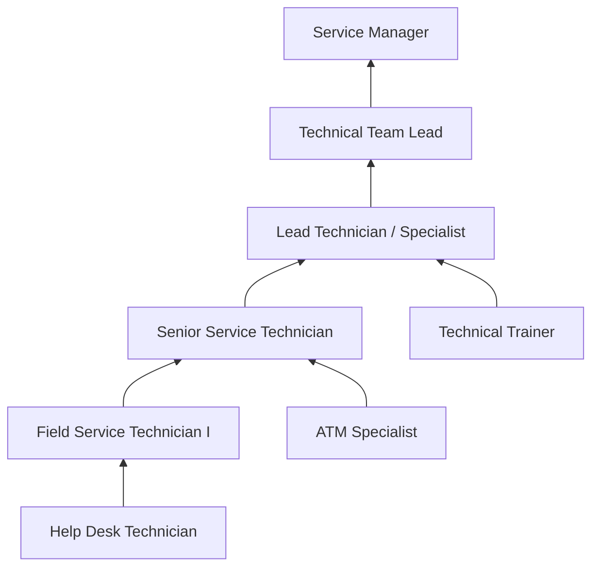

# Computer, Automated Teller, and Office Machine Repairers

> Repair, maintain, or install computers, word processing systems, automated teller machines, and electronic office machines, such as duplicating and fax machines.

## Overview

Computer, Automated Teller, and Office Machine Repairers are skilled technicians who keep essential business equipment functioning properly. They diagnose, repair, and maintain a wide range of electronic office equipment including computers, ATMs, printers, copiers, and point-of-sale systems. These professionals travel to customer locations or work in repair facilities, using diagnostic software and specialized tools to identify problems and perform repairs. As offices and financial institutions depend heavily on technology, these repairers play a critical role in minimizing equipment downtime and ensuring business continuity. The role requires a combination of electronics knowledge, mechanical aptitude, and customer service skills.

## Classification Hierarchy

## Key Statistics

| Metric | Value |
|--------|-------|
| SOC Code | 49-2011.00 |
| Job Zone | 3 (Medium Preparation) |
| Category | [Installation, Maintenance, and Repair](/occupations/Maintenance/index) |
| Core Tasks | 15+ |
| Source | O*NET |

## Core Tasks

### diagnose.EquipmentMalfunctions

Office Machine Repairers identify the root cause of equipment problems using diagnostic tools and expertise.

**Actions:**
- `diagnose.EquipmentMalfunctions.using.DiagnosticSoftware.to.identify.RootCause` - Use software tools to pinpoint issues
- `diagnose.EquipmentMalfunctions.using.TestEquipment.to.isolate.Problems` - Employ meters and analyzers
- `analyze.ErrorCodes.to.determine.FailurePoints` - Interpret diagnostic information
- `troubleshoot.SystemFailures.to.restore.Operations` - Systematically identify faults

### repair.Computers

Office Machine Repairers restore computer systems to proper working condition.

**Actions:**
- `repair.Computers.by.ReplacingComponents.to.restore.Functionality` - Swap out failed parts
- `repair.Computers.by.RestoringData.to.recover.Information` - Restore corrupted or lost data
- `repair.Computers.by.RemovingMalware.to.ensure.Security` - Clean infected systems
- `upgrade.Computers.by.InstallingComponents.to.improve.Performance` - Enhance system capabilities

### repair.AutomatedTellerMachines

Office Machine Repairers maintain and repair ATM systems ensuring secure financial transactions.

**Actions:**
- `repair.AutomatedTellerMachines.by.ReplacingParts.to.restore.Operations` - Replace worn or failed components
- `repair.AutomatedTellerMachines.by.ClearingJams.to.enable.Transactions` - Remove paper and card jams
- `service.AutomatedTellerMachines.by.CleaningSensors.to.ensure.Accuracy` - Maintain sensor functionality
- `test.AutomatedTellerMachines.for.SecurityCompliance.to.meet.Standards` - Verify security features

### install.HardwareComponents

Office Machine Repairers set up new equipment and components.

**Actions:**
- `install.HardwareComponents.in.Computers.to.upgrade.Systems` - Add memory, drives, and cards
- `install.Software.on.Equipment.to.enable.Functions` - Load operating systems and applications
- `configure.NetworkConnections.for.Equipment.to.enable.Communications` - Set up network access
- `connect.PeripheralDevices.to.Computers.to.expand.Capabilities` - Install printers, scanners, and more

### test.RepairedEquipment

Office Machine Repairers verify that repairs have been successful.

**Actions:**
- `test.RepairedEquipment.for.Functionality.to.ensure.Operation` - Confirm equipment works properly
- `test.RepairedEquipment.for.Performance.to.verify.Specifications` - Check speed and efficiency
- `run.DiagnosticTests.on.Equipment.to.validate.Repairs` - Execute comprehensive test routines
- `verify.SecurityFeatures.on.ATMs.to.ensure.Compliance` - Test security mechanisms

### maintain.Equipment

Office Machine Repairers perform preventive maintenance to extend equipment life.

**Actions:**
- `maintain.Equipment.by.CleaningComponents.to.prevent.Failures` - Keep equipment clean and functioning
- `maintain.Equipment.by.ReplacingWearParts.to.extend.Lifespan` - Swap consumable components
- `update.Software.on.Equipment.to.ensure.Security` - Apply patches and updates
- `calibrate.Equipment.to.ensure.Accuracy` - Adjust settings for optimal performance

### document.ServiceRecords

Office Machine Repairers maintain detailed service documentation.

**Actions:**
- `document.ServiceRecords.for.Equipment.to.track.History` - Log all service activities
- `record.PartsUsed.in.Repairs.to.manage.Inventory` - Track component usage
- `document.CustomerIssues.to.identify.Patterns` - Note recurring problems
- `prepare.ServiceReports.for.Customers.to.communicate.Work` - Provide service summaries

## Skills & Competencies

### Technical Skills
- **Computer Hardware** - Expert
- **Electronics Repair** - Advanced
- **Diagnostic Software** - Advanced
- **Network Configuration** - Advanced
- **ATM Systems** - Advanced
- **Office Equipment** - Expert
- **Software Installation** - Advanced

### Soft Skills
- **Problem Solving** - Critical
- **Customer Service** - Critical
- **Communication** - Essential
- **Attention to Detail** - Essential
- **Time Management** - Essential

## Related Occupations

## Industries

- [Finance and Insurance](/industries/Finance) - High Employment (ATM services)
- Administrative and Support Services - High Employment
- [Professional Services](/industries/Scientific) - Moderate Employment
- [Retail Trade](/industries/Retail/index) - Moderate Employment
- [Healthcare](/industries/Healthcare/index) - Moderate Employment
- [Government](/industries/PublicAdministration) - Moderate Employment

## Industry Variations

### Banking and Financial Services
- Focus on ATM repair and security
- Handle cash handling equipment
- Strict security protocols and background checks
- Compliance with financial regulations

### Office Equipment Services
- Work with copiers, printers, and multifunction devices
- Managed print services contracts
- Regular preventive maintenance schedules
- Parts replacement and consumables

### IT Services
- Computer repair and upgrades
- Workstation deployment and configuration
- Help desk escalation support
- Hardware lifecycle management

## Career Progression

## Education & Training

| Requirement | Details |
|-------------|---------|
| Typical Education | High school diploma plus technical training; some positions prefer associate's degree in electronics or IT |
| Work Experience | 1-3 years in electronics repair or IT support |
| On-the-Job Training | Manufacturer-specific training, on-site mentoring |
| Common Certifications | CompTIA A+, manufacturer certifications (HP, Dell, Xerox), ATM-specific certifications |

## Departments

This occupation typically works in:
- IT Support
- Field Services
- [Facilities](/departments/Operations)
- Technical Operations

## Work Environment

- Combination of customer sites and repair facilities
- Regular travel to client locations
- May carry heavy diagnostic equipment and parts
- Standing, kneeling, and reaching in various positions
- Some work in secure environments (banks, data centers)
- May require working outside normal business hours

## Tools and Equipment

- Diagnostic software and utilities
- Multimeters and oscilloscopes
- Hand tools (screwdrivers, pliers, etc.)
- Soldering equipment
- ESD protection equipment
- Parts and component inventory
- Laptop for diagnostics and documentation

---

*Source: O*NET 49-2011.00 - ONETOccupation*
