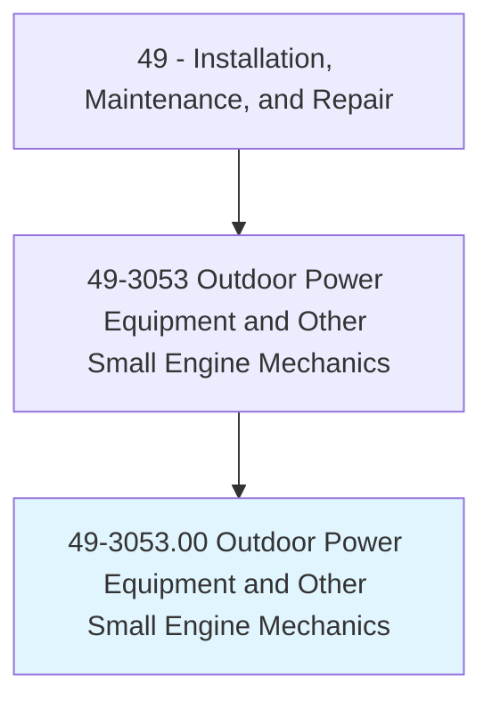
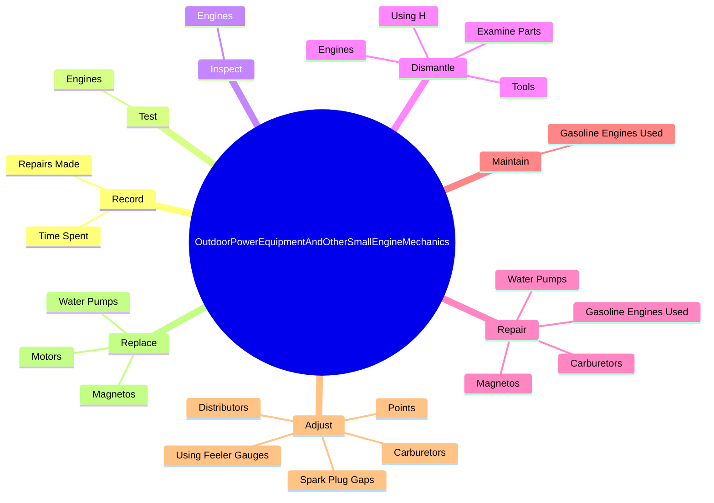
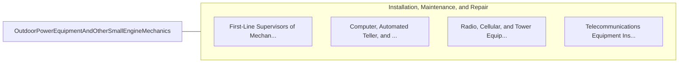

# Outdoor Power Equipment and Other Small Engine Mechanics

> Diagnose, adjust, repair, or overhaul small engines used to power lawn mowers, chain saws, recreational sporting equipment, and related equipment.

## Overview

Outdoor Power Equipment and Other Small Engine Mechanics is classified under Installation, Maintenance, and Repair (SOC 49). Diagnose, adjust, repair, or overhaul small engines used to power lawn mowers, chain saws, recreational sporting equipment, and related equipment.

## Classification Hierarchy

## Key Statistics

| Metric | Value |
|--------|-------|
| SOC Code | 49-3053.00 |
| Category | [Installation, Maintenance, and Repair](/occupations/Maintenance/index) |
| Task Count | 51 |
| Source | O*NET |

## Core Tasks

### record.RepairsMade

Outdoor Power Equipment and Other Small Engine Mechanics record repairs made as part of their core responsibilities.

**Actions:**
- `record.RepairsMade`
- `record.TimeSpent`

### test.Engines

Outdoor Power Equipment and Other Small Engine Mechanics test engines as part of their core responsibilities.

**Actions:**
- `test.Engines.to.determine.Malfunctions`
- `test.Engines.to.ToLocateMissing`
- `test.Engines.to.BrokenParts`
- `test.Engines.to.ToVerifyRepairs`

### inspect.Engines

Outdoor Power Equipment and Other Small Engine Mechanics inspect engines as part of their core responsibilities.

**Actions:**
- `inspect.Engines.to.determine.Malfunctions`
- `inspect.Engines.to.ToLocateMissing`
- `inspect.Engines.to.BrokenParts`
- `inspect.Engines.to.ToVerifyRepairs`

## Skills & Competencies

### Technical Skills
- **Equipment Repair** - Advanced
- **Diagnostic Testing** - Advanced
- **Preventive Maintenance** - Advanced

### Soft Skills
- **Communication** - Essential
- **Problem Solving** - Essential
- **Critical Thinking** - Important
- **Teamwork** - Important
- **Adaptability** - Important

## Related Occupations

## Industries

This occupation is found across multiple industries. See [Industries](/industries) for sector-specific employment data.

## Career Progression

---

*Source: O*NET 49-3053.00 - ONETOccupation*
