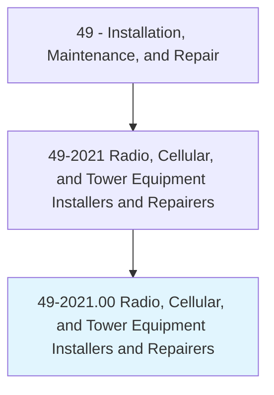
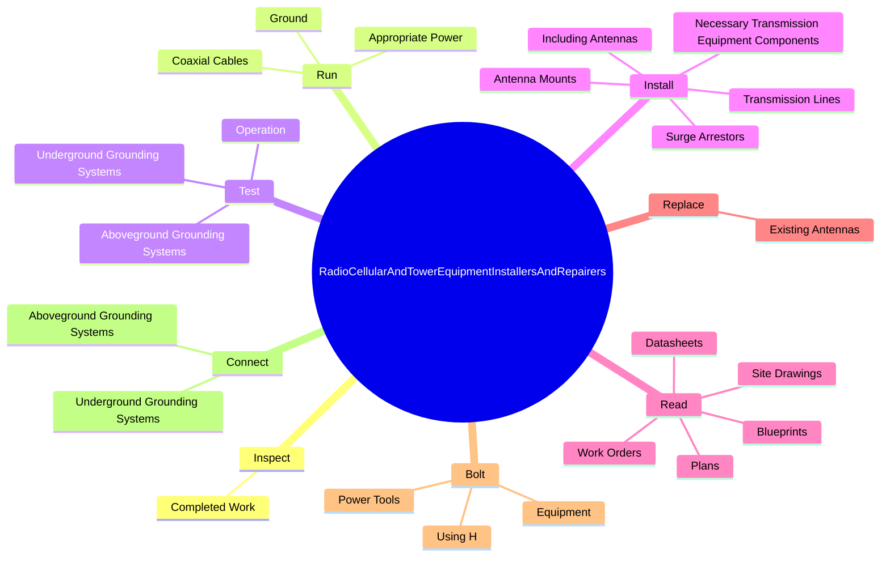
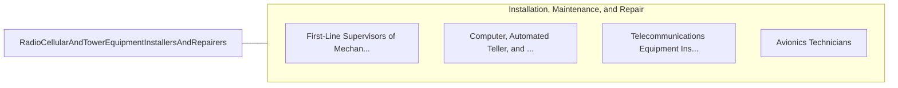

# Radio, Cellular, and Tower Equipment Installers and Repairers

> Repair, install, or maintain mobile or stationary radio transmitting, broadcasting, and receiving equipment, and two-way radio communications systems used in cellular telecommunications, mobile broadband, ship-to-shore, aircraft-to-ground communications, and radio equipment in service and emergency vehicles. May test and analyze network coverage.

## Overview

Radio, Cellular, and Tower Equipment Installers and Repairers is an occupation within the Installation, Maintenance, and Repair category. Repair, install, or maintain mobile or stationary radio transmitting, broadcasting, and receiving equipment, and two-way radio communications systems used in cellular telecommunications, mobile broadband, ship-to-shore, aircraft-to-ground communications, and radio equipment in service and emergency vehicles. 

## Classification Hierarchy

## Key Statistics

| Metric | Value |
|--------|-------|
| SOC Code | 49-2021.00 |
| Category | [Installation, Maintenance, and Repair](/occupations/Maintenance/index) |
| Task Count | 158 |
| Source | O*NET |

## Core Tasks

### inspect.CompletedWork

Radio, Cellular, and Tower Equipment Installers and Repairers inspect completed work as part of their core responsibilities.

**Actions:**
- `inspect.CompletedWork.to.ensure.HardwareIsTight`
- `inspect.CompletedWork.to.AntennasAreLevel`
- `inspect.CompletedWork.to.HangersAreProperlyFastened`
- `inspect.CompletedWork.to.ProperSupportIsInPlace`

### run.AppropriatePower

Radio, Cellular, and Tower Equipment Installers and Repairers run appropriate power as part of their core responsibilities.

**Actions:**
- `run.AppropriatePower`
- `run.Ground`
- `run.CoaxialCables`

### test.Operation

Radio, Cellular, and Tower Equipment Installers and Repairers test operation as part of their core responsibilities.

**Actions:**
- `test.Operation.of.TowerTransmissionComponents`
- `test.Operation.of.UsingSweepTestingTools`
- `test.Operation.of.Software`
- `test.UndergroundGroundingSystems`

## Skills & Competencies

### Technical Skills
- **Equipment Repair** - Advanced
- **Diagnostic Testing** - Advanced
- **Preventive Maintenance** - Advanced

### Soft Skills
- **Communication** - Essential
- **Problem Solving** - Essential
- **Critical Thinking** - Important
- **Teamwork** - Important
- **Adaptability** - Important

## Related Occupations

## Industries

This occupation is found across multiple industries. See [Industries](/industries) for sector-specific employment data.

## Career Progression

---

*Source: O*NET 49-2021.00 - ONETOccupation*
