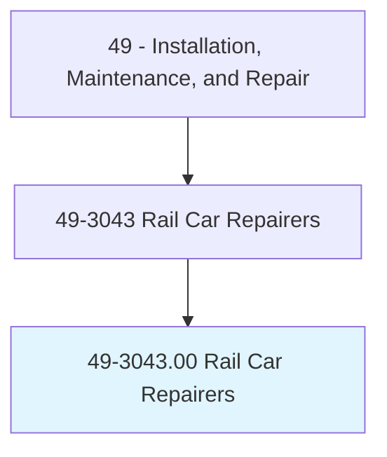
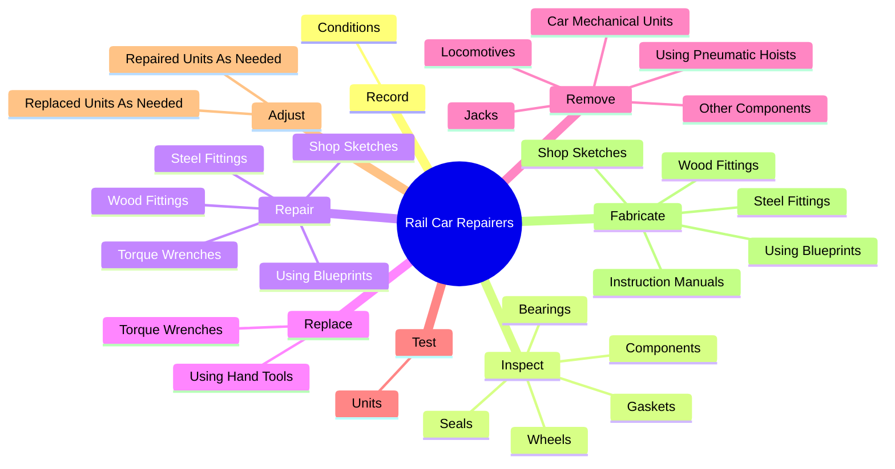
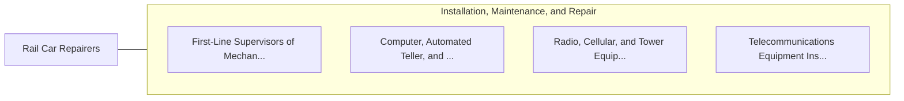

# Rail Car Repairers

> Diagnose, adjust, repair, or overhaul railroad rolling stock, mine cars, or mass transit rail cars.

## Overview

Rail Car Repairers is classified under Installation, Maintenance, and Repair (SOC 49). Diagnose, adjust, repair, or overhaul railroad rolling stock, mine cars, or mass transit rail cars.

## Classification Hierarchy

## Key Statistics

| Metric | Value |
|--------|-------|
| SOC Code | 49-3043.00 |
| Category | [Installation, Maintenance, and Repair](/occupations/Maintenance/index) |
| Task Count | 105 |
| Source | O*NET |

## Core Tasks

### record.Conditions

Rail Car Repairers record conditions as part of their core responsibilities.

**Actions:**
- `record.Conditions.of.Cars`
- `record.Conditions.of.Repair`
- `record.Conditions.of.MaintenanceWorkPerformedBePerformed`
- `record.Conditions.of.ToBePerformed`

### inspect.Components

Rail Car Repairers inspect components as part of their core responsibilities.

**Actions:**
- `inspect.Components.to.determine.IfRepairsAreNeeded`
- `inspect.Bearings.to.determine.IfRepairsAreNeeded`
- `inspect.Seals.to.determine.IfRepairsAreNeeded`
- `inspect.Gaskets.to.determine.IfRepairsAreNeeded`

### repair.TorqueWrenches

Rail Car Repairers repair torque wrenches as part of their core responsibilities.

**Actions:**
- `repair.TorqueWrenches`
- `repair.SteelFittings`
- `repair.WoodFittings`
- `repair.UsingBlueprints`

## Skills & Competencies

### Technical Skills
- **Equipment Repair** - Advanced
- **Diagnostic Testing** - Advanced
- **Preventive Maintenance** - Advanced

### Soft Skills
- **Communication** - Essential
- **Problem Solving** - Essential
- **Critical Thinking** - Important
- **Teamwork** - Important
- **Adaptability** - Important

## Related Occupations

## Industries

This occupation is found across multiple industries. See [Industries](/industries) for sector-specific employment data.

## Career Progression

---

*Source: O*NET 49-3043.00 - ONETOccupation*
