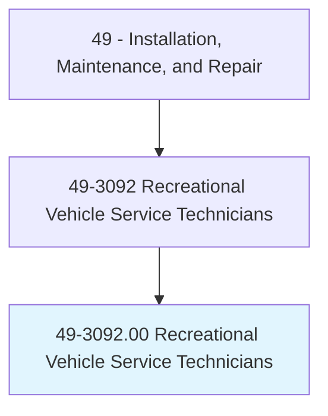
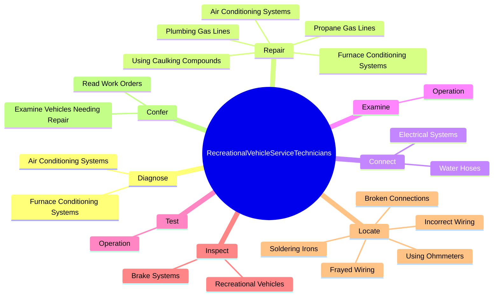
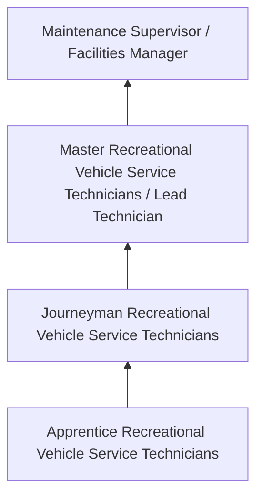
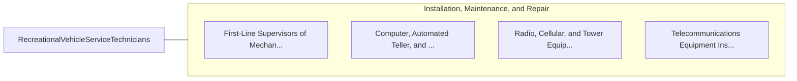

# Recreational Vehicle Service Technicians

> Diagnose, inspect, adjust, repair, or overhaul recreational vehicles including travel trailers. May specialize in maintaining gas, electrical, hydraulic, plumbing, or chassis/towing systems as well as repairing generators, appliances, and interior components. Includes workers who perform customized van conversions.

## Overview

Recreational Vehicle Service Technicians professionals diagnose, inspect, adjust, repair, or overhaul recreational vehicles including travel trailers. This occupation falls within the Installation, Maintenance, and Repair category and requires a combination of specialized knowledge, technical skills, and practical experience.

These professionals work across diverse settings and organizational contexts, applying their expertise to meet the demands of their field. They must stay current with industry standards, emerging practices, and regulatory requirements that affect their work. The role demands both independent judgment and collaborative skills, as practitioners regularly interact with colleagues, stakeholders, and the public.

As the field continues to evolve, Recreational Vehicle Service Technicians professionals increasingly leverage technology and data-driven approaches to enhance their effectiveness. Career opportunities span the public and private sectors, with demand influenced by economic conditions, demographic shifts, and technological advancement.

## Classification Hierarchy



## Key Statistics

| Metric | Value |
|--------|-------|
| SOC Code | 49-3092.00 |
| Job Zone | N/A |
| Category | [Installation, Maintenance, and Repair](/occupations/Maintenance/index) |
| Core Tasks | 92+ |
| Salary Range | $35,000 - $80,000 |
| Median Salary | $50,000 |
| Growth Outlook | 5% (As fast as average) |
| Source | O*NET |

## Core Tasks



### repair.FurnaceConditioningSystems

Recreational Vehicle Service Technicians repair furnace conditioning systems as part of their core responsibilities.

**Actions:**
- `repair.FurnaceConditioningSystems` - Diagnose and repair furnace or air conditioning systems.
- `repair.AirConditioningSystems` - Diagnose and repair furnace or air conditioning systems.
- `repair.PlumbingGasLines` - Repair plumbing or propane gas lines, using caulking compounds and plastic or...
- `repair.PropaneGasLines` - Repair plumbing or propane gas lines, using caulking compounds and plastic or...
- `repair.UsingCaulkingCompounds` - Repair plumbing or propane gas lines, using caulking compounds and plastic or...

### refinish.WoodSurfaces

Recreational Vehicle Service Technicians refinish wood surfaces as part of their core responsibilities.

**Actions:**
- `refinish.WoodSurfaces.on.Cabinets` - Refinish wood surfaces on cabinets, doors, moldings, or floors, using power s...
- `refinish.WoodSurfaces.on.Doors` - Refinish wood surfaces on cabinets, doors, moldings, or floors, using power s...
- `refinish.WoodSurfaces.on.Moldings` - Refinish wood surfaces on cabinets, doors, moldings, or floors, using power s...
- `refinish.WoodSurfaces.on.Floors` - Refinish wood surfaces on cabinets, doors, moldings, or floors, using power s...
- `refinish.WoodSurfaces.on.UsingPowerSanders` - Refinish wood surfaces on cabinets, doors, moldings, or floors, using power s...

### open.Doors

Recreational Vehicle Service Technicians open doors as part of their core responsibilities.

**Actions:**
- `open.Doors.to.test.Operation` - Open and close doors, windows, or drawers to test their operation, trimming e...
- `open.Doors.to.TrimmingEdgesToFit` - Open and close doors, windows, or drawers to test their operation, trimming e...
- `open.Doors.to.AsNecessary` - Open and close doors, windows, or drawers to test their operation, trimming e...
- `open.Windows.to.test.Operation` - Open and close doors, windows, or drawers to test their operation, trimming e...
- `open.Windows.to.TrimmingEdgesToFit` - Open and close doors, windows, or drawers to test their operation, trimming e...

### close.Doors

Recreational Vehicle Service Technicians close doors as part of their core responsibilities.

**Actions:**
- `close.Doors.to.test.Operation` - Open and close doors, windows, or drawers to test their operation, trimming e...
- `close.Doors.to.TrimmingEdgesToFit` - Open and close doors, windows, or drawers to test their operation, trimming e...
- `close.Doors.to.AsNecessary` - Open and close doors, windows, or drawers to test their operation, trimming e...
- `close.Windows.to.test.Operation` - Open and close doors, windows, or drawers to test their operation, trimming e...
- `close.Windows.to.TrimmingEdgesToFit` - Open and close doors, windows, or drawers to test their operation, trimming e...


## Skills & Competencies

### Technical Skills
- **Diagnostics and Troubleshooting** - Expert
- **Repair Techniques** - Advanced
- **Preventive Maintenance** - Advanced
- **Electrical Systems** - Advanced
- **Mechanical Systems** - Advanced
- **Safety Compliance** - Advanced

### Soft Skills
- **Problem Solving** - Critical
- **Attention to Detail** - Critical
- **Physical Stamina** - Essential
- **Communication** - Essential
- **Time Management** - Essential

## Education & Certifications

| Requirement | Details |
|-------------|---------|
| Typical Education | Post-secondary technical training or apprenticeship |
| Work Experience | 1-4 years hands-on experience |
| On-the-Job Training | Extensive - apprenticeship or technical certification programs |
| Certifications | Trade-specific licenses, EPA certifications, manufacturer certifications |

## Career Progression



## Industry Variations

### Industrial Maintenance
Equipment repair in manufacturing and production facilities. Recreational Vehicle Service Technicians professionals keep production lines running efficiently.

### Commercial Building Services
HVAC, electrical, and plumbing maintenance for commercial properties. Focus on preventive maintenance and tenant satisfaction.

### Automotive and Vehicle
Diagnosis and repair of vehicles and mobile equipment. Emphasis on diagnostic technology and manufacturer specifications.

### Specialized Technical
Maintenance of specialized systems such as telecommunications, medical equipment, or industrial controls.

## Technology & Tools

- **Diagnostic equipment and multimeters**
- **Computerized maintenance management systems (CMMS)**
- **Specialty hand and power tools**
- **Thermal imaging cameras**
- **Technical documentation systems**

## Related Occupations



## Industries

- [Automotive Repair](/industries/AutomotiveRepair) - High Employment
- [Manufacturing](/industries/Manufacturing) - High Employment
- Commercial Building Services - Moderate Employment
- Telecommunications - Moderate Employment

## Departments

This occupation typically works in:
- [Maintenance and Repair](/departments/Operations)
- [Facilities Management](/departments/Operations)
- Technical Services

## GraphDL Semantic Structure

```graphdl
Recreational Vehicle Service Technicians perform:
- diagnose.FurnaceConditioningSystems
- diagnose.AirConditioningSystems
- repair.FurnaceConditioningSystems
- repair.AirConditioningSystems
- connect.ElectricalSystems.to.OutsidePowerSources
- connect.ElectricalSystems.to.ActivateSwitchesToTestOperationOfAppliances
```

---

*Source: O*NET 49-3092.00 - ONETOccupation*
