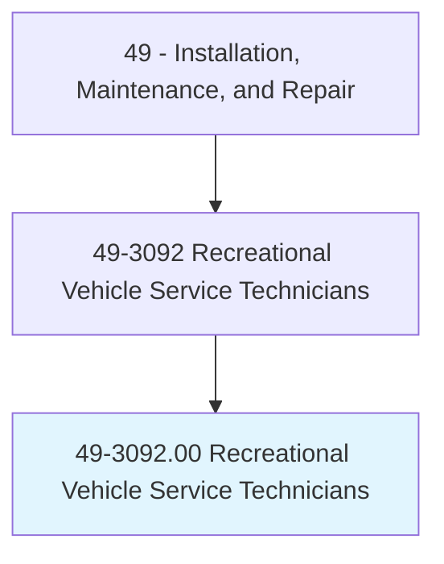
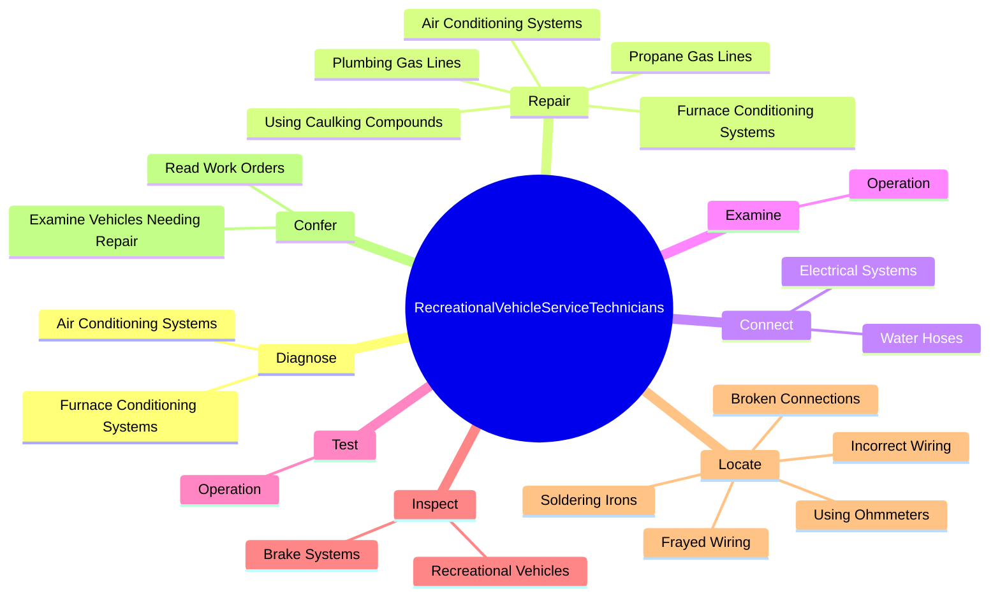

# Recreational Vehicle Service Technicians

> Diagnose, inspect, adjust, repair, or overhaul recreational vehicles including travel trailers. May specialize in maintaining gas, electrical, hydraulic, plumbing, or chassis/towing systems as well as repairing generators, appliances, and interior components. Includes workers who perform customized van conversions.

## Overview

Recreational Vehicle Service Technicians is an occupation within the Installation, Maintenance, and Repair category. Diagnose, inspect, adjust, repair, or overhaul recreational vehicles including travel trailers. May specialize in maintaining gas, electrical, hydraulic, plumbing, or chassis/towing systems as well as repairing generators, appliances, and interior components.

## Classification Hierarchy

## Key Statistics

| Metric | Value |
|--------|-------|
| SOC Code | 49-3092.00 |
| Category | [Installation, Maintenance, and Repair](/occupations/Maintenance) |
| Task Count | 92 |
| Source | O*NET |

## Core Tasks

### diagnose.FurnaceConditioningSystems

Recreational Vehicle Service Technicians diagnose furnace conditioning systems as part of their core responsibilities.

**Actions:**
- `diagnose.FurnaceConditioningSystems`
- `diagnose.AirConditioningSystems`

### repair.FurnaceConditioningSystems

Recreational Vehicle Service Technicians repair furnace conditioning systems as part of their core responsibilities.

**Actions:**
- `repair.FurnaceConditioningSystems`
- `repair.AirConditioningSystems`
- `repair.PlumbingGasLines`
- `repair.PropaneGasLines`

### connect.ElectricalSystems

Recreational Vehicle Service Technicians connect electrical systems as part of their core responsibilities.

**Actions:**
- `connect.ElectricalSystems.to.OutsidePowerSources`
- `connect.ElectricalSystems.to.ActivateSwitchesToTestOperationOfAppliances`
- `connect.ElectricalSystems.to.light.Fixtures`
- `connect.WaterHoses.to.InletPipesOfPlumbingSystems`

## Skills & Competencies

### Technical Skills
- **Equipment Repair** - Advanced
- **Diagnostic Testing** - Advanced
- **Preventive Maintenance** - Advanced

### Soft Skills
- **Communication** - Essential
- **Problem Solving** - Essential
- **Critical Thinking** - Important
- **Teamwork** - Important
- **Adaptability** - Important

## Related Occupations

## Industries

This occupation is found across multiple industries. See [Industries](/industries) for sector-specific employment data.

## Career Progression

---

*Source: O*NET 49-3092.00 - ONETOccupation*
