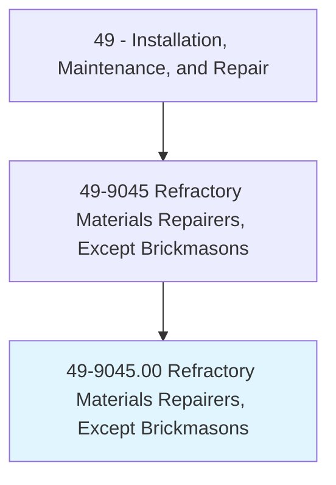
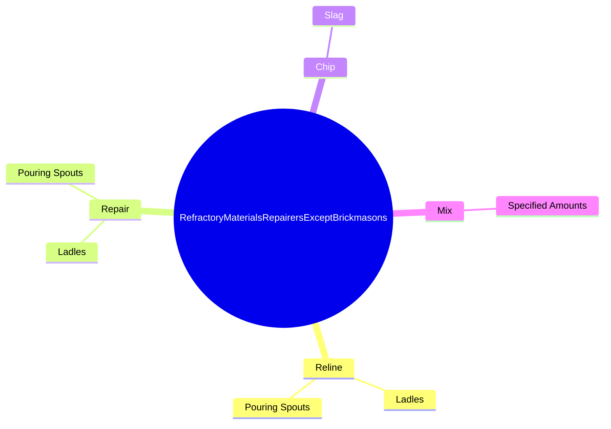
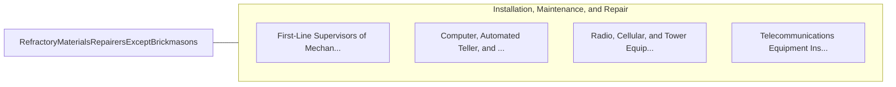

# Refractory Materials Repairers, Except Brickmasons

> Build or repair equipment such as furnaces, kilns, cupolas, boilers, converters, ladles, soaking pits, and ovens, using refractory materials.

## Overview

Refractory Materials Repairers, Except Brickmasons is classified under Installation, Maintenance, and Repair (SOC 49). Build or repair equipment such as furnaces, kilns, cupolas, boilers, converters, ladles, soaking pits, and ovens, using refractory materials.

## Classification Hierarchy

## Key Statistics

| Metric | Value |
|--------|-------|
| SOC Code | 49-9045.00 |
| Category | [Installation, Maintenance, and Repair](/occupations/Maintenance) |
| Task Count | 48 |
| Source | O*NET |

## Core Tasks

### reline.Ladles

Refractory Materials Repairers, Except Brickmasons reline ladles as part of their core responsibilities.

**Actions:**
- `reline.Ladles.with.RefractoryClay`
- `reline.Ladles.with.UsingTrowels`
- `reline.PouringSpouts.with.RefractoryClay`
- `reline.PouringSpouts.with.UsingTrowels`

### repair.Ladles

Refractory Materials Repairers, Except Brickmasons repair ladles as part of their core responsibilities.

**Actions:**
- `repair.Ladles.with.RefractoryClay`
- `repair.Ladles.with.UsingTrowels`
- `repair.PouringSpouts.with.RefractoryClay`
- `repair.PouringSpouts.with.UsingTrowels`

### chip.Slag

Refractory Materials Repairers, Except Brickmasons chip slag as part of their core responsibilities.

**Actions:**
- `chip.Slag.from.Linings.of.Ladles`
- `chip.Slag.from.RemoveLiningsWhenBeyondRepair`
- `chip.Slag.from.UsingHammers`
- `chip.Slag.from.Chisels`

## Skills & Competencies

### Technical Skills
- **Equipment Repair** - Advanced
- **Diagnostic Testing** - Advanced
- **Preventive Maintenance** - Advanced

### Soft Skills
- **Communication** - Essential
- **Problem Solving** - Essential
- **Critical Thinking** - Important
- **Teamwork** - Important
- **Adaptability** - Important

## Related Occupations

## Industries

This occupation is found across multiple industries. See [Industries](/industries) for sector-specific employment data.

## Career Progression

---

*Source: O*NET 49-9045.00 - ONETOccupation*
