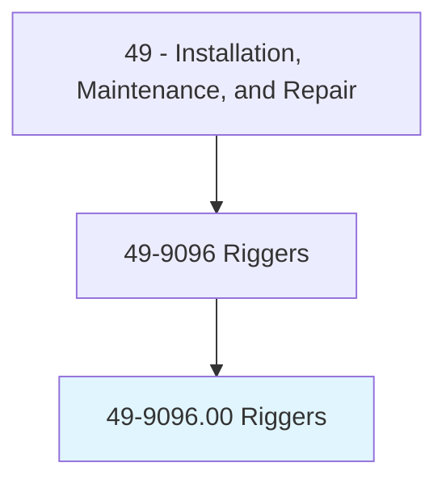
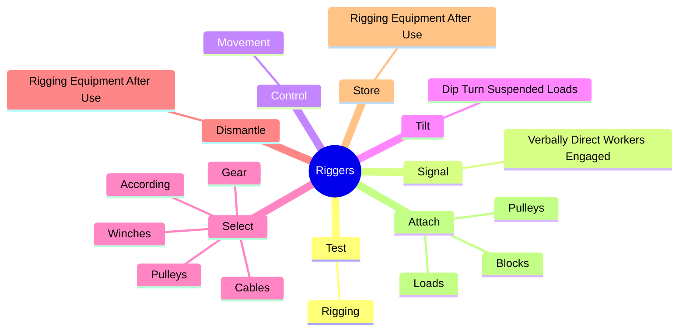
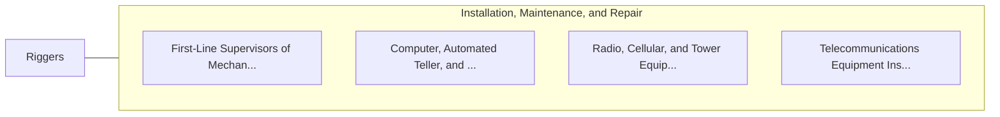

# Riggers

> Set up or repair rigging for construction projects, manufacturing plants, logging yards, ships and shipyards, or for the entertainment industry.

## Overview

Riggers is classified under Installation, Maintenance, and Repair (SOC 49). Set up or repair rigging for construction projects, manufacturing plants, logging yards, ships and shipyards, or for the entertainment industry.

## Classification Hierarchy

## Key Statistics

| Metric | Value |
|--------|-------|
| SOC Code | 49-9096.00 |
| Category | [Installation, Maintenance, and Repair](/occupations/Maintenance) |
| Task Count | 76 |
| Source | O*NET |

## Core Tasks

### test.Rigging

Riggers test rigging as part of their core responsibilities.

**Actions:**
- `test.Rigging.to.ensure.Safety`
- `test.Rigging.to.Reliability`

### signal.VerballyDirectWorkersEngaged

Riggers signal verbally direct workers engaged as part of their core responsibilities.

**Actions:**
- `signal.VerballyDirectWorkersEngaged.in.HoistingLoads.to.ensure.SafetyOfWorkersMaterials`
- `signal.VerballyDirectWorkersEngaged.in.MovingLoads.to.ensure.SafetyOfWorkersMaterials`

### control.Movement

Riggers control movement as part of their core responsibilities.

**Actions:**
- `control.Movement.of.HeavyEquipmentThroughNarrowOpeningsSpaces`
- `control.Movement.of.ConfinedSpaces`
- `control.Movement.of.UsingChainfalls`
- `control.Movement.of.GinPoles`

## Skills & Competencies

### Technical Skills
- **Equipment Repair** - Advanced
- **Diagnostic Testing** - Advanced
- **Preventive Maintenance** - Advanced

### Soft Skills
- **Communication** - Essential
- **Problem Solving** - Essential
- **Critical Thinking** - Important
- **Teamwork** - Important
- **Adaptability** - Important

## Related Occupations

## Industries

This occupation is found across multiple industries. See [Industries](/industries) for sector-specific employment data.

## Career Progression

---

*Source: O*NET 49-9096.00 - ONETOccupation*
