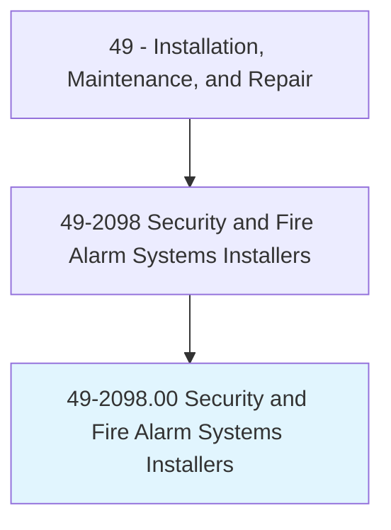
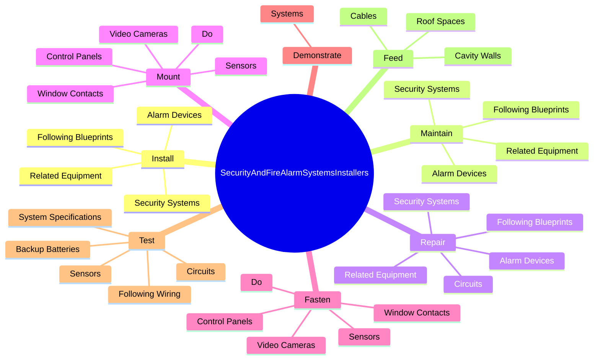
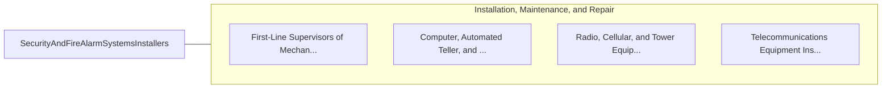

# Security and Fire Alarm Systems Installers

> Install, program, maintain, and repair security and fire alarm wiring and equipment. Ensure that work is in accordance with relevant codes.

## Overview

Security and Fire Alarm Systems Installers is an occupation within the Installation, Maintenance, and Repair category. Install, program, maintain, and repair security and fire alarm wiring and equipment. 

## Classification Hierarchy

## Key Statistics

| Metric | Value |
|--------|-------|
| SOC Code | 49-2098.00 |
| Category | [Installation, Maintenance, and Repair](/occupations/Maintenance/index) |
| Task Count | 100 |
| Source | O*NET |

## Core Tasks

### install.SecuritySystems

Security and Fire Alarm Systems Installers install security systems as part of their core responsibilities.

**Actions:**
- `install.SecuritySystems.of.ElectricalLayouts`
- `install.SecuritySystems.of.BuildingPlans`
- `install.AlarmDevices.of.ElectricalLayouts`
- `install.AlarmDevices.of.BuildingPlans`

### maintain.SecuritySystems

Security and Fire Alarm Systems Installers maintain security systems as part of their core responsibilities.

**Actions:**
- `maintain.SecuritySystems.of.ElectricalLayouts`
- `maintain.SecuritySystems.of.BuildingPlans`
- `maintain.AlarmDevices.of.ElectricalLayouts`
- `maintain.AlarmDevices.of.BuildingPlans`

### repair.SecuritySystems

Security and Fire Alarm Systems Installers repair security systems as part of their core responsibilities.

**Actions:**
- `repair.SecuritySystems.of.ElectricalLayouts`
- `repair.SecuritySystems.of.BuildingPlans`
- `repair.AlarmDevices.of.ElectricalLayouts`
- `repair.AlarmDevices.of.BuildingPlans`

## Skills & Competencies

### Technical Skills
- **Equipment Repair** - Advanced
- **Diagnostic Testing** - Advanced
- **Preventive Maintenance** - Advanced

### Soft Skills
- **Communication** - Essential
- **Problem Solving** - Essential
- **Critical Thinking** - Important
- **Teamwork** - Important
- **Adaptability** - Important

## Related Occupations

## Industries

This occupation is found across multiple industries. See [Industries](/industries) for sector-specific employment data.

## Career Progression

---

*Source: O*NET 49-2098.00 - ONETOccupation*
