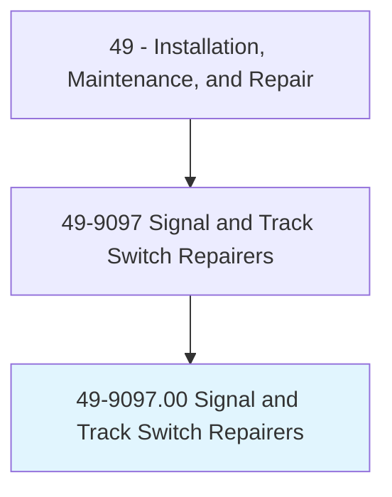
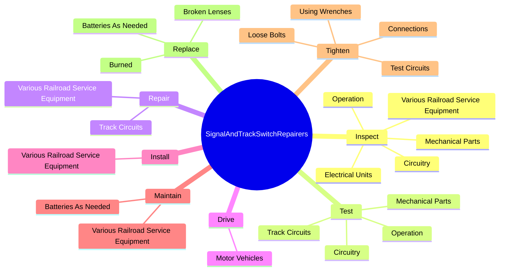
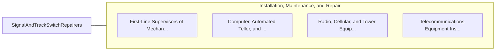

# Signal and Track Switch Repairers

> Install, inspect, test, maintain, or repair electric gate crossings, signals, signal equipment, track switches, section lines, or intercommunications systems within a railroad system.

## Overview

Signal and Track Switch Repairers is classified under Installation, Maintenance, and Repair (SOC 49). Install, inspect, test, maintain, or repair electric gate crossings, signals, signal equipment, track switches, section lines, or intercommunications systems within a railroad system.

## Classification Hierarchy

## Key Statistics

| Metric | Value |
|--------|-------|
| SOC Code | 49-9097.00 |
| Category | [Installation, Maintenance, and Repair](/occupations/Maintenance) |
| Task Count | 73 |
| Source | O*NET |

## Core Tasks

### inspect.Operation

Signal and Track Switch Repairers inspect operation as part of their core responsibilities.

**Actions:**
- `inspect.Operation.of.GateCrossings`
- `inspect.Operation.of.Signals`
- `inspect.Operation.of.SignalEquipment`
- `inspect.Operation.of.Interlocks`

### test.Operation

Signal and Track Switch Repairers test operation as part of their core responsibilities.

**Actions:**
- `test.Operation.of.GateCrossings`
- `test.Operation.of.Signals`
- `test.Operation.of.SignalEquipment`
- `test.Operation.of.Interlocks`

### repair.TrackCircuits

Signal and Track Switch Repairers repair track circuits as part of their core responsibilities.

**Actions:**
- `repair.TrackCircuits`
- `repair.VariousRailroadServiceEquipment.on.RoadShopIncludingRailroadSignalSystems`
- `repair.VariousRailroadServiceEquipment.on.InShopIncludingRailroadSignalSystems`

## Skills & Competencies

### Technical Skills
- **Equipment Repair** - Advanced
- **Diagnostic Testing** - Advanced
- **Preventive Maintenance** - Advanced

### Soft Skills
- **Communication** - Essential
- **Problem Solving** - Essential
- **Critical Thinking** - Important
- **Teamwork** - Important
- **Adaptability** - Important

## Related Occupations

## Industries

This occupation is found across multiple industries. See [Industries](/industries) for sector-specific employment data.

## Career Progression

---

*Source: O*NET 49-9097.00 - ONETOccupation*
