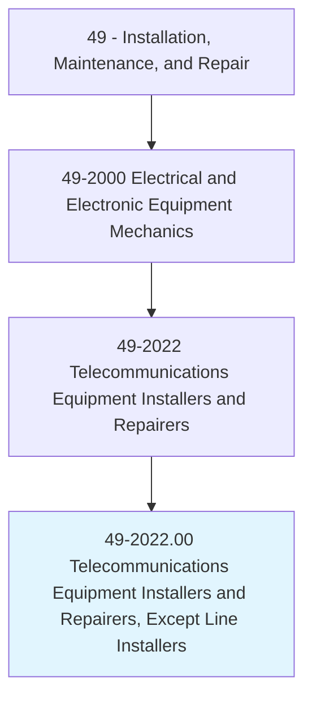
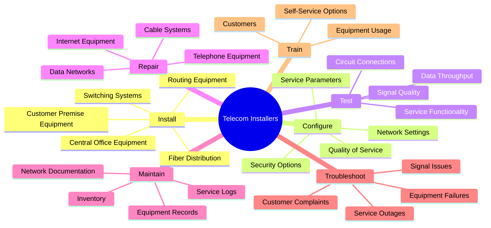
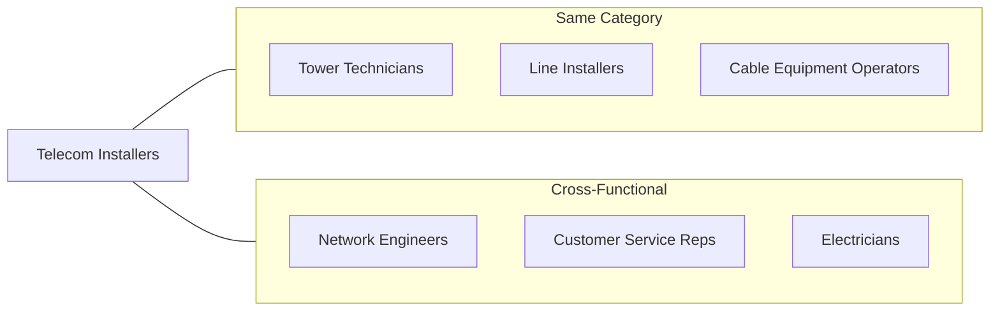
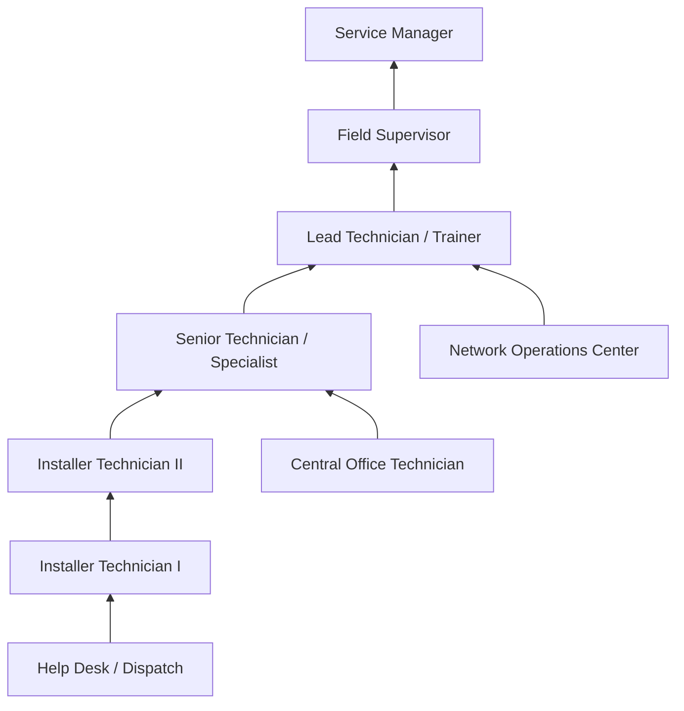

# Telecommunications Equipment Installers and Repairers, Except Line Installers

> Install, set up, rearrange, or remove switching, distribution, routing, and dialing equipment used in central offices or headends. Service or repair telephone, cable television, Internet, and other communications equipment on customers' property.

## Overview

Telecommunications Equipment Installers and Repairers work with the complex systems that enable modern communications including telephone, cable television, Internet, and data services. They install and maintain equipment ranging from central office switches and fiber distribution systems to customer premise equipment like modems, routers, and set-top boxes. These technicians diagnose and repair service issues, configure network equipment, and ensure customers have reliable communications services. The role combines electronics expertise with customer service skills, as technicians frequently work directly with residential and business customers. With the ongoing expansion of fiber optic networks and increasing demand for high-speed Internet, this occupation remains essential to telecommunications infrastructure.

## Classification Hierarchy

## Key Statistics

| Metric | Value |
|--------|-------|
| SOC Code | 49-2022.00 |
| Job Zone | 3 (Medium Preparation) |
| Category | [Installation, Maintenance, and Repair](/occupations/Maintenance/index) |
| Core Tasks | 20+ |
| Source | O*NET |

## Core Tasks

### install.CentralOfficeEquipment

Telecom Installers deploy and configure equipment in central offices and distribution facilities.

**Actions:**
- `install.SwitchingEquipment.in.CentralOffices.to.route.Calls` - Set up telephone switching systems
- `install.DistributionFrames.in.CentralOffices.to.terminate.Circuits` - Install cross-connect systems
- `install.FiberDistribution.in.Headends.to.distribute.Services` - Deploy fiber optic distribution panels
- `configure.RoutingEquipment.to.Specifications.to.enable.Connectivity` - Program routers and switches

### install.CustomerPremiseEquipment

Telecom Installers set up equipment at customer locations to deliver services.

**Actions:**
- `install.Modems.at.CustomerPremises.to.provide.InternetService` - Deploy broadband modems
- `install.Routers.at.CustomerPremises.to.enable.WiFiAccess` - Set up wireless networking
- `install.SetTopBoxes.at.CustomerPremises.to.deliver.CableTelevision` - Configure TV equipment
- `install.BusinessPhoneSystems.at.CustomerPremises.to.enable.Communications` - Deploy PBX and VoIP systems

### test.CircuitConnections

Telecom Installers verify that circuits and services are functioning properly.

**Actions:**
- `test.CircuitConnections.using.TestEquipment.to.verify.Continuity` - Check physical connections
- `test.SignalQuality.using.Analyzers.to.ensure.Performance` - Measure signal parameters
- `test.DataThroughput.using.SpeedTests.to.verify.Bandwidth` - Confirm data speeds
- `test.ServiceFunctionality.with.Customers.to.confirm.Operation` - Validate customer services

### configure.NetworkSettings

Telecom Installers program equipment to deliver services according to customer requirements.

**Actions:**
- `configure.NetworkSettings.on.Equipment.to.match.ServiceOrder` - Set up service parameters
- `configure.SecurityOptions.on.Routers.to.protect.Customers` - Enable firewall and encryption
- `configure.QualityOfService.on.Equipment.to.prioritize.Traffic` - Optimize network performance
- `program.Channels.on.SetTopBoxes.to.match.Subscription` - Activate TV service packages

### repair.TelephoneEquipment

Telecom Installers diagnose and fix problems with communications equipment.

**Actions:**
- `repair.TelephoneEquipment.by.ReplacingParts.to.restore.Service` - Swap failed components
- `repair.InternetEquipment.by.ResettingConfiguration.to.resolve.Issues` - Reconfigure problematic devices
- `repair.CableSystems.by.RepairingConnections.to.improve.Signal` - Fix loose or damaged connections
- `repair.DataNetworks.by.TroubleshootingProtocols.to.restore.Connectivity` - Resolve network issues

### troubleshoot.ServiceOutages

Telecom Installers identify and resolve service disruptions.

**Actions:**
- `troubleshoot.ServiceOutages.using.Diagnostics.to.identify.Causes` - Locate fault sources
- `troubleshoot.SignalIssues.using.Meters.to.find.Degradation` - Measure signal levels
- `troubleshoot.EquipmentFailures.using.TestProcedures.to.isolate.Problems` - Systematically diagnose faults
- `escalate.ComplexIssues.to.Engineering.to.resolve.Problems` - Coordinate with technical support

### train.Customers

Telecom Installers educate customers on using their communications services.

**Actions:**
- `train.Customers.on.EquipmentUsage.to.ensure.Satisfaction` - Demonstrate device operation
- `train.Customers.on.SelfServiceOptions.to.empower.Users` - Show troubleshooting basics
- `explain.ServiceFeatures.to.Customers.to.maximize.Value` - Highlight available capabilities
- `provide.Documentation.to.Customers.for.Reference` - Leave setup guides and contact info

## Skills & Competencies

### Technical Skills
- **Telecommunications Systems** - Expert
- **Fiber Optics** - Advanced
- **Network Configuration** - Advanced
- **Test Equipment** - Advanced
- **Copper Cabling** - Advanced
- **VoIP/IP Telephony** - Advanced
- **Cable Television Systems** - Advanced

### Soft Skills
- **Customer Service** - Critical
- **Problem Solving** - Critical
- **Communication** - Essential
- **Time Management** - Essential
- **Attention to Detail** - Essential
- **Patience** - Essential

## Related Occupations

## Industries

- [Telecommunications](/industries/Information/Telecommunications/index) - High Employment
- Cable and Satellite TV - High Employment
- Internet Service Providers - High Employment
- [Business Services](/industries/BusinessServices) - Moderate Employment
- [Utilities](/industries/Utilities/index) - Moderate Employment
- [Government](/industries/PublicAdministration) - Moderate Employment

## Industry Variations

### Telephone Companies (ILECs/CLECs)
- Central office switch maintenance
- Copper and fiber loop installation
- Business PBX and VoIP deployment
- Legacy system support

### Cable/Internet Providers
- HFC (Hybrid Fiber-Coax) network support
- DOCSIS modem deployment
- Video service installation
- Fiber to the home (FTTH) installations

### Fiber Optic Networks
- GPON/XGS-PON installations
- Fiber splicing and termination
- ONT (Optical Network Terminal) installation
- High-bandwidth business services

### Business Services
- Enterprise network installation
- SIP trunking and hosted PBX
- Managed network services
- Data center connections

## Career Progression

## Education & Training

| Requirement | Details |
|-------------|---------|
| Typical Education | High school diploma plus technical training; associate's degree preferred |
| Work Experience | 1-3 years in telecommunications or related field |
| On-the-Job Training | Extensive - company-specific systems, fiber optics, customer service |
| Common Certifications | FOA Fiber Optic Certification, CompTIA Network+, manufacturer certifications, state telecom licenses |

## Departments

This occupation typically works in:
- Field Services
- Network Operations
- Customer Operations
- Technical Support

## Work Environment

- Combination of central office, customer premises, and outdoor work
- Regular driving to customer locations
- Work in various environments (homes, businesses, utility rooms)
- Some work in underground vaults or aerial locations
- Carrying tools and equipment to work sites
- Exposure to dusty or cramped spaces
- May require evening and weekend work for customer appointments
- On-call rotation for emergency repairs

## Tools and Equipment

- Fiber optic test equipment (OTDR, power meter, visual fault locator)
- Copper test equipment (POTS test set, TDR)
- Network analyzers and cable certifiers
- Spectrum analyzers for cable/RF
- Fusion splicers and mechanical splice tools
- Cable termination tools
- Tone generators and probes
- Laptop/tablet for provisioning and documentation
- Hand tools and power tools

## Customer Interaction

### Typical Service Calls
- New service installations
- Service upgrades (speed/package changes)
- Trouble calls for outages or issues
- Equipment replacement
- Inside wire repairs

### Customer Communication
- Explain work to be performed
- Demonstrate equipment operation
- Address customer questions and concerns
- Obtain customer signatures and feedback
- Provide estimated completion times

---

*Source: O*NET 49-2022.00 - ONETOccupation*
