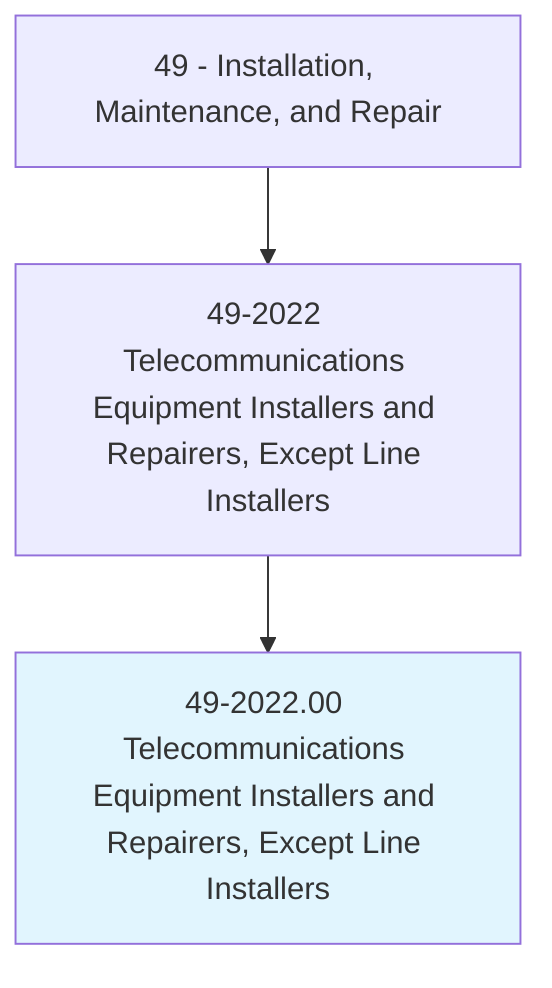
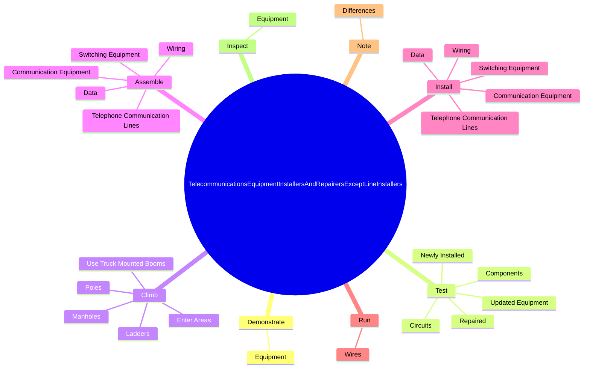
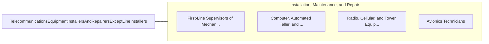

# Telecommunications Equipment Installers and Repairers, Except Line Installers

> Install, set up, rearrange, or remove switching, distribution, routing, and dialing equipment used in central offices or headends. Service or repair telephone, cable television, Internet, and other communications equipment on customers' property. May install communications equipment or communications wiring in buildings.

## Overview

Telecommunications Equipment Installers and Repairers, Except Line Installers is an occupation within the Installation, Maintenance, and Repair category. Install, set up, rearrange, or remove switching, distribution, routing, and dialing equipment used in central offices or headends. Service or repair telephone, cable television, Internet, and other communications equipment on customers' property.

## Classification Hierarchy

## Key Statistics

| Metric | Value |
|--------|-------|
| SOC Code | 49-2022.00 |
| Category | [Installation, Maintenance, and Repair](/occupations/Maintenance) |
| Task Count | 200 |
| Source | O*NET |

## Core Tasks

### demonstrate.Equipment

Telecommunications Equipment Installers and Repairers, Except Line Installers demonstrate equipment as part of their core responsibilities.

**Actions:**
- `demonstrate.Equipment.to.explain.Use`
- `demonstrate.Equipment.to.RespondingToInquiries`
- `demonstrate.Equipment.to.Complaints`

### test.Circuits

Telecommunications Equipment Installers and Repairers, Except Line Installers test circuits as part of their core responsibilities.

**Actions:**
- `test.Circuits.of.MalfunctioningTelecommunicationsEquipment.to.isolate.SourcesOfMalfunctions`
- `test.Circuits.of.UsingTestMeters`
- `test.Circuits.of.CircuitDiagrams`
- `test.Circuits.of.PolarityProbes`

### climb.Poles

Telecommunications Equipment Installers and Repairers, Except Line Installers climb poles as part of their core responsibilities.

**Actions:**
- `climb.Poles.to.install`
- `climb.Poles.to.maintain`
- `climb.Poles.to.inspect.Equipment`
- `climb.Ladders.to.install`

## Skills & Competencies

### Technical Skills
- **Equipment Repair** - Advanced
- **Diagnostic Testing** - Advanced
- **Preventive Maintenance** - Advanced

### Soft Skills
- **Communication** - Essential
- **Problem Solving** - Essential
- **Critical Thinking** - Important
- **Teamwork** - Important
- **Adaptability** - Important

## Related Occupations

## Industries

This occupation is found across multiple industries. See [Industries](/industries) for sector-specific employment data.

## Career Progression

---

*Source: O*NET 49-2022.00 - ONETOccupation*
