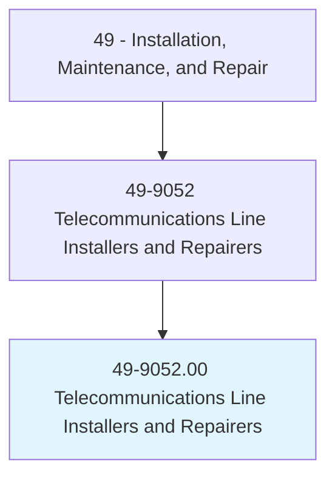
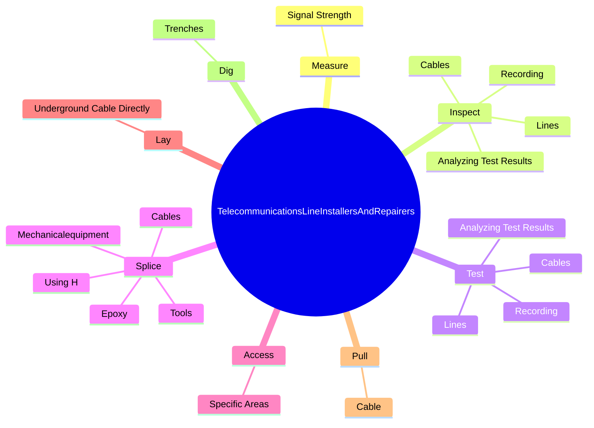
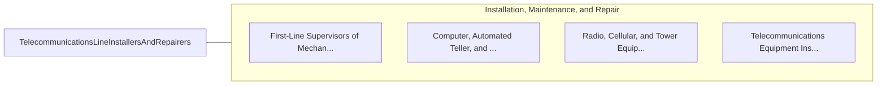

# Telecommunications Line Installers and Repairers

> Install and repair telecommunications cable, including fiber optics.

## Overview

Telecommunications Line Installers and Repairers is classified under Installation, Maintenance, and Repair (SOC 49). Install and repair telecommunications cable, including fiber optics.

## Classification Hierarchy

## Key Statistics

| Metric | Value |
|--------|-------|
| SOC Code | 49-9052.00 |
| Category | [Installation, Maintenance, and Repair](/occupations/Maintenance/index) |
| Task Count | 68 |
| Source | O*NET |

## Core Tasks

### measure.SignalStrength

Telecommunications Line Installers and Repairers measure signal strength as part of their core responsibilities.

**Actions:**
- `measure.SignalStrength.at.UtilityPoles`
- `measure.SignalStrength.at.UsingElectronicTestEquipment`

### inspect.Lines

Telecommunications Line Installers and Repairers inspect lines as part of their core responsibilities.

**Actions:**
- `inspect.Lines.to.assess.TransmissionCharacteristics`
- `inspect.Lines.to.locate.Faults`
- `inspect.Lines.to.Malfunctions`
- `inspect.Cables.to.assess.TransmissionCharacteristics`

### test.Lines

Telecommunications Line Installers and Repairers test lines as part of their core responsibilities.

**Actions:**
- `test.Lines.to.assess.TransmissionCharacteristics`
- `test.Lines.to.locate.Faults`
- `test.Lines.to.Malfunctions`
- `test.Cables.to.assess.TransmissionCharacteristics`

## Skills & Competencies

### Technical Skills
- **Equipment Repair** - Advanced
- **Diagnostic Testing** - Advanced
- **Preventive Maintenance** - Advanced

### Soft Skills
- **Communication** - Essential
- **Problem Solving** - Essential
- **Critical Thinking** - Important
- **Teamwork** - Important
- **Adaptability** - Important

## Related Occupations

## Industries

This occupation is found across multiple industries. See [Industries](/industries) for sector-specific employment data.

## Career Progression

---

*Source: O*NET 49-9052.00 - ONETOccupation*
