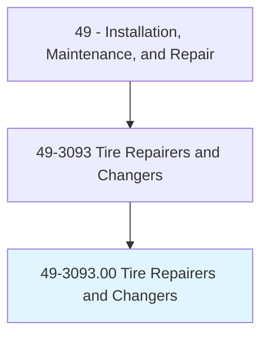
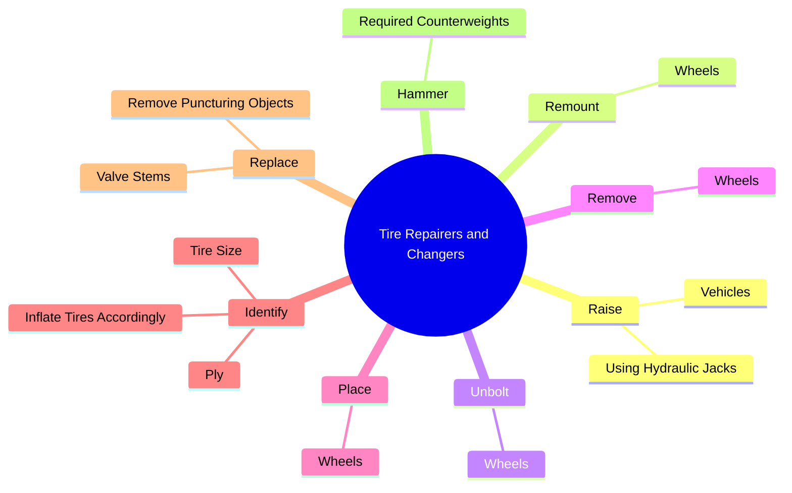
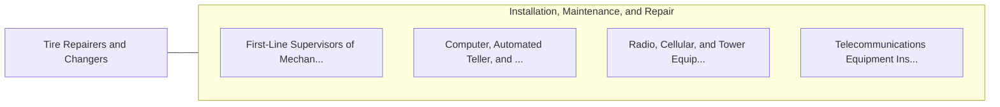

# Tire Repairers and Changers

> Repair and replace tires.

## Overview

Tire Repairers and Changers is classified under Installation, Maintenance, and Repair (SOC 49). Repair and replace tires.

## Classification Hierarchy

## Key Statistics

| Metric | Value |
|--------|-------|
| SOC Code | 49-3093.00 |
| Category | [Installation, Maintenance, and Repair](/occupations/Maintenance/index) |
| Task Count | 64 |
| Source | O*NET |

## Core Tasks

### raise.Vehicles

Tire Repairers and Changers raise vehicles as part of their core responsibilities.

**Actions:**
- `raise.Vehicles`
- `raise.UsingHydraulicJacks`

### remount.Wheels

Tire Repairers and Changers remount wheels as part of their core responsibilities.

**Actions:**
- `remount.Wheels.onto.Vehicles`

### unbolt.Wheels

Tire Repairers and Changers unbolt wheels as part of their core responsibilities.

**Actions:**
- `unbolt.Wheels.from.Vehicles`
- `unbolt.Wheels.from.UsingLugWrenches`
- `unbolt.Wheels.from.OtherHandTools`
- `unbolt.Wheels.from.PowerTools`

## Skills & Competencies

### Technical Skills
- **Equipment Repair** - Advanced
- **Diagnostic Testing** - Advanced
- **Preventive Maintenance** - Advanced

### Soft Skills
- **Communication** - Essential
- **Problem Solving** - Essential
- **Critical Thinking** - Important
- **Teamwork** - Important
- **Adaptability** - Important

## Related Occupations

## Industries

This occupation is found across multiple industries. See [Industries](/industries) for sector-specific employment data.

## Career Progression

---

*Source: O*NET 49-3093.00 - ONETOccupation*
