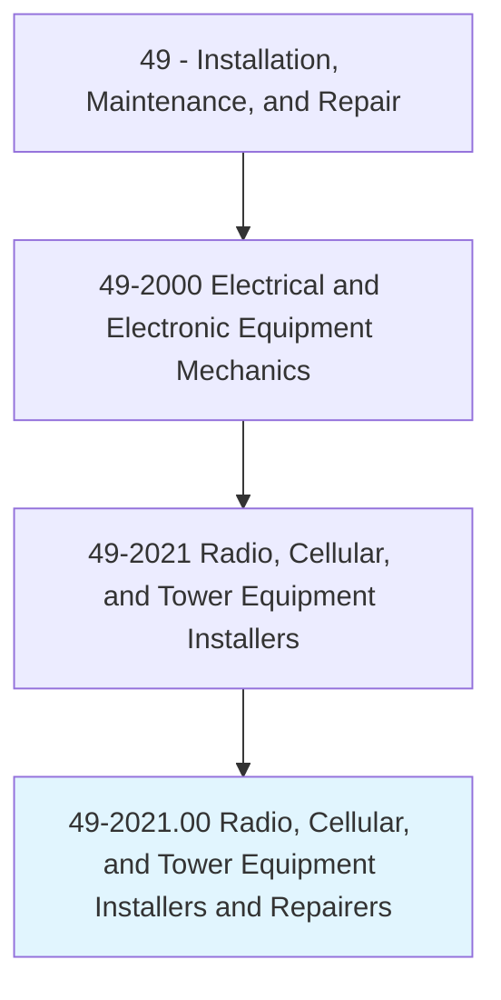
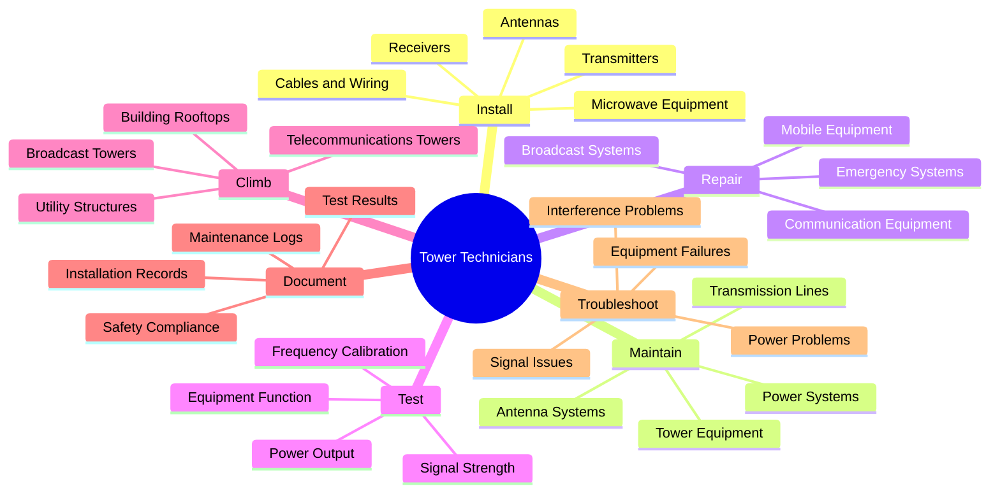
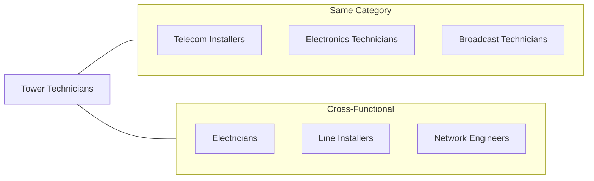
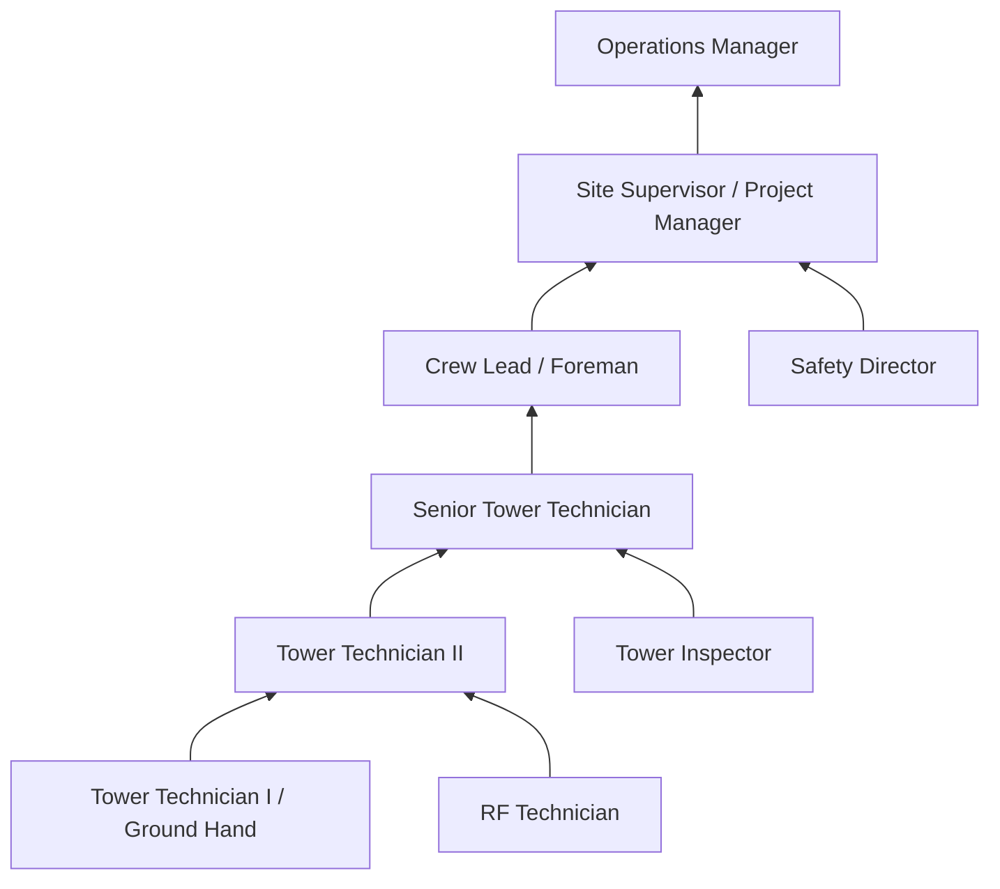

# Radio, Cellular, and Tower Equipment Installers and Repairers

> Repair, install, or maintain mobile or stationary radio transmitting, broadcasting, and receiving equipment, and two-way radio communications systems used in cellular telecommunications, mobile broadband, and other wireless communications.

## Overview

Radio, Cellular, and Tower Equipment Installers and Repairers, commonly known as Tower Technicians or Tower Climbers, work on the critical infrastructure that enables wireless communications. They install, maintain, and repair antennas, transmitters, receivers, and related equipment on telecommunications towers, rooftops, and other elevated structures. This physically demanding occupation requires working at extreme heights in various weather conditions while handling sophisticated electronic equipment. Tower technicians play an essential role in expanding and maintaining the wireless networks that support cellular communications, mobile broadband, emergency services, and broadcasting. The rapid deployment of 5G networks and increasing demand for wireless connectivity make this a growing and vital occupation.

## Classification Hierarchy

## Key Statistics

| Metric | Value |
|--------|-------|
| SOC Code | 49-2021.00 |
| Job Zone | 3 (Medium Preparation) |
| Category | [Installation, Maintenance, and Repair](/occupations/Maintenance/index) |
| Core Tasks | 15+ |
| Source | O*NET |

## Core Tasks

### install.Antennas

Tower Technicians install antenna systems on towers and structures to enable wireless communications.

**Actions:**
- `install.Antennas.on.Towers.to.enable.WirelessCommunications` - Mount cellular antennas at height
- `install.Antennas.on.Rooftops.to.extend.Coverage` - Deploy building-mounted systems
- `install.TransmissionLines.from.Equipment.to.Antennas` - Connect feedlines and jumpers
- `align.Antennas.to.Specifications.to.optimize.SignalStrength` - Adjust azimuth and tilt

### install.TransmittingEquipment

Tower Technicians deploy transmitting and receiving equipment for wireless networks.

**Actions:**
- `install.TransmittingEquipment.at.TowerSites.to.enable.Broadcasting` - Set up radio transmitters
- `install.ReceivingEquipment.at.TowerSites.to.enable.Reception` - Deploy receiver systems
- `configure.Equipment.to.Specifications.to.meet.NetworkRequirements` - Program and tune systems
- `connect.Equipment.to.PowerSystems.to.enable.Operation` - Wire power and backup systems

### maintain.TowerEquipment

Tower Technicians perform regular maintenance to ensure reliable communications.

**Actions:**
- `maintain.TowerEquipment.by.Inspecting.Components.to.identify.Issues` - Conduct visual and functional inspections
- `maintain.TowerEquipment.by.ReplacingParts.to.prevent.Failures` - Swap worn or aging components
- `maintain.TowerEquipment.by.CleaningConnections.to.ensure.Performance` - Clean contacts and weatherproofing
- `maintain.TowerEquipment.by.UpdatingSoftware.to.improve.Functionality` - Apply firmware updates

### test.SignalStrength

Tower Technicians verify that equipment is operating within specifications.

**Actions:**
- `test.SignalStrength.using.TestEquipment.to.verify.Coverage` - Measure signal levels and patterns
- `test.EquipmentFunction.using.Analyzers.to.ensure.Performance` - Check transmitter/receiver operation
- `calibrate.Frequency.to.Specifications.to.meet.Regulations` - Tune to licensed frequencies
- `measure.PowerOutput.to.verify.Compliance` - Confirm transmission power levels

### climb.Towers

Tower Technicians safely access elevated work locations to perform their duties.

**Actions:**
- `climb.Towers.using.SafetyEquipment.to.access.WorkAreas` - Scale structures with proper fall protection
- `climb.Towers.with.Tools.to.perform.Installations` - Carry equipment to height
- `inspect.TowerStructure.for.SafetyHazards.to.ensure.Safety` - Check structural integrity
- `rig.Equipment.for.Hoisting.to.WorkAreas` - Prepare materials for lifting

### troubleshoot.SignalIssues

Tower Technicians diagnose and resolve communication problems.

**Actions:**
- `troubleshoot.SignalIssues.using.TestEquipment.to.identify.Causes` - Locate signal degradation sources
- `troubleshoot.EquipmentFailures.using.Diagnostics.to.restore.Service` - Diagnose and fix malfunctions
- `troubleshoot.InterferenceProblems.to.improve.SignalQuality` - Identify and eliminate interference
- `diagnose.PowerProblems.to.restore.Operations` - Fix electrical issues

### document.WorkActivities

Tower Technicians maintain detailed records of installations and maintenance.

**Actions:**
- `document.InstallationRecords.for.Sites.to.track.Equipment` - Record installed components and configurations
- `document.MaintenanceLogs.for.Equipment.to.track.Service` - Log maintenance activities
- `document.TestResults.for.Compliance.to.meet.Regulations` - Record test measurements
- `photograph.Installations.for.Documentation.to.provide.Records` - Create visual documentation

## Skills & Competencies

### Technical Skills
- **RF Communications** - Expert
- **Electronics Repair** - Advanced
- **Antenna Systems** - Expert
- **Test Equipment** - Advanced
- **Rigging and Hoisting** - Advanced
- **Tower Climbing** - Expert
- **Network Technologies** - Advanced

### Soft Skills
- **Physical Fitness** - Critical
- **Safety Awareness** - Critical
- **Problem Solving** - Essential
- **Teamwork** - Essential
- **Communication** - Essential
- **Attention to Detail** - Essential

## Related Occupations

## Industries

- [Telecommunications](/industries/Information/Telecommunications/index) - High Employment
- [Broadcasting](/industries/Broadcasting) - Moderate Employment
- [Wireless Network Carriers](/industries/WirelessCarriers) - High Employment
- [Tower Construction](/industries/TowerConstruction) - High Employment
- [Public Safety](/industries/PublicSafety) - Moderate Employment
- [Utilities](/industries/Utilities/index) - Moderate Employment

## Industry Variations

### Wireless Carriers (5G/LTE)
- Focus on cellular network deployment and upgrades
- 5G small cell and macro installations
- Network densification projects
- Carrier equipment (Nokia, Ericsson, Samsung)

### Broadcasting
- AM/FM radio tower maintenance
- Television broadcast antenna work
- High-power transmission systems
- FCC compliance and licensing

### Public Safety Communications
- First responder radio networks
- P25 digital radio systems
- Emergency communication backup systems
- Critical infrastructure reliability

### Wireless Internet (WISP)
- Fixed wireless broadband deployment
- Point-to-point microwave links
- Rural connectivity solutions
- Customer premise equipment (CPE) installation

## Safety Requirements

### Essential Safety Training
- OSHA 10/30 Construction Safety
- Tower Climbing Safety (ANSI/TIA-1019)
- RF Safety Awareness
- Fall Protection Competent Person
- Rescue and Emergency Response

### Personal Protective Equipment
- Full-body safety harness
- Hard hat with chin strap
- Safety glasses and gloves
- Steel-toed boots
- High-visibility clothing
- RF monitoring equipment

## Career Progression

## Education & Training

| Requirement | Details |
|-------------|---------|
| Typical Education | High school diploma or equivalent; electronics training preferred |
| Work Experience | Entry-level positions available; 1-3 years for senior roles |
| On-the-Job Training | Extensive - tower climbing certification, RF safety, equipment-specific training |
| Common Certifications | NWSA Climber Certification, ComTrain Tower Technician, OSHA certifications, RF Safety certification |

## Departments

This occupation typically works in:
- [Network Operations](/departments/NetworkOps)
- [Construction](/departments/Construction)
- [Field Services](/departments/FieldServices)
- [Infrastructure](/departments/Infrastructure)

## Work Environment

- Work performed primarily outdoors at height (100-2000+ feet)
- Exposure to extreme weather conditions (heat, cold, wind, lightning risk)
- Physically demanding work requiring excellent fitness
- Travel to remote tower sites common
- May work irregular hours including nights and weekends
- Emergency call-out for network outages
- RF radiation exposure (controlled with proper procedures)

## Tools and Equipment

- Tower climbing gear (harness, lanyards, positioning devices)
- Cable analyzers and spectrum analyzers
- PIM (Passive Intermodulation) testers
- Fiber OTDR and power meters
- GPS and alignment tools
- Power tools and hand tools
- Rigging equipment
- Two-way radios

---

*Source: O*NET 49-2021.00 - ONETOccupation*
