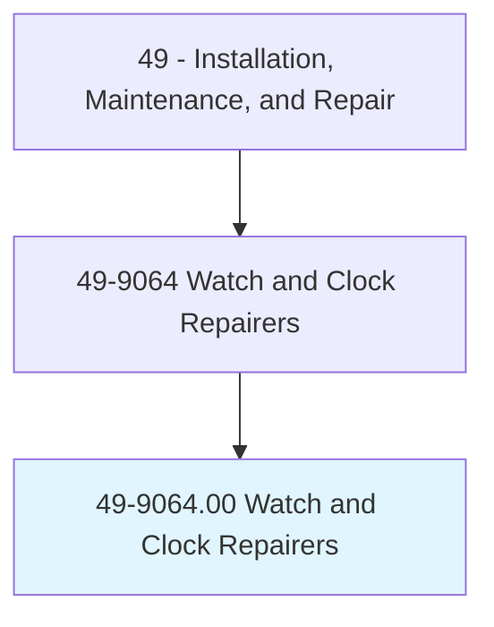
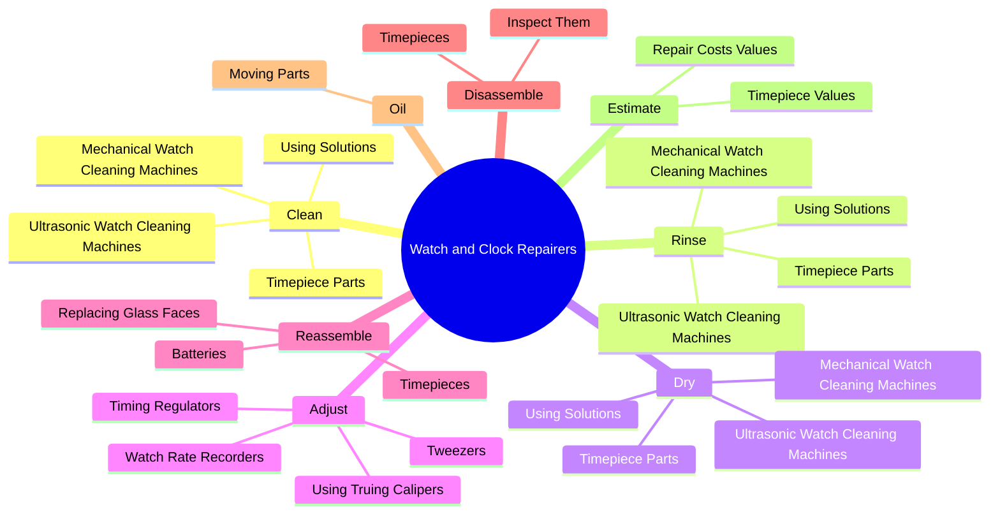
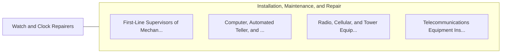

# Watch and Clock Repairers

> Repair, clean, and adjust mechanisms of timing instruments, such as watches and clocks. Includes watchmakers, watch technicians, and mechanical timepiece repairers.

## Overview

Watch and Clock Repairers is an occupation within the Installation, Maintenance, and Repair category. Repair, clean, and adjust mechanisms of timing instruments, such as watches and clocks. 

## Classification Hierarchy

## Key Statistics

| Metric | Value |
|--------|-------|
| SOC Code | 49-9064.00 |
| Category | [Installation, Maintenance, and Repair](/occupations/Maintenance/index) |
| Task Count | 90 |
| Source | O*NET |

## Core Tasks

### clean.TimepieceParts

Watch and Clock Repairers clean timepiece parts as part of their core responsibilities.

**Actions:**
- `clean.TimepieceParts`
- `clean.UsingSolutions`
- `clean.UltrasonicWatchCleaningMachines`
- `clean.MechanicalWatchCleaningMachines`

### rinse.TimepieceParts

Watch and Clock Repairers rinse timepiece parts as part of their core responsibilities.

**Actions:**
- `rinse.TimepieceParts`
- `rinse.UsingSolutions`
- `rinse.UltrasonicWatchCleaningMachines`
- `rinse.MechanicalWatchCleaningMachines`

### dry.TimepieceParts

Watch and Clock Repairers dry timepiece parts as part of their core responsibilities.

**Actions:**
- `dry.TimepieceParts`
- `dry.UsingSolutions`
- `dry.UltrasonicWatchCleaningMachines`
- `dry.MechanicalWatchCleaningMachines`

## Skills & Competencies

### Technical Skills
- **Equipment Repair** - Advanced
- **Diagnostic Testing** - Advanced
- **Preventive Maintenance** - Advanced

### Soft Skills
- **Communication** - Essential
- **Problem Solving** - Essential
- **Critical Thinking** - Important
- **Teamwork** - Important
- **Adaptability** - Important

## Related Occupations

## Industries

This occupation is found across multiple industries. See [Industries](/industries) for sector-specific employment data.

## Career Progression

---

*Source: O*NET 49-9064.00 - ONETOccupation*
