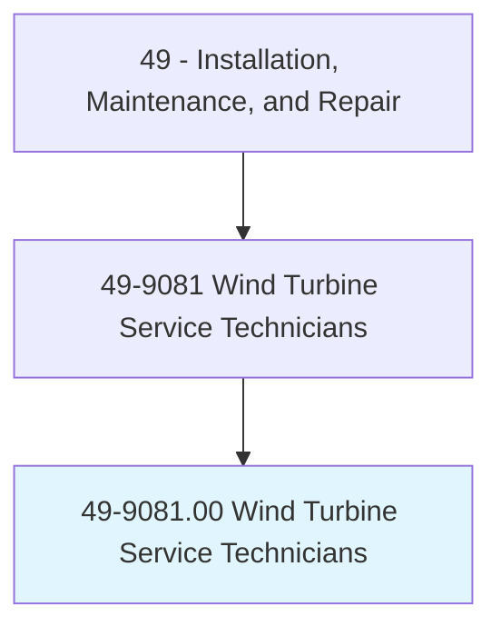
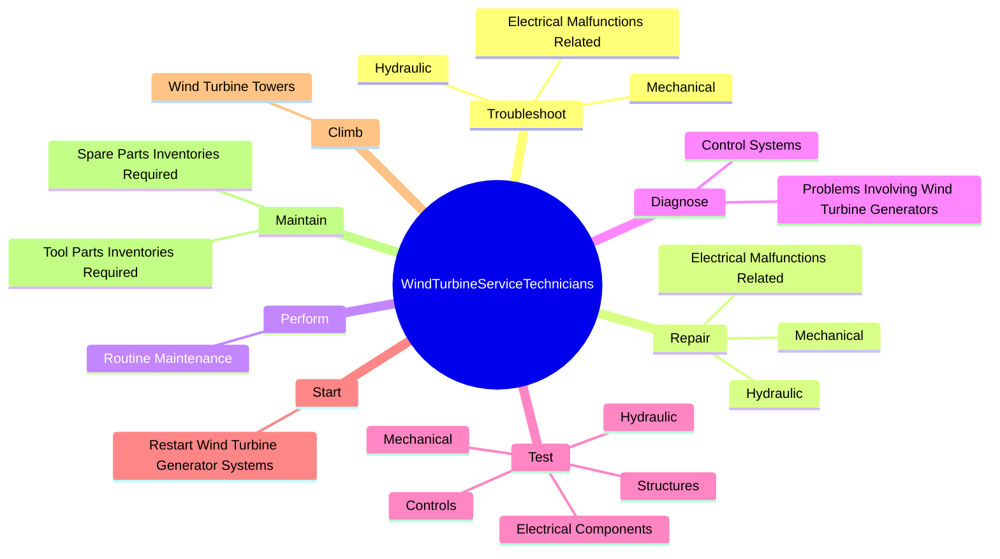
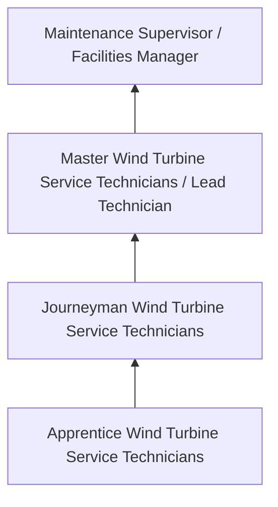
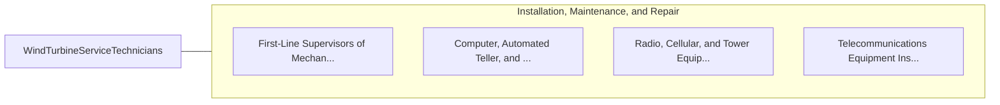

# Wind Turbine Service Technicians

> Inspect, diagnose, adjust, or repair wind turbines. Perform maintenance on wind turbine equipment including resolving electrical, mechanical, and hydraulic malfunctions.

## Overview

Wind Turbine Service Technicians professionals inspect, diagnose, adjust, or repair wind turbines. This occupation falls within the Installation, Maintenance, and Repair category and requires a combination of specialized knowledge, technical skills, and practical experience.

These professionals work across diverse settings and organizational contexts, applying their expertise to meet the demands of their field. They must stay current with industry standards, emerging practices, and regulatory requirements that affect their work. The role demands both independent judgment and collaborative skills, as practitioners regularly interact with colleagues, stakeholders, and the public.

As the field continues to evolve, Wind Turbine Service Technicians professionals increasingly leverage technology and data-driven approaches to enhance their effectiveness. Career opportunities span the public and private sectors, with demand influenced by economic conditions, demographic shifts, and technological advancement.

## Classification Hierarchy



## Key Statistics

| Metric | Value |
|--------|-------|
| SOC Code | 49-9081.00 |
| Job Zone | N/A |
| Category | [Installation, Maintenance, and Repair](/occupations/Maintenance/index) |
| Core Tasks | 75+ |
| Salary Range | $35,000 - $80,000 |
| Median Salary | $50,000 |
| Growth Outlook | 5% (As fast as average) |
| Source | O*NET |

## Core Tasks



### test.ElectricalComponents

Wind Turbine Service Technicians test electrical components as part of their core responsibilities.

**Actions:**
- `test.ElectricalComponents.of.WindSystems.with.Devices` - Test electrical components of wind systems with devices, such as voltage test...
- `test.ElectricalComponents.of.VoltageTesters` - Test electrical components of wind systems with devices, such as voltage test...
- `test.ElectricalComponents.of.Multimeters` - Test electrical components of wind systems with devices, such as voltage test...
- `test.ElectricalComponents.of.Oscilloscopes` - Test electrical components of wind systems with devices, such as voltage test...
- `test.ElectricalComponents.of.InfraredTesters` - Test electrical components of wind systems with devices, such as voltage test...

### repair.Mechanical

Wind Turbine Service Technicians repair mechanical as part of their core responsibilities.

**Actions:**
- `repair.Mechanical.to.VariablePitchSystems` - Troubleshoot or repair mechanical, hydraulic, or electrical malfunctions rela...
- `repair.Mechanical.to.VariableSpeedControlSystems` - Troubleshoot or repair mechanical, hydraulic, or electrical malfunctions rela...
- `repair.Mechanical.to.ConverterSystems` - Troubleshoot or repair mechanical, hydraulic, or electrical malfunctions rela...
- `repair.Mechanical.to.related.Components` - Troubleshoot or repair mechanical, hydraulic, or electrical malfunctions rela...
- `repair.Hydraulic.to.VariablePitchSystems` - Troubleshoot or repair mechanical, hydraulic, or electrical malfunctions rela...

### troubleshoot.Mechanical

Wind Turbine Service Technicians troubleshoot mechanical as part of their core responsibilities.

**Actions:**
- `troubleshoot.Mechanical.to.VariablePitchSystems` - Troubleshoot or repair mechanical, hydraulic, or electrical malfunctions rela...
- `troubleshoot.Mechanical.to.VariableSpeedControlSystems` - Troubleshoot or repair mechanical, hydraulic, or electrical malfunctions rela...
- `troubleshoot.Mechanical.to.ConverterSystems` - Troubleshoot or repair mechanical, hydraulic, or electrical malfunctions rela...
- `troubleshoot.Mechanical.to.related.Components` - Troubleshoot or repair mechanical, hydraulic, or electrical malfunctions rela...
- `troubleshoot.Hydraulic.to.VariablePitchSystems` - Troubleshoot or repair mechanical, hydraulic, or electrical malfunctions rela...

### train.EndUsers

Wind Turbine Service Technicians train end users as part of their core responsibilities.

**Actions:**
- `train.EndUsers.in.WindCommissioning` - Train end-users, distributors, installers, or other technicians in wind commi...
- `train.EndUsers.in.Testing` - Train end-users, distributors, installers, or other technicians in wind commi...
- `train.EndUsers.in.OtherTechnicalProcedures` - Train end-users, distributors, installers, or other technicians in wind commi...
- `train.Distributors.in.WindCommissioning` - Train end-users, distributors, installers, or other technicians in wind commi...
- `train.Distributors.in.Testing` - Train end-users, distributors, installers, or other technicians in wind commi...


## Skills & Competencies

### Technical Skills
- **Diagnostics and Troubleshooting** - Expert
- **Repair Techniques** - Advanced
- **Preventive Maintenance** - Advanced
- **Electrical Systems** - Advanced
- **Mechanical Systems** - Advanced
- **Safety Compliance** - Advanced

### Soft Skills
- **Problem Solving** - Critical
- **Attention to Detail** - Critical
- **Physical Stamina** - Essential
- **Communication** - Essential
- **Time Management** - Essential

## Education & Certifications

| Requirement | Details |
|-------------|---------|
| Typical Education | Post-secondary technical training or apprenticeship |
| Work Experience | 1-4 years hands-on experience |
| On-the-Job Training | Extensive - apprenticeship or technical certification programs |
| Certifications | Trade-specific licenses, EPA certifications, manufacturer certifications |

## Career Progression



## Industry Variations

### Industrial Maintenance
Equipment repair in manufacturing and production facilities. Wind Turbine Service Technicians professionals keep production lines running efficiently.

### Commercial Building Services
HVAC, electrical, and plumbing maintenance for commercial properties. Focus on preventive maintenance and tenant satisfaction.

### Automotive and Vehicle
Diagnosis and repair of vehicles and mobile equipment. Emphasis on diagnostic technology and manufacturer specifications.

### Specialized Technical
Maintenance of specialized systems such as telecommunications, medical equipment, or industrial controls.

## Technology & Tools

- **Diagnostic equipment and multimeters**
- **Computerized maintenance management systems (CMMS)**
- **Specialty hand and power tools**
- **Thermal imaging cameras**
- **Technical documentation systems**

## Related Occupations



## Industries

- [Automotive Repair](/industries/AutomotiveRepair) - High Employment
- [Manufacturing](/industries/Manufacturing) - High Employment
- Commercial Building Services - Moderate Employment
- Telecommunications - Moderate Employment

## Departments

This occupation typically works in:
- [Maintenance and Repair](/departments/Operations)
- [Facilities Management](/departments/Operations)
- Technical Services

## GraphDL Semantic Structure

```graphdl
Wind Turbine Service Technicians perform:
- troubleshoot.Mechanical.to.VariablePitchSystems
- troubleshoot.Mechanical.to.VariableSpeedControlSystems
- troubleshoot.Mechanical.to.ConverterSystems
- troubleshoot.Mechanical.to.related.Components
- troubleshoot.Hydraulic.to.VariablePitchSystems
- troubleshoot.Hydraulic.to.VariableSpeedControlSystems
```

---

*Source: O*NET 49-9081.00 - ONETOccupation*
