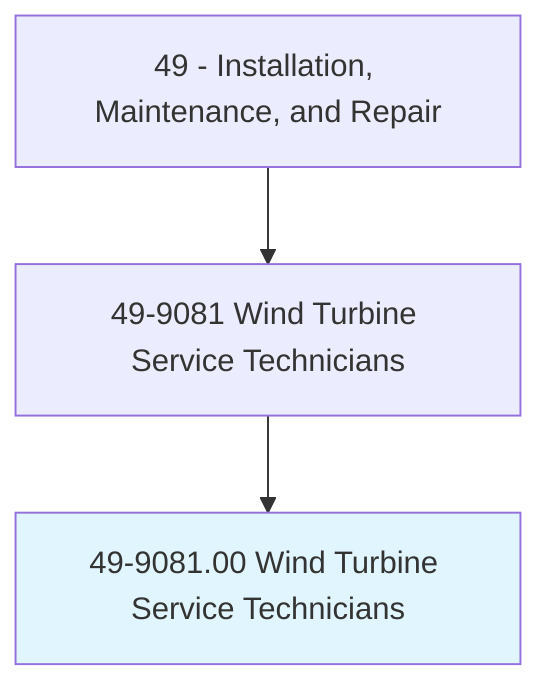
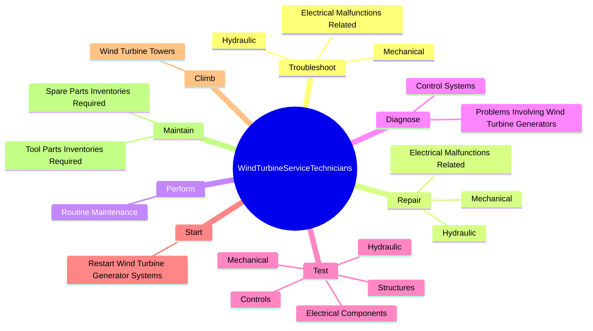
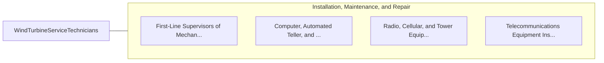

# Wind Turbine Service Technicians

> Inspect, diagnose, adjust, or repair wind turbines. Perform maintenance on wind turbine equipment including resolving electrical, mechanical, and hydraulic malfunctions.

## Overview

Wind Turbine Service Technicians is an occupation within the Installation, Maintenance, and Repair category. Inspect, diagnose, adjust, or repair wind turbines. 

## Classification Hierarchy

## Key Statistics

| Metric | Value |
|--------|-------|
| SOC Code | 49-9081.00 |
| Category | [Installation, Maintenance, and Repair](/occupations/Maintenance/index) |
| Task Count | 75 |
| Source | O*NET |

## Core Tasks

### troubleshoot.Mechanical

Wind Turbine Service Technicians troubleshoot mechanical as part of their core responsibilities.

**Actions:**
- `troubleshoot.Mechanical.to.VariablePitchSystems`
- `troubleshoot.Mechanical.to.VariableSpeedControlSystems`
- `troubleshoot.Mechanical.to.ConverterSystems`
- `troubleshoot.Mechanical.to.related.Components`

### repair.Mechanical

Wind Turbine Service Technicians repair mechanical as part of their core responsibilities.

**Actions:**
- `repair.Mechanical.to.VariablePitchSystems`
- `repair.Mechanical.to.VariableSpeedControlSystems`
- `repair.Mechanical.to.ConverterSystems`
- `repair.Mechanical.to.related.Components`

### perform.RoutineMaintenance

Wind Turbine Service Technicians perform routine maintenance as part of their core responsibilities.

**Actions:**
- `perform.RoutineMaintenance.on.WindTurbineEquipment`
- `perform.RoutineMaintenance.on.UndergroundTransmissionSystems`
- `perform.RoutineMaintenance.on.WindFieldsSubstations`
- `perform.RoutineMaintenance.on.FiberOpticSensing`

## Skills & Competencies

### Technical Skills
- **Equipment Repair** - Advanced
- **Diagnostic Testing** - Advanced
- **Preventive Maintenance** - Advanced

### Soft Skills
- **Communication** - Essential
- **Problem Solving** - Essential
- **Critical Thinking** - Important
- **Teamwork** - Important
- **Adaptability** - Important

## Related Occupations

## Industries

This occupation is found across multiple industries. See [Industries](/industries) for sector-specific employment data.

## Career Progression

---

*Source: O*NET 49-9081.00 - ONETOccupation*
