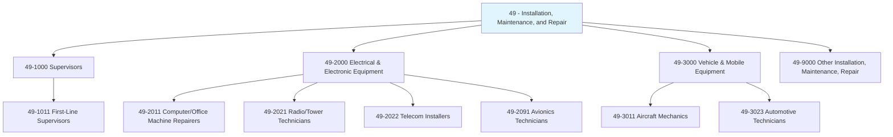
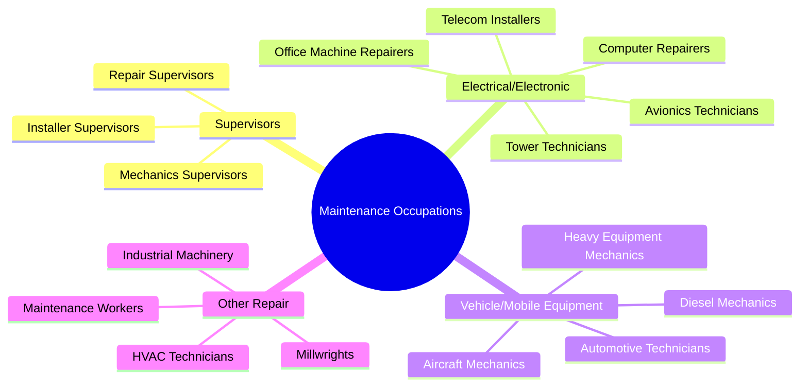
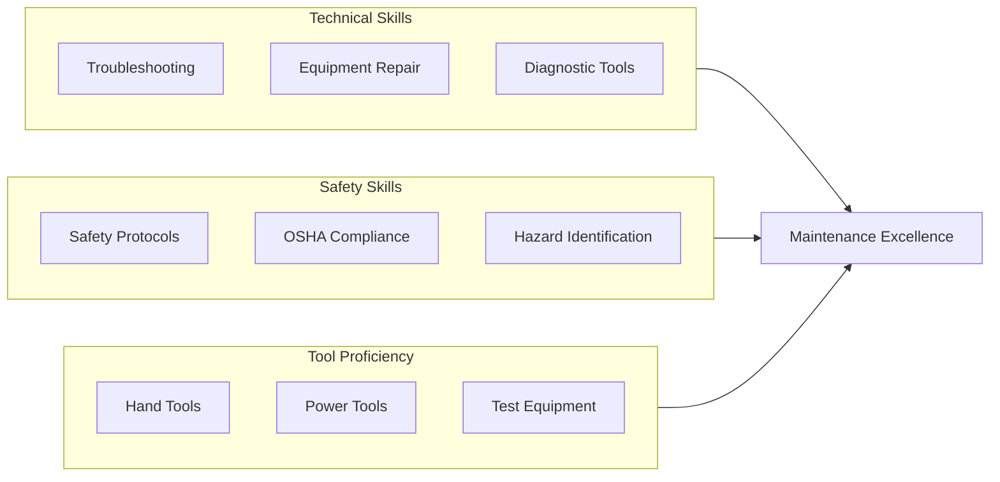
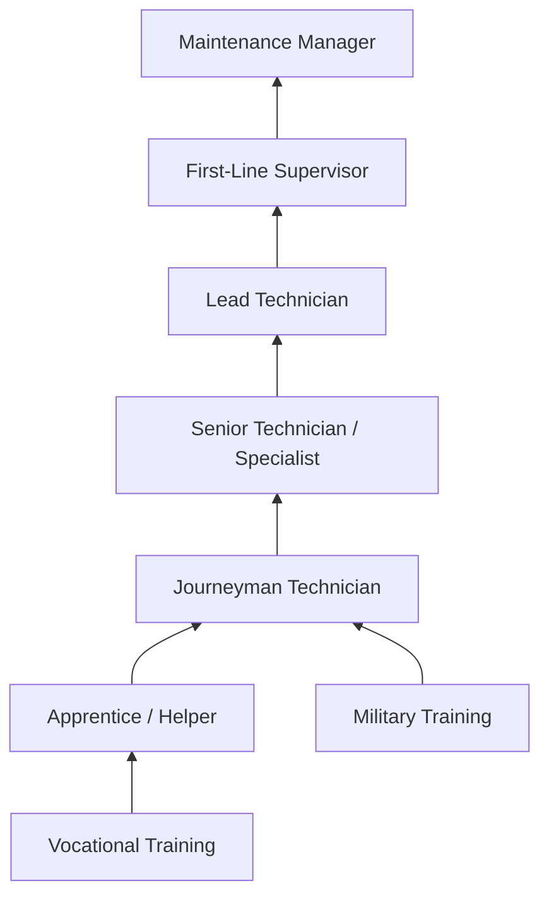

# Installation, Maintenance, and Repair Occupations

> Category 49 - Installation, Maintenance, and Repair occupations include workers who install, maintain, and repair equipment, machinery, and infrastructure across all industries.

## Overview

Installation, Maintenance, and Repair Occupations encompass skilled trades professionals who install, inspect, maintain, troubleshoot, and repair a wide range of equipment, machinery, and systems. This category includes mechanics, technicians, installers, and repairers working on everything from automobiles and aircraft to telecommunications equipment and industrial machinery. These professionals ensure that essential equipment and infrastructure operate safely and efficiently, minimizing downtime and extending equipment lifespan. As technology advances, workers in this field increasingly combine traditional mechanical skills with electronics, computer diagnostics, and specialized technical knowledge.

## Classification Hierarchy

## Key Statistics

| Metric | Value |
|--------|-------|
| SOC Category Code | 49 |
| Major Groups | 4 |
| Detailed Occupations | 60+ |
| Source | O*NET / BLS |

## Occupations in this Category

### First-Line Supervisors (49-1000)

| Occupation | Code | Description |
|------------|------|-------------|
| [First-Line Supervisors of Mechanics, Installers, and Repairers](./MechanicsSupervisors.mdx) | 49-1011.00 | Supervise and coordinate mechanics, installers, and repairers |

### Electrical and Electronic Equipment Mechanics, Installers, and Repairers (49-2000)

| Occupation | Code | Description |
|------------|------|-------------|
| [Computer, ATM, and Office Machine Repairers](./OfficeMachineRepairers.mdx) | 49-2011.00 | Repair and maintain computers, ATMs, and office machines |
| [Radio, Cellular, and Tower Equipment Technicians](./TowerTechnicians.mdx) | 49-2021.00 | Install and repair radio, cellular, and tower equipment |
| [Telecommunications Equipment Installers and Repairers](./TelecomInstallers.mdx) | 49-2022.00 | Install and repair telecommunications equipment |
| [Avionics Technicians](./AvionicsTechnicians.mdx) | 49-2091.00 | Install and repair aircraft electronic systems |

## Category Overview Diagram

## Skills Common to Maintenance Occupations

### Core Competencies

## Career Pathways

## Industries Employing Maintenance Occupations

- [Manufacturing](/industries/Manufacturing) - Highest employment for industrial mechanics
- [Telecommunications](/industries/Telecommunications) - Tower and telecom technicians
- [Transportation and Warehousing](/industries/Transportation) - Vehicle and aircraft mechanics
- [Utilities](/industries/Utilities) - Electrical and line workers
- [Automotive Dealers and Repair](/industries/AutomotiveRepair) - Automotive technicians
- [Aerospace](/industries/Aerospace) - Avionics and aircraft mechanics
- [Construction](/industries/Construction) - Equipment installers and repairers

## Education & Training Trends

| Level | Percentage of Workers |
|-------|----------------------|
| High School Diploma | 30-40% |
| Some College/Vocational | 25-35% |
| Associate's Degree | 15-25% |
| Apprenticeship Completion | 15-20% |
| Certifications/Licenses | 40-60% (varies by specialty) |

## Key Characteristics

### Work Environment
- Combination of indoor and outdoor work
- May involve heights, confined spaces, or hazardous conditions
- Often requires standing, bending, and lifting
- May involve shift work or on-call schedules

### Technology Trends
- Increasing computerization of equipment
- Growing use of diagnostic software and equipment
- Integration of IoT and predictive maintenance
- Need for continuous learning as equipment evolves

## Related Categories

- [Production Occupations](/occupations/Production) - Category 51
- [Construction and Extraction](/occupations/Construction) - Category 47
- [Transportation and Material Moving](/occupations/Transportation) - Category 53
- [Architecture and Engineering](/occupations/Architecture) - Category 17

---

*Source: O*NET / Bureau of Labor Statistics - SOC Category 49*
