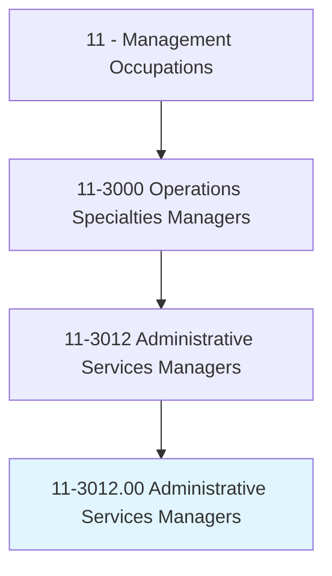
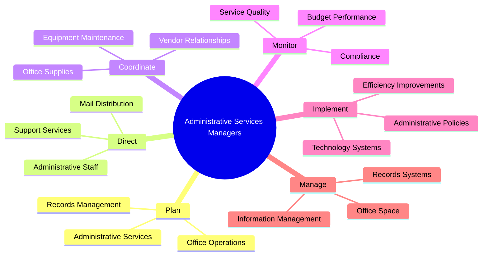
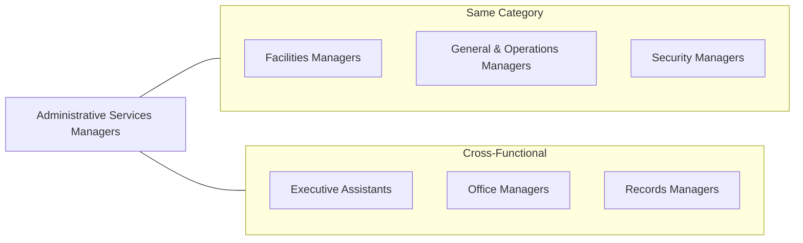
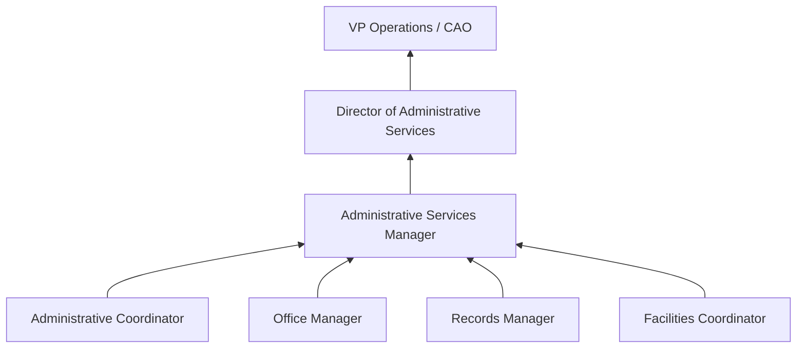

# Administrative Services Managers

> Plan, direct, or coordinate one or more administrative services of an organization, such as records and information management, mail distribution, and other office support services.

## Overview

Administrative Services Managers are operational leaders who ensure the smooth functioning of an organization's support services. They oversee critical back-office functions including records management, facilities coordination, mail services, and administrative staff. These professionals optimize office operations, manage vendor relationships, implement administrative policies, and ensure compliance with regulations. By maintaining efficient administrative systems, they enable other departments to focus on their core functions while reducing operational costs.

## Classification Hierarchy

## Key Statistics

| Metric | Value |
|--------|-------|
| SOC Code | 11-3012.00 |
| Job Zone | 4 (Considerable Preparation) |
| Category | [Management](/occupations/Management/index) |
| Core Tasks | 15+ |
| Source | O*NET |

## Core Tasks

### plan.AdministrativeServices

Administrative Services Managers design and optimize administrative operations.

**Actions:**
- `plan.AdministrativeServices.for.Efficiency` - Streamline operations
- `plan.RecordsManagement.for.Compliance` - Ensure regulatory adherence
- `plan.MailDistribution.for.Timeliness` - Optimize communication flow
- `plan.OfficeSupportServices.for.Productivity` - Enable workforce effectiveness

### direct.AdministrativeStaff

Administrative Services Managers lead teams responsible for office operations.

**Actions:**
- `direct.AdministrativeStaff.in.DailyOperations` - Supervise daily activities
- `direct.RecordsManagementStaff.in.FileOrganization` - Oversee document handling
- `train.Staff.on.AdministrativeProcedures` - Build team capabilities
- `evaluate.StaffPerformance.for.QualityAssurance` - Assess effectiveness

### coordinate.VendorRelationships

Administrative Services Managers manage external service providers and suppliers.

**Actions:**
- `coordinate.VendorContracts.for.OfficeSupplies` - Negotiate supplier agreements
- `manage.ServiceProviders.for.Maintenance` - Oversee facility services
- `evaluate.VendorPerformance.for.QualityControl` - Assess service delivery
- `negotiate.Contracts.for.CostSavings` - Optimize procurement

### implement.AdministrativePolicies

Administrative Services Managers establish and enforce operational standards.

**Actions:**
- `implement.AdministrativePolicies.for.Consistency` - Standardize procedures
- `develop.Procedures.for.RecordsRetention` - Create compliance protocols
- `establish.Guidelines.for.OfficeConduct` - Set behavioral standards
- `enforce.Policies.for.SecurityCompliance` - Ensure adherence

### manage.RecordsSystems

Administrative Services Managers oversee information and records management.

**Actions:**
- `manage.RecordsSystems.for.EasyRetrieval` - Organize document storage
- `implement.ElectronicRecordsSystems.for.Efficiency` - Digitize processes
- `ensure.RecordsCompliance.with.Regulations` - Meet legal requirements
- `archive.Documents.according.to.RetentionSchedules` - Maintain records lifecycle

## Skills & Competencies

### Technical Skills
- **Records Management** - Expert
- **Facilities Management** - Advanced
- **Vendor Management** - Advanced
- **Budget Administration** - Advanced
- **Office Technology** - Proficient
- **Project Management** - Proficient

### Soft Skills
- **Organization** - Critical
- **Communication** - Critical
- **Problem Solving** - Essential
- **Attention to Detail** - Essential
- **Leadership** - Essential
- **Time Management** - Essential

## Related Occupations

## Industries

- [Government](/industries/Government) - High Employment
- [Healthcare](/industries/Healthcare/index) - High Employment
- [Educational Services](/industries/Education/index) - High Employment
- [Professional Services](/industries/ProfessionalServices) - Moderate Employment
- [Finance and Insurance](/industries/FinanceInsurance) - Moderate Employment
- [Manufacturing](/industries/Manufacturing/index) - Moderate Employment

## Career Progression

## Education & Training

| Requirement | Details |
|-------------|---------|
| Typical Education | Bachelor's degree in Business Administration or related field |
| Work Experience | 3-5 years in administrative or operations roles |
| On-the-Job Training | Moderate; ongoing professional development |
| Common Certifications | CAP (Certified Administrative Professional), CRM (Certified Records Manager) |

## Departments

This occupation typically works in:
- [Administration](/departments/Administration)
- [Operations](/departments/Operations/index)
- [Records Management](/departments/RecordsManagement)
- [Office Services](/departments/OfficeServices)

---

*Source: O*NET 11-3012.00 - ONETOccupation*
