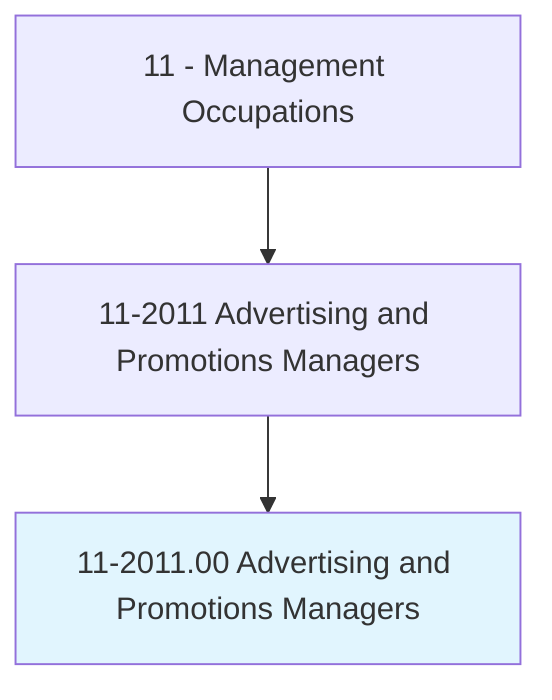
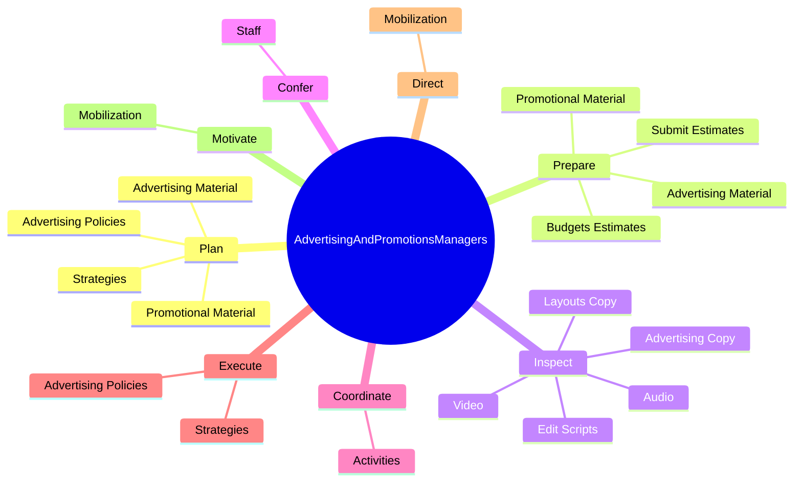

# Advertising and Promotions Managers

> Plan, direct, or coordinate advertising policies and programs or produce collateral materials, such as posters, contests, coupons, or giveaways, to create extra interest in the purchase of a product or service for a department, an entire organization, or on an account basis.

## Overview

Advertising and Promotions Managers is classified under Management Occupations (SOC 11). Plan, direct, or coordinate advertising policies and programs or produce collateral materials, such as posters, contests, coupons, or giveaways, to create extra interest in the purchase of a product or service for a department, an entire organization, or on an account basis.

## Classification Hierarchy

## Key Statistics

| Metric | Value |
|--------|-------|
| SOC Code | 11-2011.00 |
| Category | [Management Occupations](/occupations/Management/index) |
| Task Count | 173 |
| Source | O*NET |

## Core Tasks

### plan.AdvertisingMaterial

Advertising and Promotions Managers plan advertising material as part of their core responsibilities.

**Actions:**
- `plan.AdvertisingMaterial.to.increase.SalesOfProducts`
- `plan.AdvertisingMaterial.to.services`
- `plan.AdvertisingMaterial.to.WorkingWithCustomers`
- `plan.AdvertisingMaterial.to.CompanyOfficials`

### prepare.AdvertisingMaterial

Advertising and Promotions Managers prepare advertising material as part of their core responsibilities.

**Actions:**
- `prepare.AdvertisingMaterial.to.increase.SalesOfProducts`
- `prepare.AdvertisingMaterial.to.services`
- `prepare.AdvertisingMaterial.to.WorkingWithCustomers`
- `prepare.AdvertisingMaterial.to.CompanyOfficials`

### inspect.LayoutsCopy

Advertising and Promotions Managers inspect layouts copy as part of their core responsibilities.

**Actions:**
- `inspect.LayoutsCopy.for.Adherence.to.Specifications`
- `inspect.AdvertisingCopy.for.Adherence.to.Specifications`
- `inspect.EditScripts.for.Adherence.to.Specifications`
- `inspect.Audio.for.Adherence.to.Specifications`

## Skills & Competencies

### Technical Skills
- **Strategic Planning** - Advanced
- **Financial Management** - Advanced
- **Operations Management** - Advanced

### Soft Skills
- **Communication** - Essential
- **Problem Solving** - Essential
- **Critical Thinking** - Important
- **Teamwork** - Important
- **Adaptability** - Important

## Related Occupations

## Industries

This occupation is found across multiple industries. See [Industries](/industries) for sector-specific employment data.

## Career Progression

---

*Source: O*NET 11-2011.00 - ONETOccupation*
