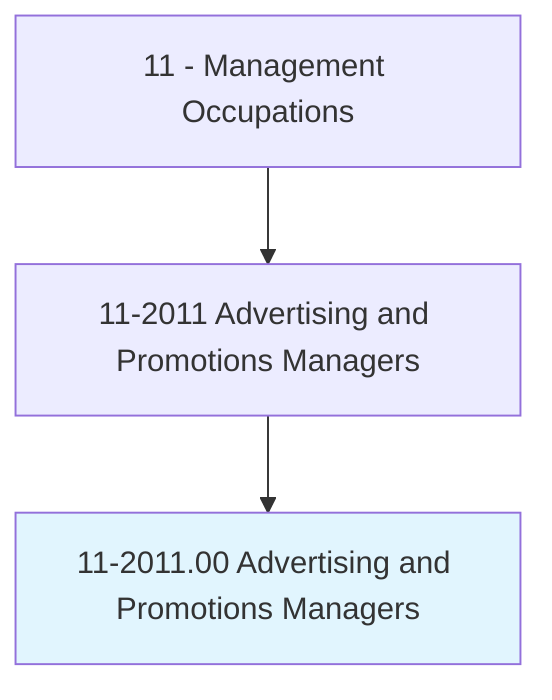
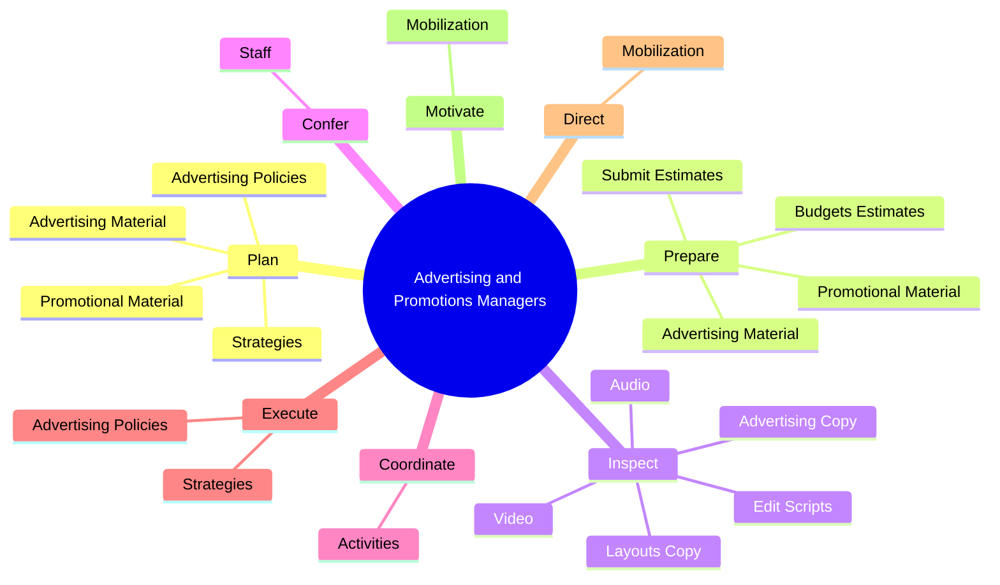
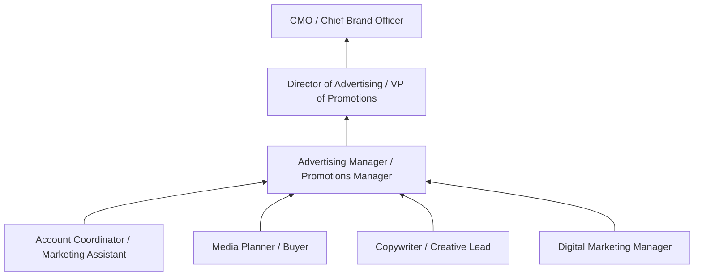
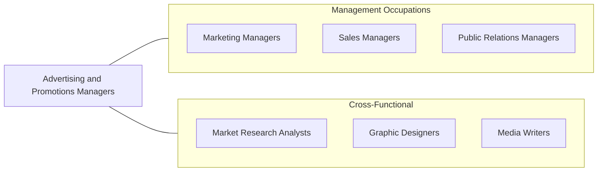

# Advertising and Promotions Managers

> Plan, direct, or coordinate advertising policies and programs or produce collateral materials, such as posters, contests, coupons, or giveaways, to create extra interest in the purchase of a product or service for a department, an entire organization, or on an account basis.

## Overview

Advertising and Promotions Managers develop and execute strategies to generate public interest in products, services, or brands. They oversee the creation of advertising campaigns across multiple channels -- including digital, print, broadcast, and outdoor media -- while managing promotional activities such as contests, giveaways, and special events designed to drive consumer engagement and sales.

These managers work at the intersection of creativity and business strategy. They collaborate with creative teams, media buyers, account executives, and client stakeholders to develop campaigns that resonate with target audiences and deliver measurable business results. Their responsibilities include setting advertising budgets, selecting media channels, reviewing creative content for brand alignment, and analyzing campaign performance metrics.

The role has evolved substantially with the rise of digital marketing. Advertising and Promotions Managers now oversee programmatic advertising, social media campaigns, influencer partnerships, and data-driven targeting strategies alongside traditional media. They must balance brand consistency with the need to adapt messaging across diverse platforms and audience segments.

## Classification Hierarchy

## Key Statistics

| Metric | Value |
|--------|-------|
| SOC Code | 11-2011.00 |
| Job Zone | 4 (Considerable Preparation) |
| Category | [Management Occupations](/occupations/Management/index) |
| Task Count | 173 |
| Salary Range | $65,000 - $150,000+ |
| Employment Level | Small - approximately 22,000 |
| Growth Outlook | Average |
| Source | O*NET |

## Core Tasks

### plan.AdvertisingMaterial

Advertising and Promotions Managers plan advertising materials and campaigns to increase sales, working closely with customers and company officials to align messaging with business objectives.

**Actions:**
- `plan.AdvertisingMaterial.to.increase.SalesOfProducts`
- `plan.AdvertisingMaterial.to.services`
- `plan.AdvertisingMaterial.to.WorkingWithCustomers`
- `plan.AdvertisingMaterial.to.CompanyOfficials`

### prepare.AdvertisingMaterial

Advertising and Promotions Managers prepare and produce advertising materials across multiple formats and channels to reach target audiences effectively.

**Actions:**
- `prepare.AdvertisingMaterial.to.increase.SalesOfProducts`
- `prepare.AdvertisingMaterial.to.services`
- `prepare.AdvertisingMaterial.to.WorkingWithCustomers`
- `prepare.AdvertisingMaterial.to.CompanyOfficials`

### inspect.LayoutsCopy

Advertising and Promotions Managers review creative assets including layouts, copy, scripts, audio, and video to ensure adherence to brand standards and campaign specifications.

**Actions:**
- `inspect.LayoutsCopy.for.Adherence.to.Specifications`
- `inspect.AdvertisingCopy.for.Adherence.to.Specifications`
- `inspect.EditScripts.for.Adherence.to.Specifications`
- `inspect.Audio.for.Adherence.to.Specifications`

## Skills & Competencies

### Technical Skills
- **Campaign Strategy & Planning** - Expert
- **Media Planning & Buying** - Advanced
- **Digital Advertising** - Advanced
- **Brand Management** - Advanced
- **Budget Management** - Advanced
- **Market Research & Analytics** - Advanced
- **Content Production Oversight** - Advanced

### Soft Skills
- **Creativity** - Critical
- **Communication** - Critical
- **Leadership** - Essential
- **Negotiation** - Essential
- **Analytical Thinking** - Essential
- **Presentation Skills** - Important
- **Adaptability** - Important

## Education & Certifications

| Requirement | Details |
|-------------|---------|
| Typical Education | Bachelor's degree in Advertising, Marketing, Communications, or Business |
| Advanced Education | MBA or Master's in Marketing/Communications for senior agency roles |
| Work Experience | 5+ years in advertising, marketing, or promotions |
| On-the-Job Training | Moderate - evolving digital platforms require continuous learning |
| Common Certifications | Google Ads Certification (Google), Meta Blueprint Certification (Meta), AMA PCM (American Marketing Association), HubSpot Inbound Marketing (HubSpot) |

## Career Progression

## Industry Variations

- **Advertising Agencies** - Client-facing account management; multi-brand campaign management; creative pitch development; media buying negotiations
- **Consumer Products (CPG)** - In-store promotions; coupon and loyalty programs; trade marketing; shelf placement strategies
- **Technology** - Product launch campaigns; digital-first strategies; growth marketing; community building
- **Retail** - Seasonal promotions; e-commerce advertising; omnichannel campaigns; circular and catalog production

## Technology & Tools

- **Ad Platforms** - Google Ads, Meta Ads Manager, The Trade Desk, Amazon Advertising
- **Creative Tools** - Adobe Creative Suite (Photoshop, Illustrator, InDesign, Premiere Pro)
- **Project Management** - Monday.com, Asana, Wrike, Basecamp
- **Analytics** - Google Analytics, Adobe Analytics, Sprout Social, Hootsuite
- **CRM & Marketing Automation** - Salesforce Marketing Cloud, HubSpot, Marketo
- **Media Planning** - Nielsen, Comscore, MediaOcean, Strata

## Related Occupations

## Industries

- [Advertising, Public Relations, and Related Services](/industries/Advertising) - Very High Employment
- [Retail Trade](/industries/Retail/index) - High Employment
- [Information](/industries/Information) - Moderate Employment
- [Manufacturing](/industries/Manufacturing/index) - Moderate Employment
- [Professional, Scientific, and Technical Services](/industries/ProfessionalServices) - Moderate Employment

## Departments

This occupation typically works in:
- [Marketing](/departments/Marketing/index)
- [Advertising](/departments/Advertising)
- [Brand Management](/departments/BrandManagement)
- [Creative Services](/departments/CreativeServices)

---

*Source: O*NET 11-2011.00 - ONETOccupation*
