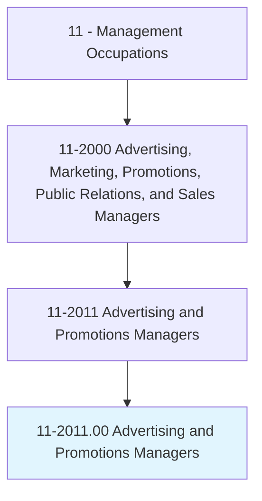
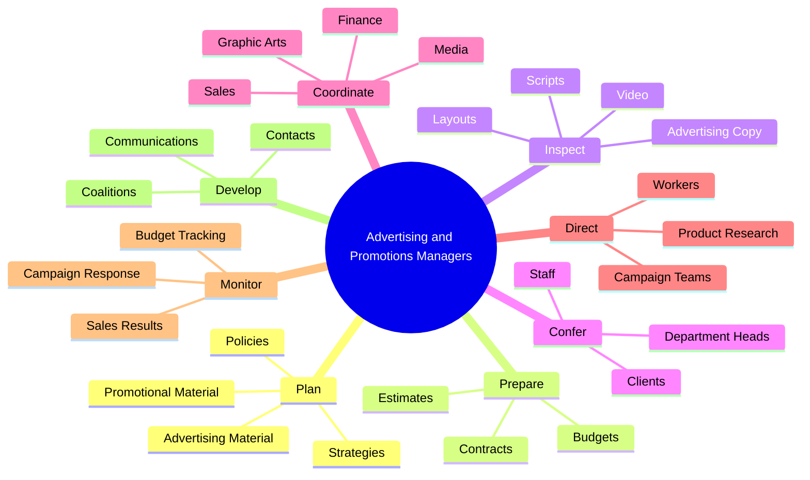
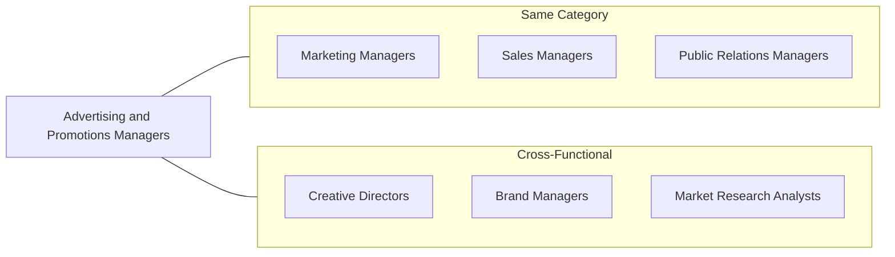
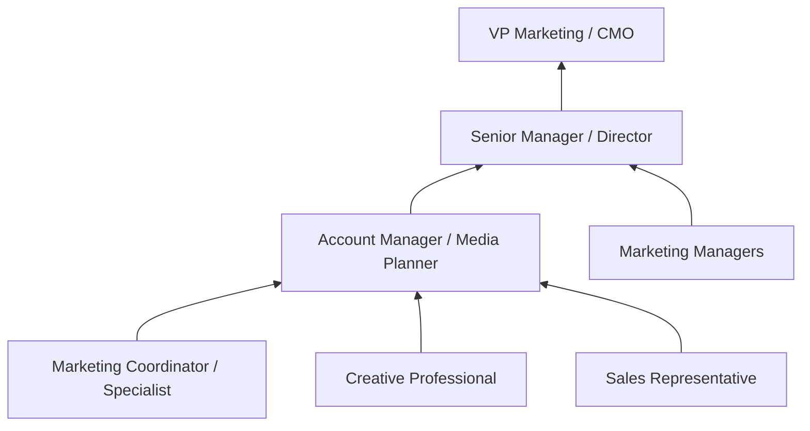

# Advertising and Promotions Managers

> Plan, direct, or coordinate advertising policies and programs or produce collateral materials, such as posters, contests, coupons, or giveaways, to create extra interest in the purchase of a product or service for a department, an entire organization, or on an account basis.

## Overview

Advertising and Promotions Managers lead the creative and strategic efforts to market products and services to target audiences. They develop comprehensive advertising campaigns, coordinate with creative teams and media partners, manage promotional budgets, and analyze campaign effectiveness. This role requires blending creative vision with business acumen, understanding consumer behavior, and staying current with evolving media channels from traditional print and broadcast to digital and social platforms.

## Classification Hierarchy

## Key Statistics

| Metric | Value |
|--------|-------|
| SOC Code | 11-2011.00 |
| Job Zone | 4 (Considerable Preparation) |
| Category | [Management](/occupations/Management) |
| Core Tasks | 15+ |
| Source | O*NET |

## Core Tasks

### plan.AdvertisingMaterial

Advertising and Promotions Managers develop comprehensive advertising and promotional content.

**Actions:**
- `plan.AdvertisingMaterial.to.increase.SalesOfProducts` - Design campaigns to drive product sales
- `plan.AdvertisingMaterial.to.WorkingWithCustomers` - Collaborate with clients on creative direction
- `plan.AdvertisingMaterial.to.CompanyOfficials` - Align with organizational objectives
- `plan.AdvertisingMaterial.to.SalesDepartments` - Coordinate with sales teams
- `plan.AdvertisingMaterial.to.AdvertisingAgencies` - Partner with external creative agencies
- `plan.PromotionalMaterial.to.increase.SalesOfProducts` - Create promotional campaigns

### prepare.AdvertisingMaterial

Advertising and Promotions Managers produce advertising content across channels.

**Actions:**
- `prepare.AdvertisingMaterial.to.increase.SalesOfProducts` - Create sales-driving advertisements
- `prepare.AdvertisingMaterial.to.services` - Develop service marketing materials
- `prepare.PromotionalMaterial.to.increase.SalesOfProducts` - Build promotional assets
- `prepare.PromotionalMaterial.to.CompanyOfficials` - Present to leadership

### inspect.LayoutsCopy

Advertising and Promotions Managers ensure quality and compliance of advertising materials.

**Actions:**
- `inspect.LayoutsCopy.for.Adherence.to.Specifications` - Review design layouts
- `inspect.AdvertisingCopy.for.Adherence.to.Specifications` - Edit written content
- `inspect.EditScripts.for.Adherence.to.Specifications` - Review audio/video scripts
- `inspect.Audio.for.Adherence.to.Specifications` - Approve audio content
- `inspect.Video.for.Adherence.to.Specifications` - Review video materials
- `inspect.OtherPromotionalMaterial.for.Adherence.to.Specifications` - Quality check all assets

### confer.Staff

Advertising and Promotions Managers collaborate with teams on campaign execution.

**Actions:**
- `confer.Staff.to.discuss.Topics` - Lead creative discussions
- `confer.Staff.to.contracts` - Negotiate vendor agreements
- `confer.Staff.to.SelectionOfAdvertisingMedia` - Choose media channels
- `confer.Staff.to.ProductToBeAdvertised` - Define product focus

### coordinate.Activities

Advertising and Promotions Managers synchronize cross-functional efforts.

**Actions:**
- `coordinate.Activities.of.Departments` - Align departmental contributions
- `coordinate.Activities.of.Sales` - Integrate sales and marketing
- `coordinate.Activities.of.GraphicArts` - Direct creative production
- `coordinate.Activities.of.Media` - Manage media relationships
- `coordinate.Activities.of.Finance` - Control budget allocation
- `coordinate.Activities.of.Research` - Leverage market research

### plan.AdvertisingPolicies

Advertising and Promotions Managers establish strategic advertising frameworks.

**Actions:**
- `plan.AdvertisingPolicies.for.Organizations` - Define advertising standards
- `plan.Strategies.for.Organizations` - Develop strategic plans
- `execute.AdvertisingPolicies.for.Organizations` - Implement policy guidelines
- `execute.Strategies.for.Organizations` - Roll out strategic initiatives

### direct.Mobilization

Advertising and Promotions Managers lead campaign teams toward objectives.

**Actions:**
- `direct.Mobilization.of.CampaignTeam.to.advance.CampaignGoals` - Lead team execution
- `motivate.Mobilization.of.CampaignTeam.to.advance.CampaignGoals` - Inspire team performance
- `monitor.Mobilization.of.CampaignTeam.to.advance.CampaignGoals` - Track team progress

### monitor.SalesPromotionResults

Advertising and Promotions Managers analyze campaign performance.

**Actions:**
- `monitor.SalesPromotionResults.to.determine.CostEffectivenessOfPromotionCampaigns` - Track promotion ROI
- `analyze.SalesPromotionResults.to.determine.CostEffectivenessOfPromotionCampaigns` - Evaluate campaign impact
- `track.ProgramBudgets.to.evaluate.Campaign` - Monitor budget utilization
- `track.CampaignResponseRates.to.evaluate.Campaign` - Measure audience engagement

### develop.Contacts

Advertising and Promotions Managers build industry relationships.

**Actions:**
- `identify.Contacts.for.PromotionalCampaignsProgramsMeetIdentifiedBuyerTargets` - Target key contacts
- `identify.Contacts.for.Dealers` - Connect with distribution channels
- `identify.Contacts.for.Distributors` - Build distributor relationships
- `develop.Contacts.for.Consumers` - Understand end customers

## Skills & Competencies

### Technical Skills
- **Digital Marketing** - Expert
- **Media Planning & Buying** - Expert
- **Creative Direction** - Advanced
- **Budget Management** - Advanced
- **Marketing Analytics** - Advanced
- **Brand Management** - Advanced

### Soft Skills
- **Creativity** - Critical
- **Communication** - Critical
- **Leadership** - Critical
- **Negotiation** - Essential
- **Project Management** - Essential
- **Strategic Thinking** - Essential

## Related Occupations

## Industries

- [Professional, Scientific, and Technical Services](/industries/ProfessionalServices) - High Employment
- [Information](/industries/Information) - High Employment
- [Retail Trade](/industries/RetailTrade) - Moderate Employment
- [Manufacturing](/industries/Manufacturing) - Moderate Employment
- [Finance and Insurance](/industries/FinanceInsurance) - Moderate Employment

## Career Progression

## Education & Training

| Requirement | Details |
|-------------|---------|
| Typical Education | Bachelor's degree in Marketing, Advertising, Communications, or Business |
| Work Experience | 5+ years in advertising, marketing, or promotions |
| On-the-Job Training | Moderate, with emphasis on media trends and digital platforms |
| Common Certifications | Google Ads, Meta Blueprint, HubSpot, AMA Professional Certified Marketer |

## Departments

This occupation typically works in:
- [Marketing](/departments/Marketing)
- [Advertising](/departments/Advertising)
- [Communications](/departments/Communications)
- [Brand Management](/departments/BrandManagement)

---

*Source: O*NET 11-2011.00 - ONETOccupation*
