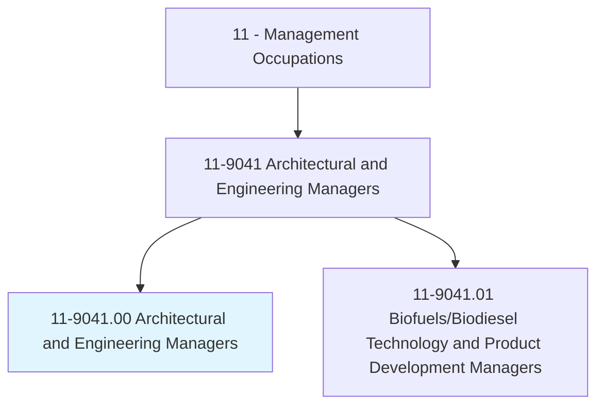
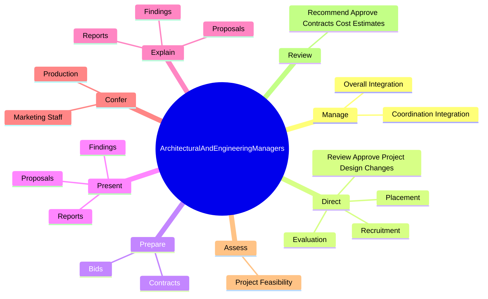
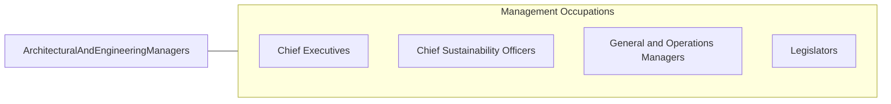

# Architectural and Engineering Managers

> Plan, direct, or coordinate activities in such fields as architecture and engineering or research and development in these fields.

## Overview

Architectural and Engineering Managers is classified under Management Occupations (SOC 11). Plan, direct, or coordinate activities in such fields as architecture and engineering or research and development in these fields.

## Classification Hierarchy

## Key Statistics

| Metric | Value |
|--------|-------|
| SOC Code | 11-9041.00 |
| Category | [Management Occupations](/occupations/Management) |
| Task Count | 94 |
| Source | O*NET |

## Core Tasks

### manage.CoordinationIntegration

Architectural and Engineering Managers manage coordination integration as part of their core responsibilities.

**Actions:**
- `manage.CoordinationIntegration.of.TechnicalActivities.in.Architecture`
- `manage.CoordinationIntegration.of.EngineeringProjects`
- `manage.OverallIntegration.of.TechnicalActivities.in.Architecture`
- `manage.OverallIntegration.of.EngineeringProjects`

### direct.ReviewApproveProjectDesignChanges

Architectural and Engineering Managers direct review approve project design changes as part of their core responsibilities.

**Actions:**
- `direct.ReviewApproveProjectDesignChanges`
- `direct.Recruitment.of.Architecture`
- `direct.Recruitment.of.EngineeringProjectStaff`
- `direct.Placement.of.Architecture`

### prepare.Bids

Architectural and Engineering Managers prepare bids as part of their core responsibilities.

**Actions:**
- `prepare.Bids`
- `prepare.Contracts`

## Skills & Competencies

### Technical Skills
- **Strategic Planning** - Advanced
- **Financial Management** - Advanced
- **Operations Management** - Advanced

### Soft Skills
- **Communication** - Essential
- **Problem Solving** - Essential
- **Critical Thinking** - Important
- **Teamwork** - Important
- **Adaptability** - Important

## Related Occupations

## Industries

This occupation is found across multiple industries. See [Industries](/industries) for sector-specific employment data.

## Career Progression

---

*Source: O*NET 11-9041.00 - ONETOccupation*
